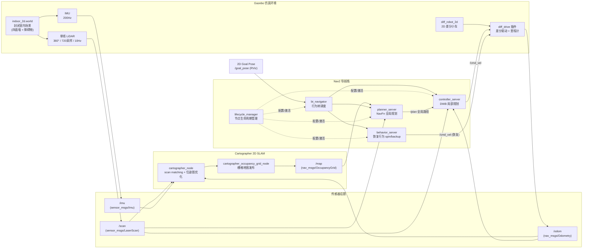
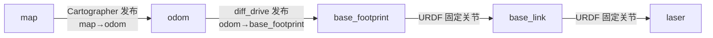
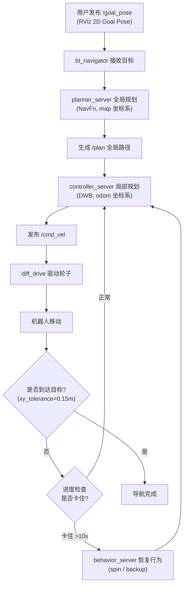

# 2D 单线 LiDAR 建图导航技术文档

> Gazebo 仿真环境下的 2D 单线 LiDAR 差分小车，使用 Cartographer 2D SLAM 在线建图 + Nav2 导航栈实现自主导航。
> 环境：Ubuntu 22.04 + ROS 2 Humble + Docker（容器 `lio_nav2`，工作空间 `/ws`）。

---

## 1. 系统流程图

### 1.1 整体架构与数据流



### 1.2 TF 坐标变换树



### 1.3 导航执行流程



---

## 2. 技术栈

| 层 | 技术 | 版本 | 用途 |
|----|------|------|------|
| 操作系统 | Ubuntu | 22.04 | 宿主机/容器系统 |
| 机器人框架 | ROS 2 | Humble | 节点通信、话题、TF、launch |
| 容器 | Docker | - | 容器名 `lio_nav2`，工作空间挂载 `/ws` |
| 仿真器 | Gazebo | 11 | 物理仿真 + 传感器仿真 |
| 机器人模型 | URDF | - | `diff_robot_2d.urdf` 差分小车 |
| 传感器 | Gazebo ray 传感器 | - | 单线 LiDAR（输出 LaserScan）+ IMU |
| 定位建图 | Cartographer | ROS 2 版 | 2D SLAM（scan matching + 位姿图优化） |
| 导航 | Nav2 | Humble | 全局规划 + 局部规划 + 行为树 + 恢复行为 |
| 全局规划器 | NavFn | - | 基于 Dijkstra 的全局路径搜索 |
| 局部规划器 | DWB | - | 动态窗口局部轨迹规划 |
| 通信中间件 | CycloneDDS | - | `RMW_IMPLEMENTATION=rmw_cyclonedds_cpp` |
| 可视化 | RViz 2 | - | 建图/导航可视化 + 2D Goal Pose 交互 |

---

## 3. 话题与模块

### 3.1 话题清单

| 话题 | 消息类型 | 发布者 | 订阅者 | 说明 |
|------|----------|--------|--------|------|
| `/scan` | `sensor_msgs/LaserScan` | Gazebo LiDAR 插件 | Cartographer、Nav2 costmap | 单线激光 360°/720 采样 |
| `/imu` | `sensor_msgs/Imu` | Gazebo IMU 插件 | Cartographer | 惯性测量数据 |
| `/odom` | `nav_msgs/Odometry` | diff_drive 插件 | Cartographer、Nav2 | 轮式里程计 |
| `/map` | `nav_msgs/OccupancyGrid` | cartographer_occupancy_grid_node | Nav2 global_costmap | 占据栅格地图 |
| `/goal_pose` | `geometry_msgs/PoseStamped` | RViz GoalTool | bt_navigator | 导航目标点 |
| `/plan` | `nav_msgs/Path` | planner_server | controller_server、RViz | 全局规划路径 |
| `/cmd_vel` | `geometry_msgs/Twist` | controller_server / behavior_server | diff_drive 插件 | 速度指令 |
| `/local_costmap/costmap` | `nav_msgs/OccupancyGrid` | local_costmap | RViz | 局部代价地图 |
| `/global_costmap/costmap` | `nav_msgs/OccupancyGrid` | global_costmap | RViz | 全局代价地图 |

### 3.2 TF 话题

| TF | 发布者 | 说明 |
|----|--------|------|
| `map → odom` | Cartographer | 定位结果（SLAM 漂移修正） |
| `odom → base_footprint` | diff_drive 插件 | 里程计累计 |
| `base_footprint → base_link` | robot_state_publisher | URDF 固定关节 |
| `base_link → laser` | robot_state_publisher | URDF 固定关节（LiDAR 安装位） |

### 3.3 模块清单

| 模块 | 包 | 可执行文件 | 作用 |
|------|-----|-----------|------|
| Gazebo 世界 | `get_urdf` | `gazebo` | 加载 indoor_2d.world + spawn 机器人 |
| 机器人状态发布 | `robot_state_publisher` | `robot_state_publisher` | 发布静态 TF |
| 差分驱动 | Gazebo 插件 | `libgazebo_ros_diff_drive.so` | 驱动轮子 + 发布 /odom |
| 单线 LiDAR | Gazebo 插件 | `libgazebo_ros_ray_sensor.so` | 输出 /scan (LaserScan) |
| IMU | Gazebo 插件 | `libgazebo_ros_imu_sensor.so` | 输出 /imu |
| Cartographer 节点 | `cartographer_ros` | `cartographer_node` | 2D SLAM |
| 栅格地图节点 | `cartographer_ros` | `cartographer_occupancy_grid_node` | 发布 /map |
| 全局规划器 | `nav2_planner` | `planner_server` | NavFn 全局路径 |
| 局部控制器 | `nav2_controller` | `controller_server` | DWB 局部规划 |
| 行为树导航 | `nav2_bt_navigator` | `bt_navigator` | 导航任务调度 |
| 恢复行为 | `nav2_behaviors` | `behavior_server` | spin/backup 恢复 |
| 生命周期管理 | `nav2_lifecycle_manager` | `lifecycle_manager` | 激活/配置 Nav2 节点 |

---

## 4. 运行命令

### 4.1 编译

```bash
# 编译 get_urdf（模型/世界）和 me_nav2_bringup（Cartographer/Nav2 配置）
# 注意限速 -j4，避免占满 CPU 卡死宿主机
docker exec lio_nav2 bash -c "
  source /opt/ros/humble/setup.bash && cd /ws &&
  MAKEFLAGS='-j4' colcon build --packages-select get_urdf me_nav2_bringup \
    --symlink-install --executor sequential
"
```

### 4.2 一键启动

```bash
# 宿主机授权 X11 显示
xhost +local:docker

# 启动（默认 indoor_2d 室内场景）
docker exec -it lio_nav2 bash -c "cd /ws && bash scripts/nav2_2d_sim.sh"

# 指定其他世界（如 test_world）
docker exec -it lio_nav2 bash -c "cd /ws && bash scripts/nav2_2d_sim.sh test_world"
```

### 4.3 交互操作

```bash
# 附加到 tmux 会话（4 个窗口：Gazebo / Carto / Nav2 / RViz）
docker exec -it lio_nav2 tmux attach -t nav2_2d
```

切到 `RViz` 窗口 → 点击顶部 **"2D Goal Pose"** 按钮 → 在地图上点击目标点 → 机器人自动规划并导航。

### 4.4 命令行发布导航目标

```bash
docker exec lio_nav2 bash -c "
  source /ws/install/setup.bash &&
  export RMW_IMPLEMENTATION=rmw_cyclonedds_cpp &&
  ros2 topic pub /goal_pose geometry_msgs/msg/PoseStamped \
  '{header: {frame_id: map}, pose: {position: {x: 6.0, y: 6.0, z: 0.0}, orientation: {x:0,y:0,z:0,w:1}}}' --once
"
```

### 4.5 关闭

```bash
docker exec lio_nav2 bash -c "
  tmux kill-server 2>/dev/null;
  killall -9 gzserver gzclient cartographer_node cartographer_occupancy_grid_node \
    planner_server controller_server bt_navigator behavior_server \
    lifecycle_manager_navigation rviz2 robot_state_publisher 2>/dev/null
"
```

### 4.6 诊断命令

```bash
# 查看节点
docker exec lio_nav2 bash -c "source /ws/install/setup.bash && \
  export RMW_IMPLEMENTATION=rmw_cyclonedds_cpp && ros2 node list"

# 查看话题
docker exec lio_nav2 bash -c "source /ws/install/setup.bash && \
  export RMW_IMPLEMENTATION=rmw_cyclonedds_cpp && ros2 topic list"

# 检查定位稳定性（map→odom TF 两次采样对比，漂移应 < 1cm/10s）
docker exec lio_nav2 bash -c "source /ws/install/setup.bash && \
  export RMW_IMPLEMENTATION=rmw_cyclonedds_cpp && ros2 run tf2_ros tf2_echo map odom"
```
