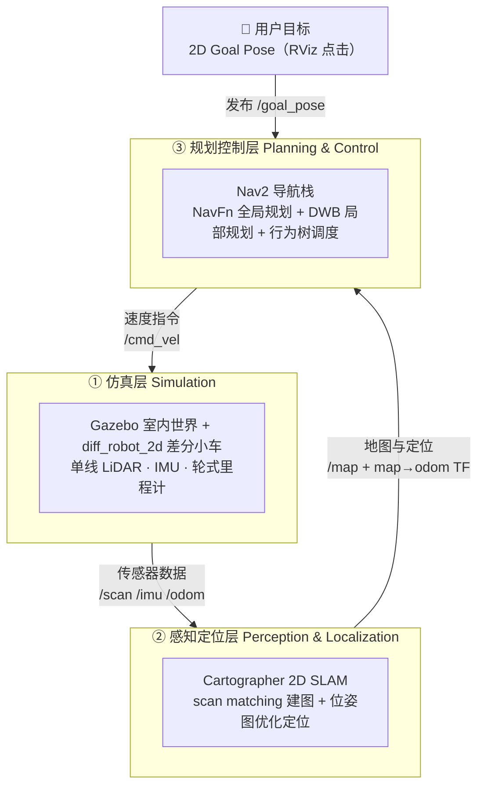
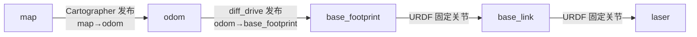
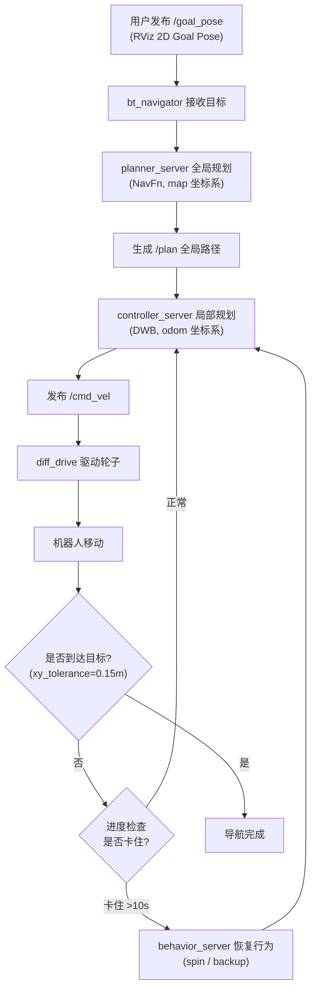
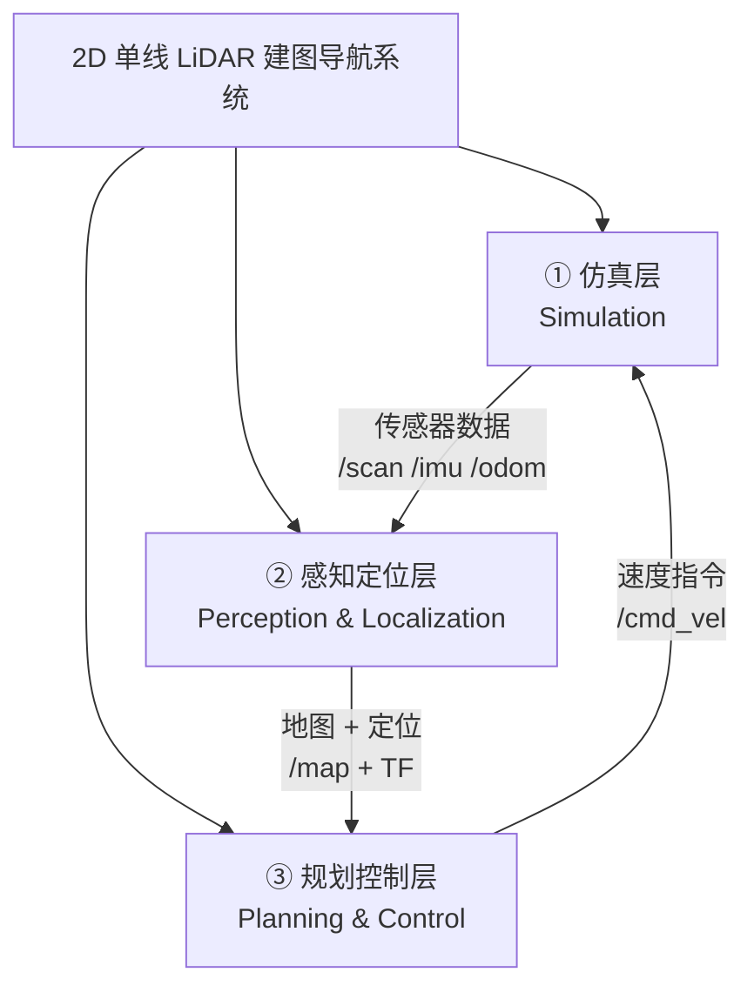
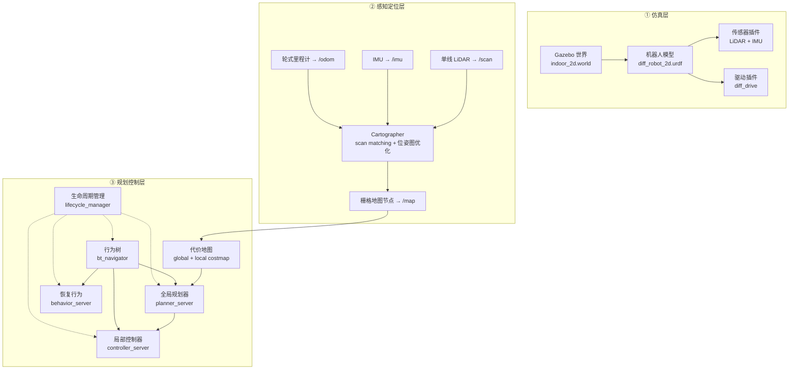

# 2D 单线 LiDAR 建图导航技术文档

> Gazebo 仿真环境下的 2D 单线 LiDAR 差分小车，使用 Cartographer 2D SLAM 在线建图 + Nav2 导航栈实现自主导航。
> 环境：Ubuntu 22.04 + ROS 2 Humble + Docker（容器 `lio_nav2`，工作空间 `/ws`）。

---

## 1. 系统流程图

### 1.1 整体架构与数据流



数据流闭环：① 用户在 RViz 点目标 → `/goal_pose` 发给 Nav2；② 仿真层传感器（LiDAR/IMU/里程计）→ Cartographer；③ Cartographer 输出 `/map` + 定位 → Nav2；④ Nav2 规划后发 `/cmd_vel` 驱动机器人，传感器继续更新，形成闭环。

### 1.2 TF 坐标变换树



### 1.3 导航执行流程



---

## 2. 技术栈

| 层 | 技术 | 版本 | 用途 |
|----|------|------|------|
| 操作系统 | Ubuntu | 22.04 | 宿主机/容器系统 |
| 机器人框架 | ROS 2 | Humble | 节点通信、话题、TF、launch |
| 容器 | Docker | - | 容器名 `lio_nav2`，工作空间挂载 `/ws` |
| 仿真器 | Gazebo | 11 | 物理仿真 + 传感器仿真 |
| 机器人模型 | URDF | - | `diff_robot_2d.urdf` 差分小车 |
| 传感器 | Gazebo ray 传感器 | - | 单线 LiDAR（输出 LaserScan）+ IMU |
| 定位建图 | Cartographer | ROS 2 版 | 2D SLAM（scan matching + 位姿图优化） |
| 导航 | Nav2 | Humble | 全局规划 + 局部规划 + 行为树 + 恢复行为 |
| 全局规划器 | NavFn | - | 基于 Dijkstra 的全局路径搜索 |
| 局部规划器 | DWB | - | 动态窗口局部轨迹规划 |
| 通信中间件 | CycloneDDS | - | `RMW_IMPLEMENTATION=rmw_cyclonedds_cpp` |
| 可视化 | RViz 2 | - | 建图/导航可视化 + 2D Goal Pose 交互 |

---

## 3. 模块由粗到细详解

### 3.1 第一层：三大子系统（粗粒度）

整个系统从最顶层看，只有三个相互协作的子系统：



| 子系统 | 一句话职责 | 核心产出 |
|--------|-----------|---------|
| ① 仿真层 | 提供物理世界、机器人、传感器与驱动 | `/scan` `/imu` `/odom` |
| ② 感知定位层 | 把传感器数据变成地图和位姿 | `/map` + map→odom TF |
| ③ 规划控制层 | 从目标点规划路径并控制机器人到达 | `/cmd_vel` |

---

### 3.2 第二层：子系统内部模块（中粒度）

把每个子系统再往下拆一层：



---

### 3.3 第三层：模块职责详解（细粒度）

#### 3.3.1 仿真层模块

**(1) Gazebo 世界 `indoor_2d.world`**

- **职责**：提供物理环境（重力、地面摩擦、障碍物碰撞）。
- **内容**：四面墙围成 20×20 m 房间 + 4 个内部 box 障碍物（1~2 m 见方）。
- **为什么重要**：封闭房间的墙壁为 2D SLAM 提供**连续、密集**的 scan matching 特征。
  实测在稀疏箱子场景（test_world）下 map→odom 漂移达 1.65 m/8s，换成室内场景后仅 5 mm/10s。

**(2) 机器人模型 `diff_robot_2d.urdf`**

- **职责**：定义机器人的几何、质量、惯性与关节拓扑。
- **link 结构**：
  - `base_footprint`（根，里程计参考）
  - `base_link`（底盘 0.22×0.18×0.08 m，离地 0.06 m）
  - `wheel_left` / `wheel_right`（驱动轮，半径 0.033 m）
  - `caster_front` / `caster_back`（万向支撑轮）
  - `laser`（LiDAR 安装架，离地 0.16 m）
- **关键细节**：驱动轮底部**嵌入地面 6 mm**——接触深度为零会导致 Gazebo 无摩擦力，轮子狂转但车不动（打滑）。

**(3) 单线 LiDAR 插件 `libgazebo_ros_ray_sensor.so`**

- **职责**：仿真一条 360° 激光扫描线。
- **输出**：`/scan`（`sensor_msgs/LaserScan`），`frame_id=laser`。
- **关键参数**：
  | 参数 | 值 |
  |------|-----|
  | 水平采样 | 720（角分辨率 0.5°） |
  | 垂直采样 | **1**（单线，输出 LaserScan 的关键） |
  | 更新频率 | 10 Hz |
  | 量程 | 0.05 ~ 12 m |
  | 噪声 | 高斯 σ=0.01 m |

**(4) IMU 插件 `libgazebo_ros_imu_sensor.so`**

- **职责**：输出角速度与线加速度（含重力）。
- **输出**：`/imu`（`sensor_msgs/Imu`）。
- **关键参数**：200 Hz，角速度噪声 σ=2e-4，加速度噪声 σ=1.7e-2。

**(5) 差分驱动插件 `libgazebo_ros_diff_drive.so`**

- **职责**：把 `/cmd_vel` 换算成左右轮转速，并累计发布里程计。
- **输入**：`/cmd_vel`；**输出**：`/odom` + `odom→base_footprint` TF。
- **关键参数**：
  | 参数 | 值 |
  |------|-----|
  | wheel_separation | 0.16 m |
  | wheel_diameter | 0.066 m |
  | max_wheel_torque | 20 N·m |
  | publish_odom / odom_tf | true |

---

#### 3.3.2 感知定位层模块

**(1) Cartographer 节点 `cartographer_node`**

- **职责**：2D SLAM 核心——实时 scan matching 估计位姿，位姿图优化消除累积误差。
- **输入**：`/scan` `/imu` `/odom`；**输出**：`map→odom` TF、submap。
- **关键配置**（`cartographer_2d.lua`）：
  | 参数 | 值 | 含义 |
  |------|-----|------|
  | use_odometry | true | 使用 diff_drive 真实里程计 |
  | use_imu_data | true | 使用 IMU（室内场景稳定） |
  | tracking_frame | base_footprint | 跟踪坐标系 |
  | published_frame | odom | 发布的定位 frame |
  | min_range / max_range | 0.1 / 12 m | 激光有效量程 |
  | optimize_every_n_nodes | 90 | 每 90 个节点做一次全局优化 |

**(2) 栅格地图节点 `cartographer_occupancy_grid_node`**

- **职责**：把 Cartographer 的 submap 拼接成占据栅格地图。
- **输出**：`/map`（`nav_msgs/OccupancyGrid`）。
- **关键参数**：分辨率 0.05 m，发布周期 1 s。

---

#### 3.3.3 规划控制层模块

**(1) 代价地图 costmap（global + local）**

- **职责**：把「地图 + 激光障碍物 + 膨胀」融合成规划器可用的代价图。
- **global_costmap**（frame=map）：`static_layer`（订阅 /map）+ `obstacle_layer`（/scan）+ `inflation_layer`。
- **local_costmap**（frame=odom，6×6 m 滚动窗口）：`obstacle_layer` + `inflation_layer`。
- **关键参数**：footprint `[0.15, 0.12]`、inflation_radius 0.55 m、cost_scaling_factor 3.0。

**(2) 全局规划器 `planner_server`（NavFn）**

- **职责**：在 global_costmap 上搜索从机器人到目标的全局路径。
- **输入**：global_costmap + 目标；**输出**：`/plan`（`nav_msgs/Path`）。
- **关键参数**：Dijkstra（use_astar=false）、allow_unknown=true、终点容差 0.5 m。

**(3) 局部控制器 `controller_server`（DWB）**

- **职责**：沿全局路径采样局部轨迹，评分选出最优速度指令。
- **输入**：`/plan` + local_costmap + `/odom`；**输出**：`/cmd_vel`（20 Hz）。
- **关键参数**：
  | 参数 | 值 |
  |------|-----|
  | max_vel_x | 0.26 m/s |
  | max_vel_theta | 1.0 rad/s |
  | critics | RotateToGoal / BaseObstacle / PathAlign / GoalAlign 等 7 个 |
  | xy_goal_tolerance | 0.15 m |

**(4) 行为树 `bt_navigator`**

- **职责**：按 `navigate_to_pose_w_replanning_and_recovery.xml` 调度规划、控制、恢复行为。
- **输入**：`/goal_pose`；**输出**：指挥 planner / controller / behavior。

**(5) 恢复行为 `behavior_server`**

- **职责**：机器人卡住时执行恢复动作。
- **行为**：`spin`（原地旋转）/ `backup`（倒车）/ `drive_on_heading` / `wait`。
- **触发**：progress checker 检测 10 s 内未移动 0.5 m。

**(6) 生命周期管理 `lifecycle_manager`**

- **职责**：统一把 4 个 Nav2 节点从 unconfigured → active。
- **关键参数**：`autostart=true`，`node_names=[planner_server, controller_server, bt_navigator, behavior_server]`。

---

### 3.4 话题清单

| 话题 | 消息类型 | 发布者 | 订阅者 | 说明 |
|------|----------|--------|--------|------|
| `/scan` | `sensor_msgs/LaserScan` | Gazebo LiDAR 插件 | Cartographer、Nav2 costmap | 单线激光 360°/720 采样 |
| `/imu` | `sensor_msgs/Imu` | Gazebo IMU 插件 | Cartographer | 惯性测量数据 |
| `/odom` | `nav_msgs/Odometry` | diff_drive 插件 | Cartographer、Nav2 | 轮式里程计 |
| `/map` | `nav_msgs/OccupancyGrid` | cartographer_occupancy_grid_node | Nav2 global_costmap | 占据栅格地图 |
| `/goal_pose` | `geometry_msgs/PoseStamped` | RViz GoalTool | bt_navigator | 导航目标点 |
| `/plan` | `nav_msgs/Path` | planner_server | controller_server、RViz | 全局规划路径 |
| `/cmd_vel` | `geometry_msgs/Twist` | controller_server / behavior_server | diff_drive 插件 | 速度指令 |
| `/local_costmap/costmap` | `nav_msgs/OccupancyGrid` | local_costmap | RViz | 局部代价地图 |
| `/global_costmap/costmap` | `nav_msgs/OccupancyGrid` | global_costmap | RViz | 全局代价地图 |

### 3.5 TF 话题

| TF | 发布者 | 说明 |
|----|--------|------|
| `map → odom` | Cartographer | 定位结果（SLAM 漂移修正） |
| `odom → base_footprint` | diff_drive 插件 | 里程计累计 |
| `base_footprint → base_link` | robot_state_publisher | URDF 固定关节 |
| `base_link → laser` | robot_state_publisher | URDF 固定关节（LiDAR 安装位） |

### 3.6 模块清单

| 模块 | 包 | 可执行文件 | 作用 |
|------|-----|-----------|------|
| Gazebo 世界 | `get_urdf` | `gazebo` | 加载 indoor_2d.world + spawn 机器人 |
| 机器人状态发布 | `robot_state_publisher` | `robot_state_publisher` | 发布静态 TF |
| 差分驱动 | Gazebo 插件 | `libgazebo_ros_diff_drive.so` | 驱动轮子 + 发布 /odom |
| 单线 LiDAR | Gazebo 插件 | `libgazebo_ros_ray_sensor.so` | 输出 /scan (LaserScan) |
| IMU | Gazebo 插件 | `libgazebo_ros_imu_sensor.so` | 输出 /imu |
| Cartographer 节点 | `cartographer_ros` | `cartographer_node` | 2D SLAM |
| 栅格地图节点 | `cartographer_ros` | `cartographer_occupancy_grid_node` | 发布 /map |
| 全局规划器 | `nav2_planner` | `planner_server` | NavFn 全局路径 |
| 局部控制器 | `nav2_controller` | `controller_server` | DWB 局部规划 |
| 行为树导航 | `nav2_bt_navigator` | `bt_navigator` | 导航任务调度 |
| 恢复行为 | `nav2_behaviors` | `behavior_server` | spin/backup 恢复 |
| 生命周期管理 | `nav2_lifecycle_manager` | `lifecycle_manager` | 激活/配置 Nav2 节点 |

---

## 4. 运行命令

### 4.1 编译

```bash
# 编译 get_urdf（模型/世界）和 nav2_planner（Cartographer/Nav2 配置）
# 注意限速 -j4，避免占满 CPU 卡死宿主机
docker exec lio_nav2 bash -c "
  source /opt/ros/humble/setup.bash && cd /ws &&
  MAKEFLAGS='-j4' colcon build --packages-select get_urdf nav2_planner \
    --symlink-install --executor sequential
"
```

### 4.2 一键启动

```bash
# 宿主机授权 X11 显示
xhost +local:docker

# 启动（默认 indoor_2d 室内场景）
docker exec -it lio_nav2 bash -c "cd /ws && bash scripts/nav2_2d_sim.sh"

# 指定其他世界（如 test_world）
docker exec -it lio_nav2 bash -c "cd /ws && bash scripts/nav2_2d_sim.sh test_world"
```

### 4.3 交互操作

```bash
# 附加到 tmux 会话（4 个窗口：Gazebo / Carto / Nav2 / RViz）
docker exec -it lio_nav2 tmux attach -t nav2_2d
```

切到 `RViz` 窗口 → 点击顶部 **"2D Goal Pose"** 按钮 → 在地图上点击目标点 → 机器人自动规划并导航。

### 4.4 命令行发布导航目标

```bash
docker exec lio_nav2 bash -c "
  source /ws/install/setup.bash &&
  export RMW_IMPLEMENTATION=rmw_cyclonedds_cpp &&
  ros2 topic pub /goal_pose geometry_msgs/msg/PoseStamped \
  '{header: {frame_id: map}, pose: {position: {x: 6.0, y: 6.0, z: 0.0}, orientation: {x:0,y:0,z:0,w:1}}}' --once
"
```

### 4.5 关闭

```bash
docker exec lio_nav2 bash -c "
  tmux kill-server 2>/dev/null;
  killall -9 gzserver gzclient cartographer_node cartographer_occupancy_grid_node \
    planner_server controller_server bt_navigator behavior_server \
    lifecycle_manager_navigation rviz2 robot_state_publisher 2>/dev/null
"
```

### 4.6 诊断命令

```bash
# 查看节点
docker exec lio_nav2 bash -c "source /ws/install/setup.bash && \
  export RMW_IMPLEMENTATION=rmw_cyclonedds_cpp && ros2 node list"

# 查看话题
docker exec lio_nav2 bash -c "source /ws/install/setup.bash && \
  export RMW_IMPLEMENTATION=rmw_cyclonedds_cpp && ros2 topic list"

# 检查定位稳定性（map→odom TF 两次采样对比，漂移应 < 1cm/10s）
docker exec lio_nav2 bash -c "source /ws/install/setup.bash && \
  export RMW_IMPLEMENTATION=rmw_cyclonedds_cpp && ros2 run tf2_ros tf2_echo map odom"
```
