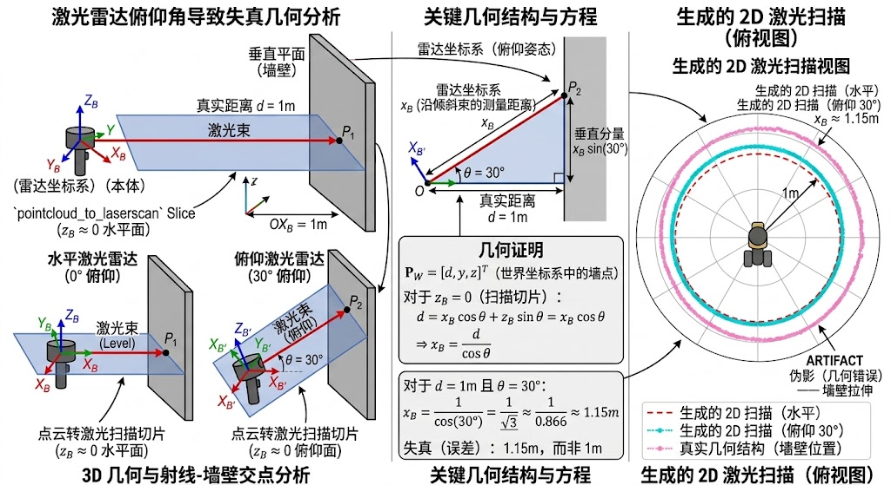

# 手持雷达 3D 运动对 2D SLAM 建图的影响：数学分析

## 问题描述

在使用手持激光雷达进行建图时，雷达的运动天然是 **6-DOF** 的（包含平移 $x, y, z$ 和旋转 roll, pitch, yaw）。然而建图后端 `slam_toolbox` 是一个 **2D SLAM** 算法，只能处理 **3-DOF** 的刚体变换（$x, y,$ yaw）。

这就产生了一个根本矛盾：**3D 运动 → 2D 投影 → 2D 刚体优化**，每一步都在丢失信息。

数据流全景：

```
                         6-DOF                          3-DOF
  ┌─────────────────────────────────────┐    ┌──────────────────────┐
  │  FAST-LIO (SE(3))                   │    │  slam_toolbox (SE(2))│
  │                                     │    │                      │
  │  位姿: (x,y,z,roll,pitch,yaw)       │    │  位姿: (x,y,yaw)     │
  │           ↓                         │    │       ↑              │
  │  /cloud_registered (3D 点云)  ──────┼────┼──→ /scan (2D 激光)  │
  │                                     │    │       │              │
  │  pitch/roll 信息 ─────────── ✗ ─────┼────┼──→ 被丢弃！         │
  └─────────────────────────────────────┘    │       ↓              │
                                             │  2D 地图（畸变）     │
                                             └──────────────────────┘
```

具体表现为三个递进的问题：

| 问题 | 现象 |
|------|------|
| 切片畸变 | 雷达倾斜后，同一面墙的测量距离被拉长，2D 扫描轮廓发生形变 |
| 位姿截断 | pitch/roll 信息在 `map → odom` 的 TF 中被丢弃，无法恢复 |
| 匹配失效 | 畸变后的 scan 不再是刚体变换，slam_toolbox 的 ICP/相关匹配崩溃 |

下文对此进行严格的数学分析。

---

## 数学推导

### 1. 降维映射：SE(3) → SE(2)

FAST-LIO 输出的位姿在三维特殊欧几里得群 $SE(3)$ 中：

$$T_{3D} = \begin{bmatrix} R(\phi, \theta, \psi) & \mathbf{t} \\ \mathbf{0}^T & 1 \end{bmatrix} \in SE(3),\quad \mathbf{t} = [x, y, z]^T$$

其中 $\phi$ 为 Roll，$\theta$ 为 Pitch，$\psi$ 为 Yaw。

`slam_toolbox` 的核心算法建立在二维流形 $SE(2)$ 上：

$$T_{2D} = \begin{bmatrix} \cos\psi & -\sin\psi & x \\ \sin\psi & \cos\psi & y \\ 0 & 0 & 1 \end{bmatrix} \in SE(2)$$

从 6-DOF 到 3-DOF 的传递过程是一个截断函数 $f: \mathbb{R}^6 \rightarrow \mathbb{R}^3$：

$$f(x, y, z, \phi, \theta, \psi) = (x, y, \psi)$$

**关键后果**：这种截断打破了 3D 空间中平移与旋转之间的耦合关系。当雷达发生 pitch 变化并向前移动时，真实的 $x, y, z$ 位移受 $\theta$ 调制，但在 $SE(2)$ 视角下 $\theta \equiv 0$，导致 2D 轨迹与真实 3D 运动发生不可逆的偏离。

### 2. 切片畸变的几何证明



如上图所示，设世界坐标系 $\{W\}$ 中有一堵竖直的墙，距离原点 $d$，墙面任意点 $\mathbf{P}_W = [d, y_W, z_W]^T$。

当雷达发生 pitch 角 $\theta$ 倾斜（无平移）时，雷达坐标系 $\{S\}$ 随之倾斜。世界坐标与雷达坐标的关系为 $\mathbf{P}_W = R_y(\theta) \mathbf{P}_S$：

$$\begin{bmatrix} d \\ y_W \\ z_W \end{bmatrix} = \begin{bmatrix} \cos\theta & 0 & \sin\theta \\ 0 & 1 & 0 \\ -\sin\theta & 0 & \cos\theta \end{bmatrix} \begin{bmatrix} x_S \\ y_S \\ z_S \end{bmatrix}$$

`pointcloud_to_laserscan` 截取 $z_S \approx 0$ 的水平切片。代入 $z_S = 0$：

$$d = x_S \cos\theta \quad\Rightarrow\quad x_S = \frac{d}{\cos\theta}$$

由于 $\cos\theta \leq 1$，**只要雷达倾斜，2D 扫描的测量距离 $x_S$ 必定大于真实距离 $d$**。

| pitch 角 $\theta$ | $\cos\theta$ | 测距误差 |
|-------------------|-------------|---------|
| 0° | 1.000 | 0% |
| 10° | 0.985 | +1.5% |
| 20° | 0.940 | +6.4% |
| 30° | 0.866 | +15.5% |
| 45° | 0.707 | +41.4% |

这是一种**非线性投影畸变**，且各方向拉伸不均匀（pitch 影响 $x$ 方向，roll 影响 $y$ 方向）。

### 3. Scan Matching 失效的数学本质

`slam_toolbox` 将当前 2D scan 与已有 2D map 对齐，目标是求解最优 2D 变换 $\Delta T_{2D}$，使误差 $E$ 最小：

$$E = \sum_{i} \left\Vert{} M(\Delta T_{2D} \cdot \mathbf{p}_i) - 1 \right\Vert{}^2$$

ICP 收敛的根本前提是**刚体变换假设**：点云之间只能平移和旋转，不能发生形变。

然而，根据上一节的推导，pitch/roll 引起的畸变并不是 $SE(2)$ 刚体变换，而是一个包含**尺度拉伸（Scale）和剪切（Shear）的仿射变换**：

$$\mathbf{p}'_i = \begin{bmatrix} 1/\cos\theta & 0 \\ 0 & 1/\cos\phi \end{bmatrix} \mathbf{p}_i + \text{Noise}(z)$$

$SE(2)$ 优化器（只允许平移和 yaw 旋转）无法拟合上式的尺度拉伸矩阵。残差 $E$ 的雅可比矩阵在迭代时指向错误的方向，算法陷入局部最优。

**最终表象**：建图出现重影、墙面断裂、回环闭合彻底失效。

---

## 如何解决

核心思路——**先旋转补偿，后水平切片**：

```
  错误做法（直接在倾斜雷达系切片）      正确做法（先旋转补偿再切片）

     雷达倾斜 θ                          雷达倾斜 θ
        ╱                                  ╱
       ╱ 切片面(倾斜)                      ╱ 点云(倾斜)
      ╱                                  ╱
     ╱________ 地面                      ╱________ 地面
                                            │
                                    R_S^B 旋转补偿
                                            ↓
                                    ┌──────────┐
                                    │ 水平切片  │
                                    │ z_B≈0    │
                                    └──────────┘
                                            │
  结果: 墙壁距离 = d/cosθ (畸变)      结果: 墙壁距离 = d (正确)
```

### 坐标系定义

| 坐标系 | 说明 |
|--------|------|
| $\{S\}$ Sensor Frame | 雷达本体坐标系，随雷达倾斜，对应 `livox_frame` |
| $\{B\}$ Base Frame | 水平基座坐标系，$X_B$-$Y_B$ 平面始终垂直重力方向，对应 `base_footprint` |

雷达在基座下的安装位姿由旋转矩阵 $R_S^B$ 和平移向量 $\mathbf{t}_S^B$ 描述。

### 步骤一：旋转补偿

将雷达测得的 3D 点云 $\mathbf{P}_S$，先乘以旋转矩阵 $R_S^B$，转换到水平基座坐标系 $\{B\}$：

$$\mathbf{P}_B = R_S^B \mathbf{P}_S + \mathbf{t}_S^B$$

以前方的墙为例（仅 pitch $\theta$，$\mathbf{t}_S^B = \mathbf{0}$）：$\mathbf{P}_B = R_y(\theta) \mathbf{P}_S$。

展开：

$$\begin{bmatrix} x_B \\ y_B \\ z_B \end{bmatrix} = \begin{bmatrix} \cos\theta & 0 & \sin\theta \\ 0 & 1 & 0 \\ -\sin\theta & 0 & \cos\theta \end{bmatrix} \begin{bmatrix} x_S \\ y_S \\ 0 \end{bmatrix} = \begin{bmatrix} x_S \cos\theta \\ y_S \\ -x_S \sin\theta \end{bmatrix}$$

此时 $x_B = x_S \cos\theta = d$，**$\cos\theta$ 造成的拉伸因子被矩阵乘法完美抵消**，恢复了真实水平距离。

### 步骤二：厚切片投影

旋转补偿后，应用厚切片过滤 + 正交投影：

$$\mathcal{F}(\mathbb{C}_B) = \{ \mathbf{P}_B \in \mathbb{C}_B \mid h_{min} \le z_B \le h_{max} \}$$

$$\text{Scan}_{2D} = \Pi( \mathcal{F}(\mathbb{C}_B) ) = \{ (x_B, y_B) \mid \mathbf{P}_B \in \mathcal{F}(\mathbb{C}_B) \}$$

这是把 $[h_{min}, h_{max}]$ 高度区间内的所有 3D 点沿 $Z$ 轴"拍扁"到 $X$-$Y$ 平面上。只要障碍物在这个高度区间内被雷达任意一线束扫到，其 $(x_B, y_B)$ 就会被保留进 2D 扫描线。这从根本上解决了俯仰导致"障碍物消失在切片中"的问题。

### 步骤三：ROS 工程落地

不需要手动编写矩阵乘法，ROS `tf2` 天然支持上述数学过程。只需修改 `pointcloud_to_laserscan` 的配置：

```yaml
Pointcloud2d_3d:
  ros__parameters:
    target_frame: "base_footprint"   # 旋转补偿：tf2 自动将点云从 livox_frame 旋转到该水平坐标系
    min_height: 0.2                  # 厚切片下界（离地高度）
    max_height: 2.0                  # 厚切片上界
    # ... 其他参数
```

- **`target_frame` 设为 `base_footprint`**：节点自动监听 `livox_frame → base_footprint` 的 TF 链，应用 $R_S^B$ 将点云摆正后再切片
- **合适的 `min_height` / `max_height`**：确保在雷达倾斜时仍能覆盖障碍物区域

---

## 总结

**数学上不存在侥幸**。

一个只能解构 $SE(2)$ 刚体变换的算法，无法消化因 $SE(3)$ 姿态变化引发的 2D 投影仿射畸变。手持雷达的运动天然是 6-DOF 的，任何将 6-DOF 位姿粗暴截断为 3-DOF 再喂给 2D SLAM 的做法，都会导致：

- 2D 扫描距离被非线性拉伸（$\propto 1/\cos\theta$）
- 不同帧的 scan 之间不再满足刚体变换假设
- ICP 匹配崩溃，建图出现重影、断裂、回环失败

**正确的处理管线**：

```
FAST-LIO (6-DOF)
    ↓
tf2 旋转补偿（target_frame = base_footprint）
    ↓
厚切片投影（min_height / max_height）
    ↓
slam_toolbox 建图（接收正交投影后的水平 2D scan）
```

该方案利用已有的 TF 树，在点云进入 `pointcloud_to_laserscan` 之前完成旋转补偿，计算开销可忽略不计，且无需修改任何算法源码。

> **长远方向**：对于频繁发生大幅 3D 旋转的建图场景（如手持建图、无人机建图），建议直接使用 3D SLAM 后端（如 RTAB-Map、FAST-LIO 原生建图），在 $SE(3)$ 空间完成全局优化，从根本上避免降维问题。
