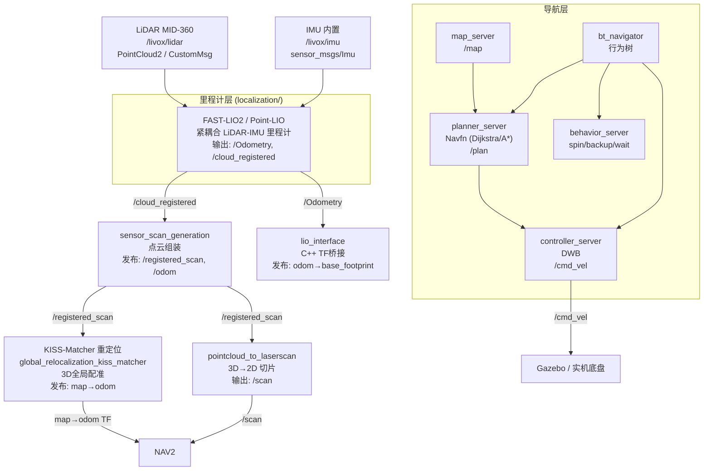
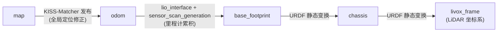
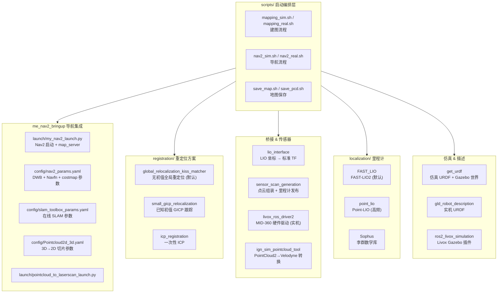
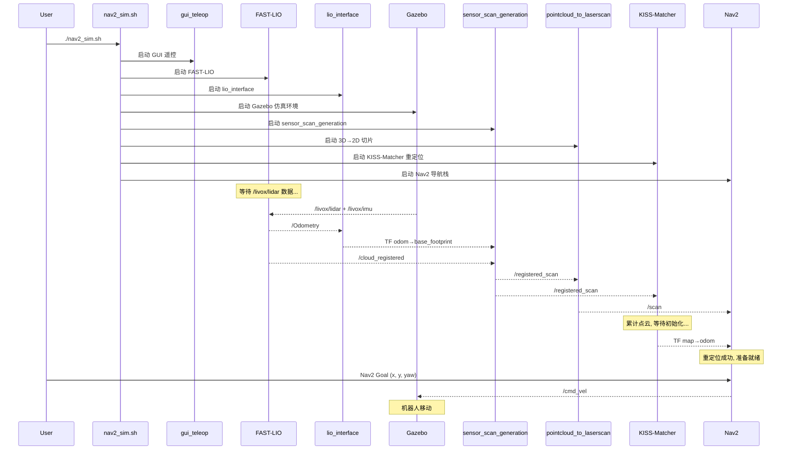

# 3d_nav_ws 架构文档

## 1. 数据管线

## 2. TF 坐标树

| TF 边 | 发布者 | 类型 | 含义 |
|--------|--------|------|------|
| `map → odom` | KISS-Matcher / small_gicp | 动态 | 全局重定位修正，漂移补偿 |
| `odom → base_footprint` | lio_interface + sensor_scan_generation | 动态 | 里程计累积位姿 |
| `base_footprint → chassis` | robot_state_publisher (URDF) | 静态 | 机器人几何中心到底盘 |
| `chassis → livox_frame` | robot_state_publisher (URDF) | 静态 | LiDAR 安装外参 |

## 3. 节点拓扑 & 通信接口

### 3.1 完整拓扑图

```mermaid
graph TB
    subgraph DRIVER["驱动层"]
        LIDAR_DRV["livox_ros_driver2<br>/livox/lidar → PointCloud2<br>/livox/imu → Imu"]
        GAZ_SIM["ros2_livox_simulation<br>Gazebo LiDAR 射线插件"]
    end

    subgraph ODOM["里程计层"]
        FASTLIO["fast_lio<br>订阅: /livox/lidar, /livox/imu<br>发布: /Odometry, /cloud_registered"]
    end

    subgraph BRIDGE["桥接层"]
        LIOIF["lio_interface<br>订阅: /Odometry<br>发布 TF: odom→base_footprint"]
        SENSOR["sensor_scan_generation<br>订阅: /cloud_registered<br>发布: /registered_scan, /odom<br>发布 TF: odom→base_footprint"]
        PC2L["pointcloud_to_laserscan<br>订阅: /registered_scan<br>发布: /scan"]
        SIMTOOL["ign_sim_pointcloud_tool<br>PointCloud2→Velodyne<br>(仅 Point-LIO 仿真需要)"]
    end

    subgraph RELOC["重定位层"]
        KISS["global_relocalization_kiss_matcher<br>订阅: /registered_scan<br>查询 TF: base_footprint→livox_frame<br>发布 TF: map→odom<br>Action: /navigate_to_pose"]
        SGICP["small_gicp_relocalization<br>订阅: /registered_scan<br>发布 TF: map→odom"]
        ICP["icp_registration<br>一次性 ICP<br>发布 TF: map→odom (仅启动时)"]
    end

    subgraph NAV["导航层 (Nav2)"]
        MAPSRV["map_server<br>服务: /map_server/load_map<br>主题: /map (OccupancyGrid)"]
        BTNAV["bt_navigator<br>Action Server: /navigate_to_pose<br>/navigate_through_poses"]
        PLANNER["planner_server<br>Action: /compute_path_to_pose<br>发布: /plan (Path)"]
        CONTROLLER["controller_server<br>Action: /follow_path<br>发布: /cmd_vel (Twist)"]
        SMOOTHER["smoother_server<br>发布: /plan_smoothed"]
        BEHAVIOR["behavior_server<br>recovery 行为: spin/backup/wait"]
        WAYPOINT["waypoint_follower<br>Action: /follow_waypoints"]
        VEL_SMOOTH["velocity_smoother<br>订阅: /cmd_vel (raw)<br>发布: /smoothed_cmd_vel"]
        COSTMAP_G["global_costmap<br>发布: /global_costmap/costmap"]
        COSTMAP_L["local_costmap<br>发布: /local_costmap/costmap"]
    end

    subgraph UI["用户交互"]
        RViz["RViz2<br>Nav2 Goal → /navigate_to_pose Action<br>2D Pose Estimate → /initialpose<br>显示: /map, /scan, /plan, /costmap"]
        GUI["gui_teleop<br>发布: /cmd_vel (手动遥控)"]
    end

    %% 数据流
    LIDAR_DRV -->|"/livox/lidar"| FASTLIO
    LIDAR_DRV -->|"/livox/imu"| FASTLIO
    FASTLIO -->|"/Odometry"| LIOIF
    FASTLIO -->|"/cloud_registered"| SENSOR
    SENSOR -->|"/registered_scan"| PC2L
    SENSOR -->|"/registered_scan"| KISS
    SENSOR -->|"/registered_scan"| SGICP
    SENSOR -->|"/registered_scan"| ICP
    PC2L -->|"/scan"| COSTMAP_G
    PC2L -->|"/scan"| COSTMAP_L
    KISS -->|"TF map→odom"| COSTMAP_G
    KISS -->|"TF map→odom"| COSTMAP_L
    MAPSRV -->|"/map"| COSTMAP_G
    PLANNER -->|"/plan"| CONTROLLER
    PLANNER -->|"/plan"| RViz
    CONTROLLER -->|"raw /cmd_vel"| VEL_SMOOTH
    VEL_SMOOTH -->|"/cmd_vel (smoothed)"| GAZ_SIM
    RViz -->|"Action /navigate_to_pose"| BTNAV
    GUI -->|"/cmd_vel"| GAZ_SIM
```

### 3.2 话题一览

| 话题 | 消息类型 | 方向 | 发布者 → 订阅者 |
|------|----------|------|-----------------|
| `/livox/lidar` | PointCloud2 / CustomMsg | 传感器 | livox_ros_driver2 → fast_lio |
| `/livox/imu` | sensor_msgs/Imu | 传感器 | livox_ros_driver2 → fast_lio |
| `/Odometry` | nav_msgs/Odometry | 里程计 | fast_lio → lio_interface |
| `/cloud_registered` | PointCloud2 | 里程计 | fast_lio → sensor_scan_generation |
| `/registered_scan` | PointCloud2 | 点云 | sensor_scan_generation → pointcloud_to_laserscan / KISS-Matcher |
| `/scan` | LaserScan | 2D扫描 | pointcloud_to_laserscan → Nav2 costmaps |
| `/map` | OccupancyGrid | 地图 | map_server → global_costmap / RViz |
| `/plan` | Path | 规划 | planner_server → controller_server / RViz |
| `/cmd_vel` | Twist | 控制 | Nav2 / gui_teleop → 底盘 |
| `/global_costmap/costmap` | OccupancyGrid | 可视化 | Nav2 → RViz |
| `/local_costmap/costmap` | OccupancyGrid | 可视化 | Nav2 → RViz |
| `/initialpose` | PoseWithCovarianceStamped | 输入 | RViz → KISS-Matcher |
| `/clock` | Clock | 时钟 | Gazebo → 所有节点 |

### 3.3 Action 一览

| Action | Action Server | Action Client |
|--------|---------------|---------------|
| `/navigate_to_pose` | bt_navigator | RViz (Nav2 Goal) / send_goal.py |
| `/navigate_through_poses` | bt_navigator | waypoint_follower |
| `/compute_path_to_pose` | planner_server | bt_navigator |
| `/follow_path` | controller_server | bt_navigator |
| `/follow_waypoints` | waypoint_follower | bt_navigator |
| `/spin` `/backup` `/wait` | behavior_server | bt_navigator |

### 3.4 服务一览

| 服务 | 服务端 | 说明 |
|------|--------|------|
| `/map_server/load_map` | map_server | 加载静态 OccupancyGrid 地图 |
| `/map_save` | SLAM Toolbox (建图模式) | 保存 PCD 点云 |
| `/map_server/map` | map_server | 获取当前地图 |

## 4. 包分层

## 5. 启动时序

## 6. 关键约束

### 6.1 互斥规则
- **同一时间只能有一个节点发布 `map → odom`**。KISS-Matcher、small_gicp、ICP 三选一。
- `/cmd_vel` 频道同一时间只能有一个发布者（Nav2 或 gui_teleop）。

### 6.2 时间同步
| 模式 | 时钟源 | `use_sim_time` |
|------|--------|----------------|
| 仿真 | `/clock` (Gazebo) | `true` |
| 实机 | 系统时钟 | `false` |

**所有节点必须统一**，否则 TF 时间戳不匹配导致 `Transform data too old` 错误。

### 6.3 重定位初始化
- KISS-Matcher 需要累计足够的 `/registered_scan` 点云才能完成全局初始化。
- 启动后让机器人**原地缓慢旋转几圈**加速初始化。
- 日志出现 `KISSMatcher initialization succeeded` 表示成功。

### 6.4 LIO 后端
| | FAST-LIO (默认) | Point-LIO |
|--|-----------------|-----------|
| LiDAR 格式 | PointCloud2 (`xfer_format=0`) | CustomMsg (`xfer_format=1`) |
| 输出话题 | `/Odometry` | `/aft_mapped_to_init` |
| 额外依赖 | 无 | ign_sim_pointcloud_tool (仿真) |

**不可混用** — `lidar_type` 枚举值定义不同。
