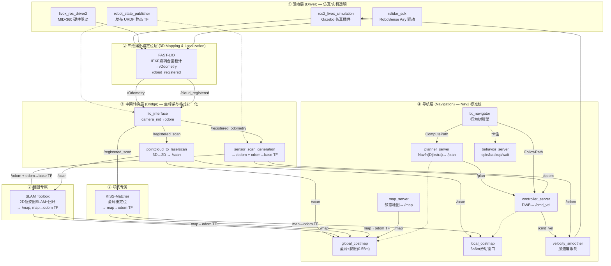
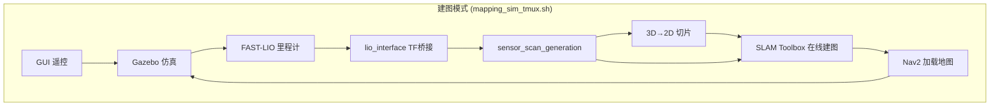
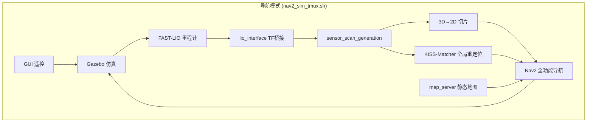

# 3d_nav_ws 仿真建图与导航 — 节点架构详解

## 1. 分层架构概览

系统按职责划分为四层。每一层只依赖下一层的输出，上层不需要知道下层的内部实现。

### 四层架构总图



### 建图 vs 导航模式对比





### 建图 vs 导航的层差异

| 层 | 建图模式 | 导航模式 |
|----|----------|----------|
| ① 驱动层 | Gazebo 仿真插件 | Gazebo 仿真插件 |
| ② 定位层 | FAST-LIO + **SLAM Toolbox** | FAST-LIO + **KISS-Matcher** + **map_server** |
| ③ 转换层 | 完全相同 | 完全相同 |
| ④ 导航层 | Nav2 仅加载，不发送目标 | Nav2 全功能运行 |

---

## 2. 各层详解

### 2.0 驱动层 (Driver Layer)

**职责**：将物理传感器（或仿真器）的原始数据流转发为 ROS 2 标准消息，对上层完全透明。

**核心原则**：上层不关心数据来自真实 LiDAR 还是 Gazebo 仿真——话题名和消息类型一致。

```
实机: RoboSense Airy → rslidar_sdk → /rslidar_points (PointCloud2)
                                       /rslidar_imu_data (Imu)

实机: Livox MID-360 → livox_ros_driver2 → /livox/lidar (PointCloud2)
                                           /livox/imu (Imu)

仿真: Gazebo 世界 → ros2_livox_simulation → /livox/lidar (PointCloud2)
                                             /livox/imu (Imu)
```

**驱动层包含：**

| 组件 | 环境 | 功能 |
|------|------|------|
| `ros2_livox_simulation` | 仿真 | Gazebo 插件，模拟 Livox MID-360 非重复扫描模式 |
| `livox_ros_driver2` | 实机 | Livox SDK2 封装，支持 PointCloud2 和 CustomMsg 两种格式 |
| `rslidar_sdk` | 实机 (Airy) | RoboSense 官方驱动 |
| `robot_state_publisher` | 仿真+实机 | 从 URDF 发布 `base_footprint→chassis→livox_frame` 静态 TF |
| `ign_sim_pointcloud_tool` | 仿真 (Point-LIO) | PointCloud2→Velodyne 格式转换，为 Point-LIO 补齐 ring/time 字段 |

**驱动层不做什么**：不做任何坐标变换、不融合传感器数据、不做滤波。这些全是上层的事。

---

### 2.1 三维建图与定位层 (3D Mapping & Localization Layer)

**职责**：从原始 LiDAR/IMU 数据中估计机器人的 6-DoF 位姿，构建环境地图，提供全局定位。

这一层是整个系统的核心——它的精度直接决定导航的成败。

#### 2.1.1 FAST-LIO — LiDAR-IMU 紧耦合里程计

**解决什么问题**：单独用 LiDAR 或 IMU 估计位姿都有致命缺陷。LiDAR 在退化场景（长走廊、开阔地）会发散；IMU 积分累积漂移。FAST-LIO 把两者紧耦合在同一个迭代卡尔曼滤波器中，互补短处。

**核心算法**：IEKF (Iterated Error-State Kalman Filter) + ikd-Tree 增量 KD 树

```
IMU 数据 (200Hz)                     LiDAR 数据 (10Hz)
     │                                      │
     ▼                                      ▼
 中值积分前向传播                     去畸变 (反向传播)
 (预测当前位姿)                       │
     │                                ▼
     │                          ikd-Tree 最近邻搜索
     │                          平面拟合 + 点面残差
     │                                │
     └──────── IEKF 迭代更新 ─────────┘
              (4 次迭代)
                   │
         ┌────────┴────────┐
         ▼                 ▼
    /Odometry        /cloud_registered
   (camera_init→body)  (去畸变后点云)
```

**为什么叫"紧耦合"**：IMU 的预积分项和 LiDAR 的点面距离残差在同一个优化目标函数中联合求解，不是先积分 IMU 再拿 IMU 结果去校正 LiDAR。

#### 2.1.2 SLAM Toolbox — 2D 在线建图（建图模式）

**解决什么问题**：FAST-LIO 只有局部里程计，没有全局一致性。机器人在大环境中走了几百米后，里程计漂移累积了几十厘米，地图必然变形。SLAM Toolbox 通过回环检测发现"这个地方我来过"，用图优化消除累积漂移。

**核心算法**：基于 Karto 的位姿图 SLAM

```
/scan (LaserScan) + odom TF
        │
        ▼
   Scan Matcher (关联当前帧与局部子图)
        │
        ▼
   位姿图 (Pose Graph)
   ├── 节点: 机器人历史位姿
   ├── 边 (odom): 里程计约束
   └── 边 (loop): 回环检测约束
        │
        ▼
   SPA 求解器 (Sparse Pose Adjustment)
        │
   ┌────┴────┐
   ▼         ▼
  /map    map→odom TF
```

**建图 vs 导航的关键区别**：建图时 SLAM Toolbox 实时构建并发布 `/map` 和 `map→odom` TF。导航时 SLAM Toolbox 不启动——`/map` 由 map_server 从磁盘文件加载，`map→odom` 由 KISS-Matcher 发布。

#### 2.1.3 KISS-Matcher — 全局重定位（导航模式）

**解决什么问题**：导航启动时，机器人物理位置和地图坐标系没有任何几何关系。KISS-Matcher 回答"机器人在已知地图中的哪个位置"——把当前的 LiDAR 扫描和历史 PCD 地图对齐，输出 `map→odom` TF。

**两阶段策略**：

```
阶段 1: 全局粗配准 (无初值)
    FPFH 特征提取 → TEASER++ 鲁棒匹配 → small_gicp 精配准
    相当于"在整张地图中搜索当前扫描的最佳匹配位置"

阶段 2: 连续跟踪 (有初值)
    以上一帧 map→odom 为初值 → small_gicp 局部配准
    相当于"已知大致位置，微调对齐"
```

**为什么需要两阶段**：全局配准慢但不需要初值，连续跟踪快但需要初值。两者互补，启动时跑一次全局初始化，之后持续跟踪即可。

---

### 2.2 中间转换层 (Bridge Layer)

**职责**：把定位层的"传感器中心"输出转换为导航层的"机器人中心"标准格式。

这一层解决了定位层和导航层之间的 **坐标系不匹配** 和 **消息格式不匹配**。

#### 2.2.1 lio_interface — 坐标系归一化

```
问题：FAST-LIO 输出 /Odometry 在 camera_init 坐标系
      Nav2 期望位姿在 odom 坐标系

解决：查 base_footprint→livox_frame 静态 TF（URDF）
     在启动第一帧建立 camera_init→odom 的初始对齐
     后续每帧把 LIO 位姿转到 odom 系
```

**为什么不直接在 FAST-LIO 里改坐标系**：解耦。换用 Point-LIO、换传感器型号、换机器人，只改这一层，导航层完全不受影响。

#### 2.2.2 sensor_scan_generation — 发布 odom→base_footprint TF 和 /odom

```
问题：FAST-LIO 只发布 LiDAR 的位姿 (odom→livox_frame)
     Nav2 需要机器人的位姿 (odom→base_footprint)

解决：TF 链式乘法
     odom→base_footprint = odom→livox_frame × livox_frame→base_footprint
     (LIO 输出)            (URDF 静态 TF)
```

同时通过相邻帧位姿差分计算机器人速度，发布 `/odom`（Nav2 controller_server 的必读话题）。

**这一层是整个系统中最关键的节点**：如果它挂了，Nav2 的所有 TF 查询超时，整个导航栈不可用。

#### 2.2.3 pointcloud_to_laserscan — 3D → 2D 切片

```
问题：FAST-LIO 输出 3D 点云 (PointCloud2, ~30,000 点/帧)
     Nav2 代价地图需要 2D 激光扫描 (LaserScan, ~720 角度/帧)

解决：在 livox_frame 坐标系下
     1) 高度裁剪 [0.2m, 1.0m]（去掉地面和天花板）
     2) 360° 按角度分 720 个桶 (0.5° 一个)
     3) 每个桶取最近点到原点的距离 → ranges[i]
```

---

### 2.3 导航层 (Navigation Layer)

**职责**：给定目标位姿，规划无碰路径并控制机器人沿路径行驶。

这一层是 ROS 2 Nav2 框架的标准实现，8 个子节点各司其职。

#### 架构全景

```
                       /navigate_to_pose (Action)
                              │
                              ▼
                      bt_navigator (行为树)
                       ├── ComputePathToPose ──→ planner_server
                       │                              │
                       │                          /plan (Path)
                       │                              │
                       ├── FollowPath ──────────→ controller_server
                       │                              │
                       │                          /cmd_vel (Twist)
                       │                              │
                       └── Recovery (如果卡住)
                            ├── spin (旋转清代价地图)
                            ├── backup (倒车)
                            └── wait (等待)
```

#### 各子节点角色

| 子节点 | 角色 | 类比 |
|--------|------|------|
| `bt_navigator` | 总指挥，管理导航任务的完整生命周期 | 大脑 |
| `planner_server` | 在全局代价地图上计算最优路径 | 导航软件 |
| `controller_server` | 在线执行路径跟随，实时避障 | 司机 |
| `map_server` | 加载静态占据栅格地图 | GPS 地图 |
| `global_costmap` | 全局地图 + 动态障碍物 + 膨胀 | 全局视野 |
| `local_costmap` | 机器人周围 6×6m 滑动窗口 | 近场视野 |
| `behavior_server` | 卡住时执行恢复动作 | 脱困模式 |
| `smoother_server` | 平滑 planner 输出的折线路径 | 路径美化 |
| `waypoint_follower` | 依次导航到多个航点 | 多目的地 |
| `velocity_smoother` | 加速度限制，防急加速 | 缓启动 |

#### 代价地图的双层设计

```
global_costmap                  local_costmap
─────────────                   ─────────────
坐标系: map                     坐标系: odom
大小: 覆盖整个地图               大小: 6×6m 滑动窗口
图层: static+obstacle+inflation 图层: obstacle+inflation
用途: planner 全局路径规划       用途: controller 局部避障
更新: 5Hz                       更新: 20Hz
```

**为什么需要两层**：planner 需要全局视野来规划"绕一大圈"的长路径；controller 只需要局部视野来做高速避障。两者在不同坐标系、不同频率下独立更新，互不干扰。

**膨胀层的作用**：在障碍物周围生成 cost 衰减梯度——

```
障碍物边缘 → cost=254 (致命)
    0.2m   → cost=128
    0.35m  → cost=64
    0.55m  → cost=0   (安全)
```

planner 规划时避开高 cost 区域而非严格避开障碍物边缘，这样路径离墙有一定安全距离。

---

## 3. 节点详解（逐节点参考）

### 2.1 Gazebo 仿真环境

| 属性 | 值 |
|------|-----|
| **启动方式** | `ros2 launch get_urdf get_urdf_launch.py` |
| **必要性** | 🔴 仿真模式必备，实机无需 |

**输入/输出：**

| 方向 | 话题/实体 | 格式 |
|------|-----------|------|
| 生成 | `robot_description` (topic) | URDF 字符串 |
| 生成 | LiDAR 射线传感器 | Gazebo 插件，输出 `/livox/lidar` (PointCloud2) |
| 生成 | IMU 传感器 | Gazebo 插件，输出 `/livox/imu` (sensor_msgs/Imu) |
| 接收 | `/cmd_vel` | geometry_msgs/Twist（驱动底盘） |

**内部流程：**

1. `robot_state_publisher` 加载 `simple_car.urdf`，发布静态 TF (`base_footprint→chassis→livox_frame`)
2. Gazebo 启动指定 `.world` 文件，加载环境模型
3. `spawn_entity.py` 在 Gazebo 中生成机器人模型
4. Livox 仿真插件模拟 MID-360 扫描，发布 `/livox/lidar` (PointCloud2, ~10Hz)

---

### 2.2 FAST-LIO（里程计核心）

| 属性 | 值 |
|------|-----|
| **包名** | `fast_lio_robosense`（也支持 `fast_lio`） |
| **可执行文件** | `fastlio_mapping` |
| **频率** | timer 100Hz，实际处理 ~10Hz（每帧 LiDAR 数据触发一次） |
| **必要性** | 🔴 整个系统的里程计核心 |

**输入：**

| 话题 | 格式 | 频率 | 用途 |
|------|------|------|------|
| `/livox/lidar` (仿真) / `/rslidar_points` (实机 Airy) | PointCloud2, ~20,000-30,000 点/帧 | ~10Hz | LiDAR 扫描 |
| `/livox/imu` (仿真) / `/rslidar_imu_data` (实机 Airy) | sensor_msgs/Imu | ~200Hz | IMU 加速度+角速度 |

**输出：**

| 话题 | 格式 | 频率 | 用途 |
|------|------|------|------|
| `/Odometry` | nav_msgs/Odometry | ~10Hz | LIO 估计位姿 (camera_init→body) |
| `/cloud_registered` | PointCloud2 | ~10Hz | 去畸变后的点云 |
| `/path` | nav_msgs/Path | ~1Hz | 轨迹可视化 |

**内部处理管线（timer_callback，实际约 10Hz 触发）：**

```
standard_pcl_cbk  (IMU callback 也在并行写 buffer)
    │
    ▼
sync_packages(Measures)
    │ 从 lidar_buffer 取一帧 + 对应的 imu_buffer 数据
    ▼
p_imu->Process(Measures, kf, feats_undistort)
    │  ① IMU 前向传播（中值积分）→ 预测位姿
    │  ② 反向传播去畸变 → feats_undistort
    ▼
lasermap_fov_segment()
    │  滑动窗口管理：机器人移出局部地图范围时删除远处 KD-Tree 节点
    ▼
downSizeFilterSurf.filter()  // 体素降采样 filter_size_surf=0.5m
    │  ~30,000 点 → ~3,000 点
    ▼
kf.update_iterated_dyn_share_modified()  // IEKF 迭代更新（默认 4 次）
    │  h_share_model():
    │    ├── ikdtree.Nearest_Search → 5 个最近邻
    │    ├── esti_plane() → 平面拟合
    │    └── 雅可比矩阵 H 构造
    ▼
publish_odometry()    → /Odometry + camera_init→body TF
map_incremental()     → ikdtree.Add_Points()
publish_frame_world() → /cloud_registered
```

**必要性举例：** 如果没有 FAST-LIO，系统就没有里程计——不知道机器人在哪、朝什么方向。Nav2 的代价地图、KISS-Matcher 的重定位、SLAM Toolbox 的建图全部依赖 FAST-LIO 输出的 `/Odometry` 和 `/cloud_registered`。

---

### 2.3 lio_interface（TF 桥接 + 点云转发）

| 属性 | 值 |
|------|-----|
| **包名** | `lio_interface` |
| **可执行文件** | `lio_interface_node` |
| **必要性** | 🟡 解耦传感器和导航的标准桥接层 |

**输入：**

| 话题 | 格式 | 用途 |
|------|------|------|
| `/Odometry` | nav_msgs/Odometry (camera_init→body) | FAST-LIO 原始位姿 |
| `/cloud_registered` | PointCloud2（camera_init 系） | FAST-LIO 输出去畸变点云 |

**输出：**

| 话题 | 格式 | 用途 |
|------|------|------|
| `/registered_odometry` | nav_msgs/Odometry (odom→livox_frame) | 标准 odom 系位姿 |
| `/registered_scan` | PointCloud2（odom 系） | 转换后的点云 |

**内部流程：**

```
odometryCallback()
    │  首次：查 base_footprint→livox_frame 静态 TF → tf_odom_to_lidar_odom_
    │  此后：tf_lidar_odom * tf_odom_to_lidar_odom_ → odom 系位姿
    ▼  publish /registered_odometry

pointCloudCallback()
    │  pcl_ros::transformPointCloud("odom", tf, cloud_registered → registered_scan)
    │  逐个点应用 4×4 刚体变换（~30,000 点 × 矩阵乘法）
    ▼  publish /registered_scan
```

**为什么需要这个节点：** FAST-LIO 输出在 `camera_init` 坐标系（世界原点即开机位置），但 Nav2 使用 `odom` 坐标系。`lio_interface` 做两件事：(1) 把 LIO 内部坐标映射到 `odom` 系，(2) 统一输出接口——无论后端是 FAST-LIO 还是 Point-LIO，下游节点看到的话题名不变。

---

### 2.4 sensor_scan_generation（里程计 + TF 发布）

| 属性 | 值 |
|------|-----|
| **包名** | `sensor_scan_generation` |
| **可执行文件** | `sensor_scan_generation` |
| **必要性** | 🔴 发布 `odom→base_footprint` TF 和 `/odom`，Nav2 直接依赖 |

**输入：**

| 话题 | 格式 | 用途 |
|------|------|------|
| `/registered_scan` | PointCloud2 (odom 系) | 用于时间戳对齐 |
| `/registered_odometry` | nav_msgs/Odometry (odom→livox_frame) | LiDAR 在 odom 系位姿 |

**输出：**

| 话题/TF | 格式 | 用途 |
|---------|------|------|
| `odom→base_footprint` TF | TransformStamped, ~10Hz | **Nav2 直接依赖** |
| `/odom` | nav_msgs/Odometry | Nav2 里程计输入 |
| `/lidar_frame_pcd` | PointCloud2 | 可视化用 |

**内部流程：**

```
laserCloudAndOdometryHandler()   // message_filter ApproximateTime 同步后触发
    │
    ├── tf_buffer->lookupTransform(livox_frame→base_footprint)
    │       查询 URDF 提供的静态 TF
    │
    ├── tf_odom_to_base = tf_odom_to_livox × tf_livox_to_base
    │       链式 TF 乘法
    │
    ├── publishTransform(odom→base_footprint)   ← Nav2 等这一条
    ├── publishOdometry(odom→base_footprint)
    │       static 变量存上一帧位姿，差分计算线速度/角速度
    │
    └── pcl_ros::transformPointCloud(livox_frame)
            点云从 odom 系转回 livox_frame 系
```

**必要性举例：** 如果注释掉 `sensor_scan_generation`，Nav2 的 controller_server 和 planner_server 全部报错——它们订阅 `/odom` 并查询 `odom→base_footprint` TF 来获取机器人实时位姿。

---

### 2.5 3D→2D 切片 (pointcloud_to_laserscan)

| 属性 | 值 |
|------|-----|
| **包名** | `pointcloud_to_laserscan` (ROS 2 内置包) |
| **启动文件** | `me_nav2_bringup/launch/pointcloud_to_laserscan_launch.py` |
| **必要性** | 🔴 Nav2 costmap 需要 LaserScan 格式 |

**输入：**

| 话题 | 格式 | 用途 |
|------|------|------|
| `/registered_scan` | PointCloud2 (odom 系) | 3D 点云 |

**输出：**

| 话题 | 格式 | 用途 |
|------|------|------|
| `/scan` | sensor_msgs/LaserScan | 2D 激光扫描 |

**切片参数 (Pointcloud2d_3d.yaml)：**

| 参数 | 值 | 含义 |
|------|-----|------|
| `target_frame` | `livox_frame` | 在 LiDAR 坐标系下切片 |
| `min_height` | 0.2m | 切掉地面 |
| `max_height` | 1.0m | 切掉车顶以上 |
| `angle_increment` | 0.0087 rad (~0.5°) | 角分辨率 |
| `range_max` | 70m | 最远距离 |

**内部原理：** 对 3D 点云取 `[min_height, max_height]` 高度范围的 z 轴切片，在 XY 平面按角度分桶，每个桶取最近点作为距离值，输出标准 LaserScan。

---

### 2.6 SLAM Toolbox（建图模式专属）

| 属性 | 值 |
|------|-----|
| **包名** | `slam_toolbox` |
| **模式** | online_async（在线异步 SLAM） |
| **必要性** | 🔴 建图模式必备，导航模式**不需要** |

**输入：** `/scan` (LaserScan), `odom→base_footprint` TF

**输出：** `/map` (OccupancyGrid), `map→odom` TF (回环修正)

**内部原理：** 基于 Karto 的图优化 SLAM。接收 LaserScan + 里程计构建位姿图，scan matching 检测回环，SPA 求解器优化全局一致性。

**保存地图：**
```bash
./scripts/save_map.sh    # → src/me_nav2_bringup/map/
./scripts/save_pcd.sh    # → src/me_nav2_bringup/pcd/
```

---

### 2.7 KISS-Matcher 全局重定位（导航模式专属）

| 属性 | 值 |
|------|-----|
| **包名** | `global_relocalization_kiss_matcher` |
| **可执行文件** | `global_kiss_matcher_relocalization_exec` |
| **必要性** | 🔴 导航模式必备（无初始位姿时），建图模式**不需要** |

**输入：** `/registered_scan` (PointCloud2), 参数 `prior_pcd_file` (.pcd 先验地图), `base_footprint→livox_frame` TF

**输出：** `map→odom` TF（全局重定位修正）

**内部流程（两阶段）：**

```
阶段 1: 全局初始化 (KISS-Matcher)
    │  累计 /registered_scan，加载先验 PCD 地图
    │  FPFH 特征提取 + TEASER++ 鲁棒粗配准 + small_gicp 精配准
    │  日志: "KISSMatcher initialization succeeded"

阶段 2: 连续跟踪 (small_gicp)
    │  以上一帧位姿为初值，/registered_scan vs prior_pcd 的 GICP 配准
    │  持续更新 map→odom TF
    │  连续失败 → 自动重新全局初始化
```

**必要性举例：** 导航启动时，机器人物理位置 (`odom` 系) 和地图 (`map` 系) 没有对齐关系。KISS-Matcher 通过匹配 LiDAR 扫描和历史 PCD 地图算出 `map→odom` 变换，Nav2 才能把里程计位姿转到 map 系做路径规划。

---

### 2.8 Nav2 导航栈

| 属性 | 值 |
|------|-----|
| **启动文件** | `me_nav2_bringup/launch/my_nav2_launch.py` |
| **配置文件** | `config/nav2_params.yaml` |
| **必要性** | 🔴 导航核心 |

包含 8 个子节点：

**map_server** — 从文件加载 `/map` (OccupancyGrid)。建图模式由 SLAM Toolbox 替代。

**planner_server** — Navfn (Dijkstra) 全局规划器。在 global_costmap 上搜索避障路径，输出 `/plan` (Path)。

**controller_server** — DWB 局部控制器。在 local_costmap (6×6m 滑动窗口) 内采样 400 条轨迹，7 个评价函数打分（避障/路径对齐/目标对齐/距离/旋转），选最优轨迹发 `/cmd_vel` (Twist)。参数: max_vel_x=0.26 m/s, max_vel_theta=1.0 rad/s, xy_goal_tolerance=0.035m。

**bt_navigator** — 行为树引擎。`/navigate_to_pose` Action → ComputePathToPose → FollowPath → 卡住则 Recovery (Spin/BackUp/Wait) → 重规划。

**behavior_server** — spin(原地旋转清代价地图), backup(倒车), wait(等待)。

**smoother_server** — 对全局路径做样条平滑。

**waypoint_follower** — 顺序导航途经多航点。

**velocity_smoother** — OPEN_LOOP 模式，对 cmd_vel 做加速度限制。

---

### 2.9 代价地图

| | global_costmap | local_costmap |
|---|---|---|
| 坐标系 | `map` | `odom` |
| 大小 | 由 `/map` 决定 | 6×6m 滑动窗口 |
| 分辨率 | 0.05m | 0.05m |
| 图层 | static + obstacle + inflation | obstacle + inflation |
| 膨胀半径 | 0.55m | 0.55m |
| 更新频率 | 5Hz | 20Hz |

---

### 2.10 GUI 遥控 (gui_teleop)

| 属性 | 值 |
|------|-----|
| **包名** | `gui_teleop` |
| **实现** | Python tkinter |
| **必要性** | 🟢 非必须，可用键盘替代 |

**输出：** `/cmd_vel` (Twist)。WASD=移动，Shift=加速，空格=急停。GUI 滑块实时调节速度倍率 (0.1x~3.0x)。

---

## 3. 数据格式速查

| 消息类型 | 关键字段 | 典型大小 |
|---------|---------|---------|
| `PointCloud2` | `data` (序列化点数组), `fields`, `height`, `width` | 降采样 ~50KB, 全量 ~500KB |
| `LaserScan` | `ranges[]`, `angle_min/max/increment`, `range_min/max` | ~4KB |
| `Odometry` | `pose.pose`, `twist.twist`, `child_frame_id` | ~200B |
| `OccupancyGrid` | `data[]` (0-100), `info.resolution/origin/width/height` | 按地图大小 |
| `Twist` | `linear.x/y/z`, `angular.x/y/z` | ~100B |
| `Imu` | `angular_velocity`, `linear_acceleration`, `orientation` | ~200B |
| `TransformStamped` | `transform.translation/rotation`, `child_frame_id` | ~150B |

---

## 4. TF 树完整链路

```
map ──(KISS-Matcher/SLAM)──→ odom ──(sensor_scan_generation)──→ base_footprint
                                                                     │
                                                (robot_state_publisher, URDF)
                                                                     │
                                                                     ▼
                                                                  chassis
                                                                     │
                                                (robot_state_publisher, URDF)
                                                                     │
                                                                     ▼
                                                                livox_frame
```

| TF 边 | 发布者 | 类型 | 含义 |
|--------|--------|------|------|
| `map→odom` | KISS-Matcher (导航) / SLAM Toolbox (建图) | 动态 | 全局修正 |
| `odom→base_footprint` | sensor_scan_generation | 动态 ~10Hz | 实时里程计 |
| `base_footprint→chassis` | robot_state_publisher (URDF) | 静态 | 几何中心 |
| `chassis→livox_frame` | robot_state_publisher (URDF) | 静态 | LiDAR 外参 |

---

## 5. 操作指南

### 建图流程

```bash
source install/setup.bash
./scripts/mapping_sim_tmux.sh
# 驾驶机器人遍历环境后：
./scripts/save_map.sh    # → src/me_nav2_bringup/map/
./scripts/save_pcd.sh    # → src/me_nav2_bringup/pcd/
./scripts/kill_mapping_sim.sh
```

### 导航流程

```bash
# 确保地图和 PCD 路径正确
vim src/me_nav2_bringup/launch/my_nav2_launch.py  # map_yaml_file
vim src/registration/global_relocalization_kiss_matcher/launch/...py  # prior_pcd_file

source install/setup.bash
./scripts/nav2_sim_tmux.sh
# RViz "Nav2 Goal" 或命令行：
ros2 run me_nav2_bringup send_goal.py --ros-args -p x:=3.0 -p y:=-1.0 -p yaw:=0.0
```
