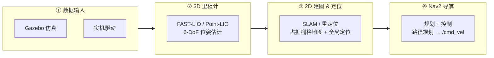
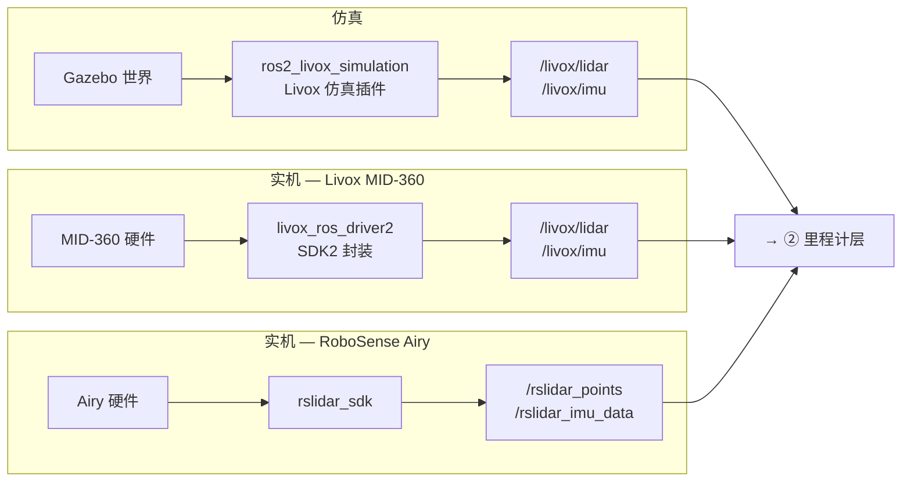
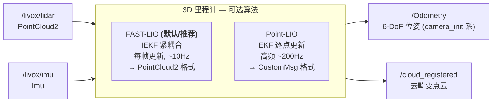
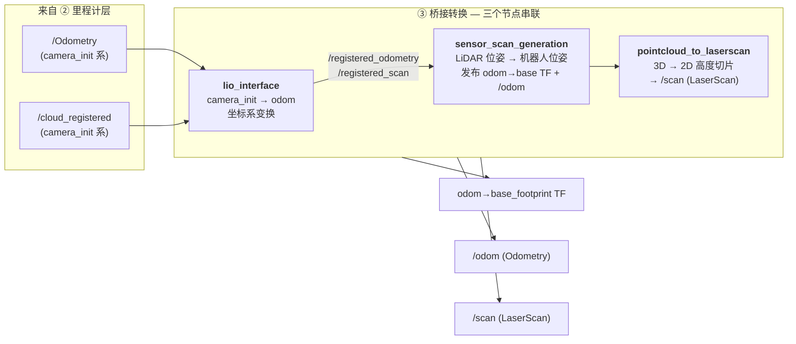
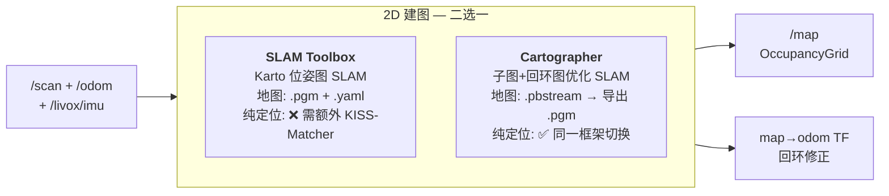
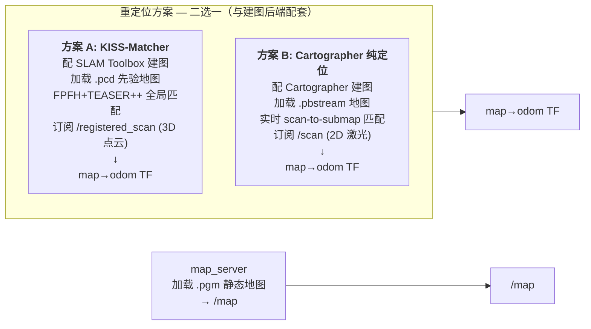
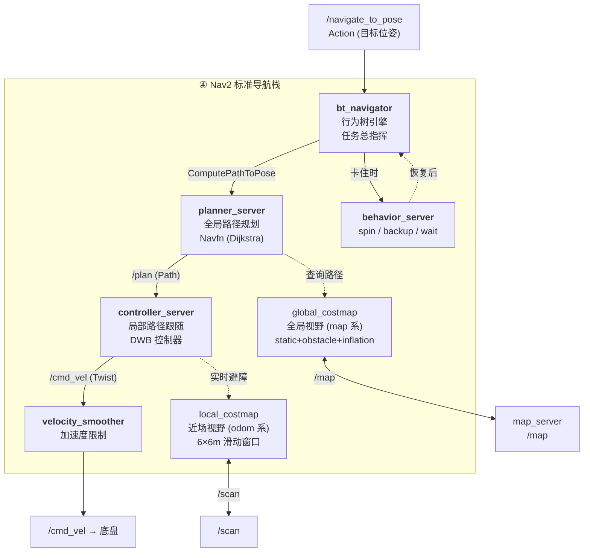

# LIO_Nav2_ROS2 架构详解

> 本文档从**粗到细**介绍项目架构：先理解各模块"做什么"，再深入"有哪些选项、怎么选、话题接口是什么"。

---

## 1. 总览：数据如何从传感器流到车轮

整个系统可看作一条四级流水线：



| 层 | 输入 | 输出 | 核心问题 |
|----|------|------|----------|
| ① 数据输入 | 物理/仿真传感器 | `/livox/lidar` ` /livox/imu` | 把原始数据变成 ROS 2 标准消息 |
| ② 3D 里程计 | 点云 + IMU | `/Odometry` ` /cloud_registered` | 我在哪？朝向哪？（局部，每帧） |
| ③ 2D 建图定位 | 里程计 + 3D 点云 | `/map` ` map→odom` TF | 环境长什么样？我在地图中的哪里？（全局） |
| ④ Nav2 导航 | 地图 + 定位 + `/scan` | `/cmd_vel` | 怎么从 A 安全走到 B？ |

**关键理解**：每层只依赖下一层的输出。第④层不知道也不关心里程计是 FAST-LIO 还是 Point-LIO——它只知道有 `odom→base_footprint` TF 和 `/scan`。

---

## 2. 各模块粗览 —— 谁做什么

### 2.1 数据输入层 —— 传感器从哪来



**任务**：让上层不管数据来自仿真还是实机，看到的话题名和消息类型一致。每类驱动只负责"把硬件数据转成 ROS 2 标准消息"，不做任何滤波或变换。

---

### 2.2 3D 里程计层 —— 实时位姿估计



**任务**：回答"此时此刻我在哪、朝向哪"。高频（~10Hz）、局部（原点=开机位置）、6-DoF。**不建图、不做全局修正**。

> **怎么选**：仿真和一般实机用 **FAST-LIO**（仿真直接可用，无需额外转换）。Point-LIO 适合高动态场景（无人机/手持），仿真下需要额外的 `ign_sim_pointcloud_tool` 做格式转换。

---

### 2.3 桥接转换层 —— 坐标系与格式归一化



**任务**：把"传感器中心"的输出转成"机器人中心"的格式。三个节点像流水线一样串联——`lio_interface` 做坐标系变换，`sensor_scan_generation` 发布机器人 TF，`pointcloud_to_laserscan` 把 3D 点云切成 2D 扫描。

> ⚠️ 这是整个栈最容易出问题的一层——`sensor_scan_generation` 发布的 `odom→base_footprint` TF 和 `/odom` 是 Nav2 的直接依赖，断了导航全挂。

---

### 2.4 2D 建图 & 定位层 —— 全局一致性

#### 建图模式



#### 导航模式



> **怎么配**：建图用 SLAM Toolbox → 导航用 **KISS-Matcher**（方案 A）。建图用 Cartographer → 导航用 **Cartographer 纯定位**（方案 B）。跨配不行——KISS 不认识 `.pbstream`，Cartographer 不认识 `.pcd`。

**任务**：回答"环境长什么样"（地图）和"我在这张地图的哪个位置"（全局定位）。建图模式下边跑边画地图；导航模式下加载已有地图，实时推算机器人在图中的位姿。

---

### 2.5 Nav2 导航层 —— 规划与控制



**任务**：给定目标位姿，规划无碰路径并控制机器人沿路径行驶。planner 看全局地图规划最优路径，controller 看局部代价地图实时避障。卡住时 behavior_server 自动执行 spin/backup 恢复动作。

---

## 3. 各模块细览 —— 选项、话题、参数

### 3.1 数据输入：仿真 vs 实机

#### 选项一览

| 选项 | 环境 | LiDAR 驱动 | 话题前缀 |
|------|------|-----------|----------|
| Gazebo 仿真 | 仿真 | `ros2_livox_simulation` | `/livox/` |
| Livox MID-360 | 实机 | `livox_ros_driver2` | `/livox/` |
| RoboSense Airy | 实机 | `rslidar_sdk` | `/rslidar_` |

#### 关键话题

| 话题 | 类型 | 频率 | 说明 |
|------|------|------|------|
| `/livox/lidar` | `PointCloud2` | ~10Hz | 3D 点云，~30,000 点/帧 |
| `/livox/imu` | `sensor_msgs/Imu` | ~200Hz | 6 轴 IMU（加速度+角速度） |
| `/clock` | `rosgraph_msgs/Clock` | 仿真特有 | Gazebo 仿真时钟 |

#### `use_sim_time` 规则

| 环境 | `use_sim_time` | 时钟源 |
|------|---------------|--------|
| 仿真 | `true` | `/clock` (Gazebo) |
| 实机 | `false` | 系统时钟 |

> **所有节点必须一致**，否则 TF 时间戳不匹配，出现 `Transform data too old` 错误。

---

### 3.2 3D 里程计：FAST-LIO vs Point-LIO

#### 选项对比

| | FAST-LIO | Point-LIO |
|--|----------|-----------|
| **算法** | IEKF (迭代卡尔曼滤波) | EKF (逐点更新) |
| **更新频率** | 每帧一次（~10Hz） | 逐点更新（~200Hz） |
| **LiDAR 格式要求** | `PointCloud2` (`xfer_format=0`) | `CustomMsg` (`xfer_format=1`) |
| **输出话题** | `/Odometry` | `/Odometry` (经 `ign_sim_pointcloud_tool` 后) |
| **仿真适配** | 直接可用 | 需 `ign_sim_pointcloud_tool` 做格式转换 |
| **适用场景** | 通用，仿真+实机 | 高动态场景（无人机、手持设备） |

> **推荐**：仿真和一般实机场景用 **FAST-LIO**。Point-LIO 的高频优势在低速地面机器人上不显著，且仿真需要额外的格式转换节点。

#### FAST-LIO 核心话题

| 方向 | 话题 | 类型 | 说明 |
|------|------|------|------|
| 订阅 | `/livox/lidar` | `PointCloud2` | 原始 LiDAR 点云 |
| 订阅 | `/livox/imu` | `Imu` | IMU 测量 |
| 发布 | `/Odometry` | `nav_msgs/Odometry` | 6-DoF 位姿，在 `camera_init` 坐标系 |
| 发布 | `/cloud_registered` | `PointCloud2` | 去畸变+配准后的点云 |
| 发布 | `/path` | `nav_msgs/Path` | 轨迹可视化 |

#### 关键参数（FAST-LIO `mapping.launch.py`）

| 参数 | 典型值 | 说明 |
|------|--------|------|
| `filter_size_surf` | 0.5m | 体素降采样，控制计算量 |
| `filter_size_map` | 0.5m | KD-Tree 地图体素分辨率 |
| `cube_side_length` | 1000m | 局部地图立方体边长 |
| `imu_en` | `true` | 启用 IMU 紧耦合 |

---

### 3.3 桥接转换：三个节点的职责链

#### 3.3.1 lio_interface —— 坐标系变换

**解决什么问题**：FAST-LIO 在 `camera_init` 系（开机时 LiDAR 位姿为原点）输出位姿，但 ROS 生态用 `odom` 坐标系。

**做法**：开机第一帧捕获 `camera_init→base_footprint` 的偏移，建立 `camera_init→odom` 的初始对齐，后续每帧做坐标变换。

| 方向 | 话题 | 说明 |
|------|------|------|
| 订阅 | `/Odometry` | FAST-LIO 位姿（`camera_init` 系） |
| 订阅 | `/cloud_registered` | 去畸变点云（`camera_init` 系） |
| 发布 | `/registered_odometry` | 位姿（`odom` 系） |
| 发布 | `/registered_scan` | 点云（`odom` 系） |

#### 3.3.2 sensor_scan_generation —— 机器人位姿发布

**解决什么问题**：FAST-LIO 只知道 LiDAR 在哪，Nav2 需要知道**机器人中心**（`base_footprint`）在哪。

**做法**：查 URDF 的静态 TF `livox_frame→base_footprint`，链式乘法算出 `odom→base_footprint`，同时差分计算速度发布 `/odom` 话题。

| 方向 | 话题/TF | 说明 |
|------|---------|------|
| 订阅 | `/registered_scan` | 用于时间戳对齐 |
| 订阅 | `/registered_odometry` | LiDAR 在 odom 系的位姿 |
| **发布** | **`odom→base_footprint` TF** | **Nav2 直接依赖，断了导航全挂** |
| **发布** | **`/odom`** | **Nav2 controller/velocity_smoother 的必读话题** |

> ⚠️ 这是整个栈最关键的节点。如果它挂了，Nav2 所有 TF 查询超时。

#### 3.3.3 pointcloud_to_laserscan —— 3D→2D

**解决什么问题**：Nav2 代价地图需要 `LaserScan`，但上游只有 3D `PointCloud2`。

**做法**：在 Z 轴 `[min_height, max_height]` 范围内取高度切片，XY 平面按角度分桶，每桶取最近点。

| 方向 | 话题 | 说明 |
|------|------|------|
| 订阅 | `/registered_scan` | 3D 点云 |
| **发布** | **`/scan`** | **2D LaserScan，costmap 直接消费** |

**切片参数 (`Pointcloud2d_3d.yaml`)**：

| 参数 | 值 | 含义 |
|------|-----|------|
| `min_height` | 0.2~0.3m | 底部裁剪（去掉地面） |
| `max_height` | 1.0~2.0m | 顶部裁剪（去掉天花板） |
| `angle_increment` | 0.0087 rad | ~0.5° 角分辨率，约 720 个角度桶 |
| `range_max` | 40~70m | 最远有效距离 |
| `target_frame` | `livox_frame` | 在 LiDAR 坐标系下做切片 |

---

### 3.4 2D 建图：SLAM Toolbox vs Cartographer

#### 选项对比

| | SLAM Toolbox | Cartographer |
|--|-------------|-------------|
| **算法** | Karto 位姿图 SLAM | 子图+回环检测的图优化 SLAM |
| **回环检测** | ✅ 基于 scan matching | ✅ 基于分支定界的快速回环 |
| **地图格式** | `.pgm` + `.yaml` | `.pbstream`（内部）→ 导出 `.pgm` |
| **纯定位模式** | ❌ 需额外 KISS-Matcher | ✅ 自带（加载 `.pbstream`） |
| **建图+导航统一** | 分离（建图=slam_toolbox, 定位=KISS） | 统一（同一框架，切换模式即可） |
| **内存占用** | 较低 | 较高（需存子图） |
| **大场景表现** | 中等（回环依赖参数调优） | 良好（子图机制天然适合大场景） |

> **推荐**：大范围建图、需要建图和定位用同一框架时选 **Cartographer**。小范围快速建图、资源受限时 **SLAM Toolbox** 够用。

#### SLAM Toolbox 话题

| 方向 | 话题 | 说明 |
|------|------|------|
| 订阅 | `/scan` | 2D 激光扫描 |
| 发布 | `/map` | OccupancyGrid 建图结果 |
| 发布 | `map→odom` TF | 回环修正后的全局位姿 |

#### Cartographer 话题

| 方向 | 话题 | 说明 |
|------|------|------|
| 订阅 | `/scan` | 2D 激光扫描 |
| 订阅 | `/livox/imu` | IMU（辅助 scan matching） |
| 订阅 | `/odom` | 里程计运动先验 |
| 发布 | `/map` | OccupancyGrid（通过 `cartographer_occupancy_grid_node`） |
| 发布 | `map→odom` TF | 图优化后的全局位姿 |

#### Cartographer 关键参数（建图 `.lua`）

| 参数 | 典型值 | 说明 |
|------|--------|------|
| `tracking_frame` | `base_footprint` | 机器人基准帧 |
| `published_frame` | `odom` | 里程计帧 |
| `provide_odom_frame` | `false` | 不发布 odom→base（FAST-LIO 已发布） |
| `use_odometry` | `true` | 使用 FAST-LIO 里程计作为运动先验 |
| `TRAJECTORY_BUILDER_2D.use_imu_data` | `true` | 使用 IMU 辅助方向估计 |
| `POSE_GRAPH.optimize_every_n_nodes` | `90` | 每 90 个节点触发一次全局优化 |
| `submap_publish_period_sec` | `0.3` | 子图发布频率 |

---

### 3.5 全局重定位：KISS-Matcher vs Cartographer 纯定位

#### KISS-Matcher（建图用 SLAM Toolbox 时的配套方案）

**两阶段策略**：

```
阶段 1 — 全局初始化 (无初值, KISS-Matcher):
  FPFH 特征提取 → TEASER++ 鲁棒匹配 → small_gicp 精配准
  日志: "KISSMatcher initialization succeeded"

阶段 2 — 连续跟踪 (有初值, small_gicp):
  以上一帧位姿为初值做 GICP 局部配准
  连续失败 → 自动触发 KISS 全局恢复
```

| 方向 | 话题 | 说明 |
|------|------|------|
| 订阅 | `/registered_scan` | 3D 注册点云 |
| 订阅 | `/initialpose` | RViz "2D Pose Estimate" 手动初始位姿 |
| **发布** | **`map→odom` TF** | 全局定位修正 |
| 参数 | `prior_pcd_file` | 先验 3D 点云地图路径（.pcd） |

#### Cartographer 纯定位（建图用 Cartographer 时的配套方案）

**与 KISS-Matcher 的区别**：不单独加载 PCD 点云地图，而是在建图阶段保存的 `.pbstream`（含子图+位姿图）上做实时 scan-to-submap 匹配。

```
当前 /scan ──→ 与 .pbstream 中子图做 CSM 匹配 ──→ map→odom TF
              （不需要 FPFH/TEASER++ 全局搜索，子图本身就提供了空间索引）
```

| 方向 | 话题 | 说明 |
|------|------|------|
| 订阅 | `/scan` | 2D 激光扫描 |
| 订阅 | `/livox/imu` | IMU |
| 订阅 | `/odom` | 里程计运动先验 |
| **发布** | **`map→odom` TF** | 全局定位修正 |
| 参数 | `load_state_filename` | `.pbstream` 地图路径 |

**关键参数（纯定位 `.lua`）**：

| 参数 | 建图值 | 纯定位值 | 说明 |
|------|--------|---------|------|
| `TRAJECTORY_BUILDER.pure_localization` | `false` | **`true`** | 不建图，只匹配 |
| `CSM linear_search_window` | 0.15m | **0.2m** | 扩大搜索窗口提升鲁棒性 |
| `CSM angular_search_window` | 20° | **30°** | 同上 |
| `POSE_GRAPH.optimize_every_n_nodes` | 90 | **20** | 纯定位不过度优化 |

---

### 3.6 Nav2 导航栈

#### 8 个子节点速览

| 子节点 | 做什么 | 类比 |
|--------|--------|------|
| `map_server` | 加载 `.pgm` 静态地图 → `/map` | 离线地图 |
| `bt_navigator` | 行为树引擎，管理导航任务生命周期 | 总指挥 |
| `planner_server` | 在 `global_costmap` 上搜索全局路径 → `/plan` | 导航软件 |
| `controller_server` | 在 `local_costmap` 上实时跟随路径 → `/cmd_vel` | 司机 |
| `global_costmap` | 全局代价地图：静态地图 + 障碍物 + 膨胀层 | 全局视野 |
| `local_costmap` | 局部代价地图：6×6m 滑动窗口 | 近场视野 |
| `behavior_server` | 卡住时 spin/backup/wait 恢复行为 | 脱困模式 |
| `velocity_smoother` | 对 `/cmd_vel` 做加速度限制，防急加速 | 缓启动器 |

#### 核心话题

| 话题 | 类型 | 发布者 → 订阅者 |
|------|------|----------------|
| `/map` | `OccupancyGrid` | `map_server` → `global_costmap` |
| `/scan` | `LaserScan` | `pointcloud_to_laserscan` → 两个 `costmap` |
| `/odom` | `Odometry` | `sensor_scan_generation` → `controller_server`, `velocity_smoother` |
| `/plan` | `Path` | `planner_server` → `controller_server` + RViz |
| `/cmd_vel` | `Twist` | `controller_server` → `velocity_smoother` → 底盘 |

#### global_costmap vs local_costmap

| | global_costmap | local_costmap |
|--|--|--|
| 坐标系 | `map` | `odom` |
| 大小 | 等于 `/map` 地图 | 6×6m 滑动窗口 |
| 图层 | static + obstacle + inflation | obstacle + inflation |
| 更新 | 5Hz | 20Hz |
| 膨胀半径 | 0.55m | 0.55m |
| 用途 | planner 全局规划 | controller 局部避障 |

#### 关键参数（`nav2_params.yaml`）

| 参数 | 值 | 说明 |
|------|-----|------|
| `controller_server.max_vel_x` | 0.26 m/s | 最大线速度 |
| `controller_server.max_vel_theta` | 1.0 rad/s | 最大角速度 |
| `controller_server.xy_goal_tolerance` | 0.035m | 目标位置容差 |
| `local_costmap.rolling_window` | `true` | 以机器人为中心滑动 |
| `global_costmap.robot_radius` | 0.22m | 机器人底盘半径 |

#### 行为树流程

```
/navigate_to_pose (Action)
        │
        ▼
  ComputePathToPose ──→ planner_server ──→ /plan
        │
        ▼
  FollowPath ──→ controller_server ──→ /cmd_vel
        │
        │ (卡住/超时)
        ▼
  Recovery ──→ behavior_server
   ├── spin (原地旋转清代价地图)
   ├── backup (倒车)
   └── wait (等待)
        │
        ▼
  重新 ComputePathToPose (重规划)
```

---

## 4. 当前项目架构：全套管线

### 4.1 建图模式

```
                         ┌────────────────────────┐
                         │    ① 数据输入           │
                         │  Gazebo / Livox 驱动    │
                         │  → /livox/lidar + /imu │
                         └───────────┬────────────┘
                                     │
                         ┌───────────▼────────────┐
                         │    ② 3D 里程计          │
                         │    FAST-LIO             │
                         │  → /Odometry            │
                         │  → /cloud_registered    │
                         └───────────┬────────────┘
                                     │
                         ┌───────────▼────────────┐
                         │    ③ 桥接转换          │
                         │  lio_interface          │
                         │  sensor_scan_generation │
                         │  pointcloud_to_laserscan│
                         │  → odom→base TF + /odom │
                         │  → /scan                │
                         └───────────┬────────────┘
                                     │
                    ┌────────────────┼────────────────┐
                    │                                  │
         ┌──────────▼──────────┐          ┌───────────▼──────────┐
         │  ③a SLAM Toolbox    │          │  ③b Cartographer      │
         │  2D 位姿图 SLAM     │          │  子图+回环 SLAM        │
         │  → /map + map→odom  │          │  → /map + map→odom    │
         └──────────┬──────────┘          └───────────┬──────────┘
                    │                                  │
                    └────────────────┬─────────────────┘
                                     │
                         ┌───────────▼────────────┐
                         │    ④ Nav2 (可选)        │
                         │  加载地图，不发送目标    │
                         │  rviz2 可视化建图结果    │
                         └────────────────────────┘
```

**启动脚本**：

| 脚本 | SLAM 后端 | 环境 |
|------|-----------|------|
| `mapping_sim_tmux.sh` | SLAM Toolbox | 仿真（宿主机，gnome-terminal） |
| `mapping_sim_docker.sh` | SLAM Toolbox | 仿真（Docker，tmux） |
| **`mapping_sim_carto_docker.sh`** | **Cartographer** | **仿真（Docker，tmux）** |

### 4.2 导航模式

```
                         ┌────────────────────────┐
                         │    ①②③ 同上            │
                         │  (到 /scan 输出)        │
                         └───────────┬────────────┘
                                     │
         ┌───────────────────────────┼───────────────────────────┐
         │                           │                           │
         ▼                           ▼                           ▼
  ┌──────────────┐          ┌──────────────────┐        ┌──────────────┐
  │ map_server   │          │ 重定位            │        │ Nav2 导航    │
  │ 加载静态     │          │                  │        │              │
  │ .pgm 地图    │          │                  │        │              │
  │ → /map       │          │                  │        │              │
  └──────┬───────┘          └────────┬─────────┘        └──────┬───────┘
         │                           │                         │
         ▼                           ▼                         │
  global_costmap  ◄─── /map    map→odom TF ──────────→ global_costmap
                                        ──────────→ local_costmap
                                                           │
                                                           ▼
                                                      /cmd_vel → 底盘
```

**重定位方案对比**：

| 方案 | 建图时用 | 导航时加载 | 发布 |
|------|---------|-----------|------|
| KISS-Matcher | SLAM Toolbox | `.pcd` 先验地图 | `map→odom` TF |
| Cartographer 纯定位 | Cartographer | `.pbstream` 地图 | `map→odom` TF |

> ⚠️ `map→odom` TF **同一时间只能有一个发布者**——用了 KISS 就不要开 Cartographer 定位，反之亦然。

**启动脚本**：

| 脚本 | 重定位方案 | 环境 |
|------|-----------|------|
| `nav2_sim_tmux.sh` | KISS-Matcher | 仿真（宿主机） |
| `nav2_sim_docker.sh` | KISS-Matcher | 仿真（Docker，tmux） |
| **`nav2_sim_carto_docker.sh`** | **Cartographer 纯定位** | **仿真（Docker，tmux）** |

### 4.3 完整 TF 树

```
map ──(重定位节点发布)──→ odom ──(sensor_scan_generation)──→ base_footprint
                                                                  │
                                             (robot_state_publisher, URDF)
                                                                  │
                                                          ┌───────┴───────┐
                                                          ▼               ▼
                                                       chassis        livox_frame
                                                          │
                                             (URDF 静态变换)
                                                          │
                                                          ▼
                                                   left/right_wheel ...
```

| TF 边 | 发布者 | 频率 | 含义 |
|--------|--------|------|------|
| `map → odom` | KISS-Matcher / Cartographer / SLAM Toolbox | 动态 | 全局定位修正，漂移补偿 |
| `odom → base_footprint` | sensor_scan_generation | ~10Hz | 里程计累积位姿 |
| `base_footprint → chassis` | robot_state_publisher (URDF) | 静态 | 机器人中心到底盘 |
| `chassis → livox_frame` | robot_state_publisher (URDF) | 静态 | LiDAR 安装外参 |

### 4.4 选型决策树

```
需要建图？
├── 大场景 (>500m²)，需要回环检测？  → Cartographer
├── 小场景，快速测试？                → SLAM Toolbox
└── 需要建图和定位统一框架？          → Cartographer

需要导航？
├── 建图用了 SLAM Toolbox？
│   └── KISS-Matcher 重定位（加载 .pcd）+ map_server（加载 .pgm）
├── 建图用了 Cartographer？
│   └── Cartographer 纯定位（加载 .pbstream）+ map_server（加载 .pgm）
└── 不确定？
    └── Cartographer 全套（建图+纯定位），框架统一，维护成本低

运行环境？
├── Docker？    → 用 *_docker.sh (tmux版)
└── 宿主机？    → 用 *_tmux.sh 或 *_sim.sh (gnome-terminal版)
```

### 4.5 脚本-模式-会话速查

| 脚本 | 模式 | tmux 会话 | 里程计 | SLAM/定位 | 环境 |
|------|------|-----------|--------|-----------|------|
| `mapping_sim_docker.sh` | 建图 | `mapping_sim` | FAST-LIO | SLAM Toolbox | Docker |
| `mapping_sim_carto_docker.sh` | 建图 | `mapping_carto` | FAST-LIO | Cartographer | Docker |
| `nav2_sim_docker.sh` | 导航 | `nav2_sim` | FAST-LIO | KISS-Matcher | Docker |
| `nav2_sim_carto_docker.sh` | 导航 | `nav2_carto` | FAST-LIO | Cartographer 纯定位 | Docker |
| `octomap_sim_docker.sh` | 3D建图 | `octomap_sim` | FAST-LIO | OctoMap | Docker |
| `mapping_sim_superlio_docker.sh` | 建图 | — | Super-LIO | — | Docker |

---

## 5. 常见架构问题与排错

### Q1：Nav2 报 "Transform data too old"

**原因**：`use_sim_time` 不一致（仿真必须全 `true`），或某个发布 TF 的节点挂了。

```bash
# 检查各节点的 use_sim_time
ros2 param get /cartographer_node use_sim_time
ros2 param get /controller_server use_sim_time
```

### Q2：建图不更新 / 地图漂移

**原因**：里程计质量差（FAST-LIO 初始化不充分），或 Cartographer 的 scan matching 参数不匹配。

**排查**：
```bash
# 检查 /scan 是否正常
ros2 topic hz /scan
# 检查 TF 是否完整
ros2 run tf2_tools view_frames
# 检查 Cartographer 是否有 scan matching 日志
docker exec lio_nav2 tmux attach -t mapping_carto  # 看 Cartographer 窗口
```

### Q3：KISS-Matcher 一直显示 "initializing"

**原因**：累计的 `/registered_scan` 点云不够，或 `prior_pcd_file` 路径错误。

**解决**：让机器人原地缓慢旋转几圈加速初始化；检查 `.pcd` 文件是否存在。

### Q4：Cartographer 纯定位无法初始化

**解决**：
1. 确认 `.pbstream` 路径正确
2. 在 RViz 中用 "2D Pose Estimate" 给初始位姿
3. 让机器人原地旋转几圈

### Q5：两个节点同时发布 `map→odom` TF

**现象**：机器人位姿在 RViz 中来回跳动。

**解决**：检查是否有 KISS-Matcher 和 Cartographer 同时运行——两者只能有一个。

```bash
# 列出所有发布 map→odom TF 的节点
ros2 run tf2_tools view_frames  # 查看 frames.pdf
```
