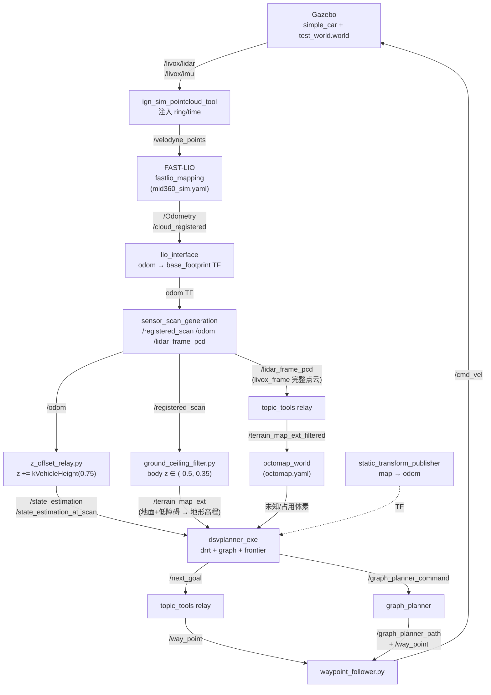

# DSV Planner 仿真运行文档（Gazebo + FAST-LIO）

> 适用范围：`3d_nav_ws` 中基于 **DSV Planner**（`src/planner/dsv_planner`）的自主探索仿真。
> 入口脚本：`scripts/exploration_dsv_sim.sh`（tmux 会话名 `dsv_gz`）。
> 本文记录：① 仿真 pipeline；② 编译方法；③ 文件配置；④ 运行命令；⑤ 调试中**发现的问题与解决方案**。
>
> 硬约束：**不拷贝 dev 环境的前端三节点**（terrain_analysis / terrain_analysis_ext / dev sensor_scan_generation），DSV 的输入话题全部由 fast-lio 输出 **remap / 过滤** 得到。

---

## 1. DSV Planner 仿真 Pipeline

整体数据流（地面机器人，差速底盘 simple_car）：



### 关键话题一览

| 话题 | 类型 | 发布者 | 消费者 |
|------|------|--------|--------|
| `/livox/lidar` | PointCloud2 | Gazebo | ign_sim_pointcloud_tool |
| `/livox/imu` | Imu | Gazebo | FAST-LIO |
| `/velodyne_points` | PointCloud2 | ign_sim_pointcloud_tool | FAST-LIO |
| `/Odometry`、`/cloud_registered` | Odometry / PointCloud2 | FAST-LIO | lio_interface、rviz |
| `/registered_scan` | PointCloud2（odom 帧） | sensor_scan_generation | ground_ceiling_filter |
| `/odom` | Odometry | sensor_scan_generation | z_offset_relay |
| `/lidar_frame_pcd` | PointCloud2（livox_frame 帧） | sensor_scan_generation | relay → octomap |
| `/state_estimation`、`/state_estimation_at_scan` | Odometry | z_offset_relay | dsvplanner / graph_planner / exploration |
| `/terrain_map_ext` | PointCloud2（地面+低障碍） | ground_ceiling_filter | dsvplanner（地形高程 / grid） |
| `/terrain_map_ext_filtered` | PointCloud2（完整） | topic_tools relay | octomap_world |
| `/next_goal` | PointStamped | dsvplanner | relay → `/way_point` |
| `/way_point` | PointStamped | relay 或 graph_planner | waypoint_follower |
| `/cmd_vel` | Twist | waypoint_follower | Gazebo（simple_car） |
| `/graph_planner_command`、`/graph_planner_path` | GraphPlannerCommand / Path | exploration / graph_planner | graph_planner / exploration |

**TF 树**：`map --静态→ odom --lio_interface→ base_footprint --sensor_scan_generation→ chassis / livox_frame`。

### 关键设计决策

1. **纯 remap，不拷贝前端三节点**：DSV 需要的 `/state_estimation`、`/terrain_map_ext`、`/terrain_map_ext_filtered` 全部由 fast-lio 输出中继/过滤得到。
2. **z_offset_relay 抬高 z**：把 `/odom` 的 z 抬到 `kVehicleHeight(0.75)`，使 RRT 在“车辆高度”上规划——这是修复“立刻 returning home”的关键（见问题 ①）。
3. **octomap 必须收 livox_frame 帧完整点云**：`insertPointcloudWithTf` 用 `cloud.frame → map` 求射线原点，odom 帧会让射线原点锁死在 map 原点（见问题 ③）。
4. **`/terrain_map_ext` 必须只含地面/低矮点**：地形体素混入墙壁 → `max-min Z ≥ 0.4` → `elev=1000`（不可通行）→ RRT 扩展全被拒（见问题 ④）。

---

## 2. 编译

DSV Planner 位于 `src/planner/dsv_planner`，一组 ROS 2 包，无需额外系统依赖之外的东西（octomap 用系统 `ros-humble-octomap`）。

```bash
cd /home/ros/rosws/3d_nav_ws
source /opt/ros/humble/setup.bash
conda deactivate                 # 始终在构建前执行，避免 conda 库遮蔽系统库
./scripts/build.sh               # colcon build --symlink-install --cmake-args -DCMAKE_BUILD_TYPE=Release -DCMAKE_POLICY_VERSION_MINIMUM=3.5
source install/setup.bash
```

只改 DSV 相关包时的增量构建：

```bash
colcon build \
  --packages-select dsvplanner dsvp_launch graph_planner octomap_world \
                     volumetric_map_base volumetric_msgs kdtree graph_utils \
                     misc_utils minkindr minkindr_conversions \
  --symlink-install \
  --cmake-args -DCMAKE_BUILD_TYPE=Release -DCMAKE_POLICY_VERSION_MINIMUM=3.5
```

> `CMAKE_POLICY_VERSION_MINIMUM=3.5` 是 CMake 4.x 兼容必需。
> **注意**：`symlink-install` 不会把新增/修改的 `config/*.yaml` 同步到 `install/share`，launch 文件里若用相对路径会加载到旧配置——脚本中 FAST-LIO 的 config 特意用**源码绝对路径**（见问题 ⑥）。

---

## 3. 文件配置

| 文件 | 作用 |
|------|------|
| `scripts/exploration_dsv_sim.sh` | 一键仿真入口：起 Gazebo/FAST-LIO/中继/DSV，tmux 分窗 |
| `scripts/z_offset_relay.py` | z 偏移中继：`/odom` → `/state_estimation` + `/state_estimation_at_scan`（z += 0.75） |
| `scripts/ground_ceiling_filter.py` | 地面/天花板过滤：`/registered_scan` → `/terrain_map_ext` |
| `src/planner/dsv_planner/.../dsvp_launch/config/exploration.yaml` | dsvplanner + exploration + graph 全部参数 |
| `src/planner/dsv_planner/.../dsvp_launch/config/octomap.yaml` | octomap 参数 |
| `src/planner/dsv_planner/.../dsvp_launch/config/default.rviz` | RViz 显示配置 |
| `src/localization/FAST_LIO_ROBOAIRY/config/mid360_sim.yaml` | FAST-LIO 仿真配置（Livox MID-360，`lidar_type=1`） |

### 3.1 exploration.yaml 关键参数（dsvplanner）

```yaml
# 启动：autoExp=true → 收到 /state_estimation + /terrain_map_ext 后自动开始探索
interface/initX: 0.0
interface/initY: 4.0
interface/initTime: 12.0        # 初始等待(odom/点云就绪)，4s 不够 → 会超时
interface/returnHomeThres: 1.5

# 话题映射
planner/odomSubTopic: /state_estimation
grid/odomSubTopic: /state_estimation_at_scan
graph/sub_keypose_topic: /state_estimation_at_scan
planner/terrainCloudSubTopic: /terrain_map_ext
graph/sub_graph_planner_status_topic: /graph_planner_status

# 增益：只把"未知"当作增益；5m 带、z±0.4、±15° 视锥（kSensorVertical=30）
drrt/gain/kFree: 0.0
drrt/gain/kOccupied: 0.0
drrt/gain/kUnknown: 1.0
drrt/gain/kRange: 5.0
drrt/gain/kRangeZMinus: 0.4
drrt/gain/kRangeZPlus: 0.4
drrt/gain/kMinEffectiveGain: 5

# RRT 树
drrt/tree/kExtensionRange: 1.0
drrt/tree/kMinExtensionRange: 0.8
drrt/tree/kMaxExtensionAlongZ: 1.0   # 必须 ≥ kVehicleHeight(0.75)，否则首条 dz≈0.75 的扩展被拒
drrt/vertexSize: 120

# 车辆模型
rm/kBoundX: 0.6
rm/kBoundY: 0.6
rm/kBoundZ: 0.4
rm/kVehicleHeight: 0.75
rm/kSensorVertical: 30.0

# 图：顶点高度差阈值 —— z-offset 后 keypose 与 RRT 节点统一在 z≈0.78，|Δz|≈0 才能建边
graph/kMaxVertexDiffAlongZ: 0.5
graph/kMinVertexDist: 0.8
```

### 3.2 octomap.yaml 关键参数

```yaml
octo/resolution: 0.35
octo/sensorMaxRange: 15.0        # 超过此距离 castRay 只标 free 不标占用
octo/treatUnknownAsOccupied: false
octo/mapPublishFrequency: 1.0
octo/velodyne_cloud_topic: /terrain_map_ext_filtered   # 必须收 livox_frame 完整点云
```

### 3.3 z_offset_relay.py（问题 ① 的修复，核心）

```python
# /odom 的 z += 0.75（kVehicleHeight）后发往 /state_estimation + /state_estimation_at_scan
def odom_cb(self, msg):
    out = Odometry(); out.header = msg.header
    out.child_frame_id = msg.child_frame_id
    out.pose = msg.pose
    out.pose.pose.position.z += self.z_offset
    out.twist = msg.twist
    self.pub1.publish(out)   # /state_estimation
    self.pub2.publish(out)   # /state_estimation_at_scan
```

只影响 DSV 内部坐标系：octomap 用 `/lidar_frame_pcd` + TF 取真实高度、waypoint_follower 二维驱动、grid `getIndex` 只认 x/y、exploration 回家判定 `|Δx|+|Δy|+|Δz| ≤ 1.5`（0.78 < 1.5 OK）、移动检测用 Δz（常数抵消）——下游全部不受影响。

---

## 4. 运行命令

```bash
cd /home/ros/rosws/3d_nav_ws
source install/setup.bash

# 一键启动（tmux 会话 dsv_gz，含全部窗口）
bash scripts/exploration_dsv_sim.sh

# 查看窗口
tmux attach -t dsv_gz
# 窗口：Gazebo | convert | FAST-LIO | lio_if | sensor | tf_map | relays | groundfilt | relay_terrain | follower | DSV

# 切到 DSV 窗口看探索日志
tmux select-window -t dsv_gz:DSV
```

RViz（DSV 窗口自动打开 `dsvp_rviz`）重点观察：
- `/new_tree_path`（绿，RRT 树）、`/remaining_tree_path`
- `/next_goal`（目标点）
- `/global_frontier`、`/local_frontier`（前沿）
- `/occpancy_grid_map`（grid 点阵）、octomap 的 marker

调试命令：

```bash
ros2 topic hz  /state_estimation            # 应有频率
ros2 topic echo /state_estimation --once | grep z   # z 应≈0.78（relay 生效）
ros2 topic hz  /terrain_map_ext             # 地形点云在流
ros2 topic echo /next_goal --once           # 目标点更新
ros2 topic echo /way_point --once
ros2 topic echo /cmd_vel --once             # 车在动
# 确认处于探索阶段（DSV 窗口应打印 "Planning iteration N"，无 "returning home"）
```

结束/清理：

```bash
# 各窗口 Ctrl+C，或
bash scripts/kill_all.sh          # 杀掉所有 gnome-terminal / ROS 节点 / Gazebo
tmux kill-session -t dsv_gz
```

---

## 5. 发现的问题与解决方案

| # | 问题 | 根因 | 解决方案 | 验证 |
|---|------|------|----------|------|
| ① | 启动后**立刻** "Exploration completed, returning home"（mode=2），车不动 | **规划高度不一致**（见下详解） | `scripts/z_offset_relay.py` 把 `/odom` z += 0.75 → `/state_estimation` + `/state_estimation_at_scan` | `/state_estimation` z≈0.78；迭代全为 Exploration Stage，树长满 120 节点（kVertexSize），图顶点持续增长，机器人探索到 (16.48, 9.98)，日志 0 条 "returning home" |
| ② | 树只长 ~10 个节点就停 | 同 ①：RRT 扩展全被拒 → 树长不出来 → `gainFound()=false` | 同 ① | 修复后 [RRT-DBG] 显示大量成功扩展 |
| ③ | 机器人开走后 octomap 已知区域锁死在原点，gain 归零 | octomap `insertPointcloudWithTf` 用 `lookupTransform(cloud.frame → map)` 求射线原点；喂 **odom 帧**点云 → 原点恒为 map 原点 (0,0,0)，前方 5m gain 带全被标 free | octomap 改喂 **livox_frame 帧**点云：`/lidar_frame_pcd →(topic_tools relay)→ /terrain_map_ext_filtered`，射线原点跟随雷达 | 已知区域随车移动，前方保持 unknown，gain() 找到未知单元 |
| ④ | 地形高程异常：RRT 扩展大量 "z>=1000 reject"；实测喂完整点云会**撞障碍物** | `terrain_voxle_elev_` 存点 **z**，体素内混入墙壁点 → `max-min Z ≥ 0.4` → `elev=1000`（不可通行）→ RRT 扩展被拒；**且** 2D grid（`grid/terrainCloudSubTopic` 同用 `/terrain_map_ext`，`kObstacleHeightThre: 0.2`）会把墙壁标成障碍 → 规划绕墙走，而 `/way_point` 是 `relay /next_goal` 直线执行（不走 graph_planner 曲线路径）→ **规划绕墙、执行直线冲墙 → 撞墙** | `ground_ceiling_filter.py` 只保留 body z ∈ (-0.5, 0.35)：下界必须 < -0.3 才保留地面平面（body z≈-0.3），上界 0.35 去墙 | `/terrain_map_ext` 只含地面+低障碍；回退后无碰撞、正常探索 |
| ⑤ | 启动即 "initTime timeout" | `initTime=4` 太短，odom/点云未就绪 | `initTime: 12.0` | 正常进入探索 |
| ⑥ | FAST-LIO 用相对路径加载 config 失败 | `symlink-install` 不自动同步新 yaml 到 install/share | 脚本里用源码绝对路径：`config_file:=$WS/src/localization/FAST_LIO_ROBOAIRY/config/mid360_sim.yaml` | 正常建图 |
| ⑦ | Gazebo `/livox/lidar` 缺 ring/time 字段，FAST-LIO（Velodyne 模式）发散 | ray 传感器不输出 ring/time | `ign_sim_pointcloud_tool` 按垂直角注入 ring、按行注入 time(秒)，输出 `/velodyne_points` | 里程计稳定 |
| ⑧ | dsvplanner 刷屏 "Failed to find match for field 'intensity'" | `ground_ceiling_filter.py` 用 `create_cloud_xyz32` 输出**无 intensity** 的点云 | **已知、无害**：grid 的 intensity 分类全判 traversable，不阻塞。可选修复：输出前补 intensity=0 字段 | 不影响探索 |

### 5.1 问题 ① 详解：为什么 RRT 根在 z≈0 会导致立即回家

`drrtp.cpp` 的 mode=2 触发（"Exploration completed, returning home"）：

```cpp
// drrtp.cpp:139
if (!nextNodeFound_ && global_plan_pre_ && gainFound() <= 0) → mode=2
// drrtp.cpp:154
if (!nextNodeFound_ && !global_plan_pre_ && getGain(robot_position) <= 0) → relocation
```

`gainFound()` 依赖：(a) 树能长出来（扩展不被拒）；(b) 图有路径（`ShortestPathBtwVertex` 非空）。地面机器人 z-offset 修复前两处都坏：

- **RRT 根 vs 节点高度不一致**：根取 odom z（≈0.03，贴地），但扩展节点 z 被 `getZvalue()` 覆盖为 `terrain_voxle_elev_ + kVehicleHeight` ≈ 0.78。根落在雷达**正下方永远 unknown 的地面体素** [-0.175, +0.175] 内（雷达看不到正下方），`getLineStatusBoundingBox` 的 ±0.2 z 偏移线每次扎进该体素 → **所有扩展被拒** → 树长不出来。
- **图顶点高度不一致**：keypose 顶点（`/state_estimation_at_scan`，z≈0.03）与 RRT 节点顶点（z≈0.78）`|Δz|=0.75 > kMaxVertexDiffAlongZ(0.5)` → `addNewLocalVertex` / `zCollisionCheck` 拒边 → 图路径空 → `getGain()=0`。

两条叠加 → `gainFound()<=0` → mode=2。**修复 = 统一高度**：z_offset_relay 把所有 DSV 内部坐标抬到车辆高度，根跳出未知地面体素、keypose 与 RRT 节点 z 一致（|Δz|≈0 < 0.5），树和图都能建立。

### 5.2 gain 机制（为什么 mode=2 这么容易误触发）

- 未知格 `kUnknown=1.0`，free/占用/零 = 0.0 → gain = 5m 带（`kRange`）× z±0.4（`kRangeZMinus/Max`）× ±15° 视锥（`kSensorVertical=30`）内的未知单元数。
- `getVisibility(origin, vec, false)` 被墙挡的射线返回 kOccupied → **被遮挡的未知单元不计入** gain。
- 只有视线无遮挡的未知单元才计 gain——这类单元只在 `sensorMaxRange(15m)` free 标记范围之外存在。所以树必须长到 ~10m 外才找得到 unknown；`kMaxExtensionAlongZ`、octomap 输入话题稍有不对，gain 立即归零 → 误判"探索完成"。这是地面机器人上 DSV 参数/话题极度敏感的根源。
