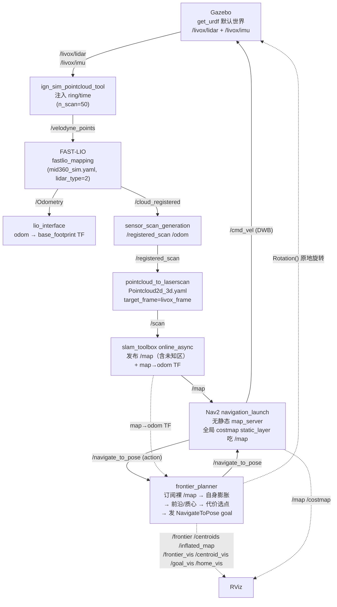
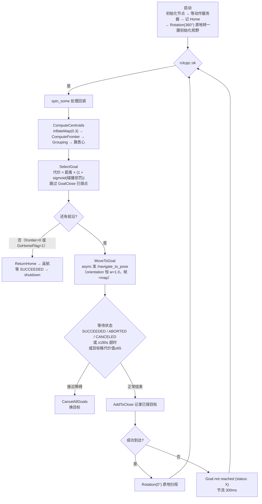

# frontier_exploration 仿真运行文档（Gazebo + FAST-LIO + Nav2 + frontier_planner）

> 适用范围：`3d_nav_ws` 中基于 **frontier_exploration**（`src/planner/frontier-occ-exploration`，ROS1→ROS2 Humble 移植版）的前沿（frontier）自主探索仿真。
> 入口脚本：`scripts/exploration_frontier_sim.sh`（tmux 会话名 `frontier_gz`）。
> 本文记录：① 仿真 pipeline；② 探索算法与流程图；③ 编译方法；④ 文件配置；⑤ 运行命令；⑥ 调试中**发现的问题与解决方案**。
>
> 与 `docs/m-explore-run.md`（explore_lite 探索）的区别：探索前端由 explore_lite 换成 `frontier_planner`，**不拷贝任何前端节点**，全部复用 fast-lio 输出 + 标准 3D→2D→SLAM→Nav2 链路。

---

## 1. 仿真 Pipeline

整体数据流（地面差速机器人，Livox MID-360 仿真，`get_urdf` 默认世界 `test_world.world`）：



### 关键话题一览

| 话题 | 类型 | 发布者 | 消费者 |
|------|------|--------|--------|
| `/livox/lidar` | PointCloud2 | Gazebo | ign_sim_pointcloud_tool |
| `/livox/imu` | Imu | Gazebo | FAST-LIO |
| `/velodyne_points` | PointCloud2（含 ring/time） | ign_sim_pointcloud_tool | FAST-LIO |
| `/Odometry`、`/cloud_registered` | Odometry / PointCloud2 | FAST-LIO | lio_interface |
| `/registered_scan` | PointCloud2（odom 帧） | sensor_scan_generation | pointcloud_to_laserscan |
| `/odom` | Odometry | sensor_scan_generation | rviz / Nav2 |
| `/scan` | LaserScan | pointcloud_to_laserscan | slam_toolbox、Nav2 costmap obstacle_layer |
| `/map` | OccupancyGrid（含未知区） | slam_toolbox | **frontier_planner（本脚本直接吃这个）**、Nav2 global_costmap static_layer |
| `/navigate_to_pose` | Nav2 action | bt_navigator | **frontier_planner（action client）** |
| `/frontier` | PointArray | frontier_planner | RViz（全部前沿单元点） |
| `/centroids` | PointArray | frontier_planner | RViz（前沿质心） |
| `/inflated_map` | OccupancyGrid | frontier_planner | RViz（膨胀后地图） |
| `/frontier_vis` | Marker | frontier_planner | RViz（蓝色 POINTS） |
| `/centroid_vis` | Marker | frontier_planner | RViz（红色 POINTS） |
| `/goal_vis` | Marker | frontier_planner | RViz（粉色 SPHERE，当前目标） |
| `/home_vis` | Marker | frontier_planner | RViz（绿色 SPHERE，起点/返航点） |
| `/cmd_vel` | Twist | Nav2 DWB + frontier Rotation() | Gazebo |
| `/get_centroids` | Service | frontier_planner | 手动触发质心计算 |

**TF 树**：`map --slam_toolbox→ odom --lio_interface→ base_footprint --URDF→ chassis → livox_frame`。frontier 的 `ObtainPose()` 查询 `map → robot_base_frame`（必须覆盖为 `base_footprint`）。

### 与 explore_lite 的三点不同（关键设计决策）

1. **frontier_planner 读裸 `/map` 自己做膨胀**：`InflateMap(obstacle_inflation=0.3)` 产出 `/inflated_map`，**不依赖** `/global_costmap/costmap`（explore_lite 是吃 Nav2 全局 costmap 的）。
2. **无 `/explore/resume` 暂停话题**：停止 = 在 frontier 窗口 `Ctrl+C`（阻塞式主循环，见 §2 流程图）。
3. **启动即阻塞等待动作服务器**：`Actuator` 构造时 `wait_for_action_server("/navigate_to_pose")`，Nav2 没起来会一直等。
4. **Nav2 必须无静态 map_server**：`my_nav2_launch.py` 带静态图 `test_map__2.yaml`，会跟 slam_toolbox 抢 `/map`；frontier 读到全已知图 → 无未知格 → 无前沿 → 探索立即结束。因此 Nav2 窗口直接用 `nav2_bringup/navigation_launch.py`。
5. **FAST-LIO 必须用 `mid360_sim.yaml` + convert**：Gazebo 的 `/livox/lidar` 没有 `ring/time`，必须经 `ign_sim_pointcloud_tool` 注入后由 FAST-LIO 订阅 `/velodyne_points`（`lidar_type:2` Velodyne 需要这俩字段）。
6. **`robot_base_frame` 必须覆盖为 `base_footprint`**（库默认 `base_link`，工作区约定是 `base_footprint`），否则 `ObtainPose()` 永远 "Cannot Obtain robot pose!!"。

---

## 2. 探索算法（frontier_planner 内部流程）



主循环要点（`src/frontierMain.cpp` + `src/actuator.cpp`）：

- **初始化**：`Actuator` 构造时阻塞等 `/navigate_to_pose` action server；`ObtainPose()` 取 `map→base_footprint` 位姿记为 `Home`；先执行一次 `Rotation(360.0)` 原地转一圈（`raw_map` 为空则跳过并告警，等地图）。
- **选点代价**（`SelectGoal`）：对每个质心算 `temp = 欧氏距离 × (1 + sigmoid(collision))`，其中 `sigmoid = 2/(1+e^{-0.3·collision}) - 1`，`collision` = 沿机器人→质心直线上代价值 >65 的栅格数。**距离越近、碰撞越少的质心优先**。
- **送目标**（`MoveToGoal`）：async 发送，**`orientation.w` 恒为 1.0（yaw=0）**、帧为 `map`。目标是否"到达"完全交给 Nav2 的 goal_checker 判定。
- **等待**：内层循环在 `SUCCEEDED / ABORTED / CANCELED / Duration≥180s / 目标格代价值≥65` 任一条件退出。目标格接近障碍（≥65）→ `CancelAllGoals` 立即换目标。
- **判定"到达"**：只有 `STATUS_SUCCEEDED` 且非接近障碍且未超时，才打印 `Reached the goal!` 并 `Rotation(0°)`；否则打印 `Goal not reached (status: X)`（6=ABORTED、0=UNKNOWN）并节流 300ms 后选下一个。
- **返航**：`frontier.size()==0` 且已收到地图，或 `GoHomeFlag==1`（全部质心都在 close 列表）→ `ReturnHome()` 导航回起点，等 SUCCEEDED 后 `shutdown` 退出。

---

## 3. 编译

```bash
cd /home/ros/rosws/3d_nav_ws
source /opt/ros/humble/setup.bash
conda deactivate                 # 始终在构建前执行，避免 conda 库遮蔽系统库
colcon build --packages-select frontier_exploration \
  --cmake-args -DCMAKE_BUILD_TYPE=Release -DCMAKE_POLICY_VERSION_MINIMUM=3.5
source install/setup.bash
```

> 包在 `src/planner/frontier-occ-exploration/frontier_exploration_occupancygrid`（包名 `frontier_exploration`），依赖 Nav2 的 `nav2_msgs`（`ros-humble-navigation2`）。只改了 `frontierMain.cpp`/`actuator.cpp` 时重编这一个包即可。

---

## 4. 文件配置

| 文件 | 作用 |
|------|------|
| `scripts/exploration_frontier_sim.sh` | 一键仿真入口：起 Gazebo/convert/FAST-LIO/SLAM/Nav2/frontier/RViz，tmux 分窗（会话 `frontier_gz`） |
| `src/planner/frontier-occ-exploration/frontier_exploration_occupancygrid/src/frontierMain.cpp` | 探索主循环：探测→选点→导航→返航 |
| `src/planner/frontier-occ-exploration/frontier_exploration_occupancygrid/src/actuator.cpp` | `MoveToGoal` / `Rotation` / `ReturnHome` / `SelectGoal`（代价选点） |
| `src/planner/frontier-occ-exploration/frontier_exploration_occupancygrid/src/frontier_detector.cpp` | `InflateMap` / `ComputeFrontier` / `Grouping` / `ComputeCentroids` |
| `src/planner/frontier-occ-exploration/frontier_exploration_occupancygrid/config/rviz/frontier_exploration.rviz` | RViz 显示（已配好全部 frontier 可视化） |
| `src/planner/nav2_planner_bringup/config/nav2_params.yaml` | Nav2 全栈参数（DWB、Navfn、costmap；goal 容差已放宽，见 4.2） |
| `src/planner/nav2_planner_bringup/config/slam_toolbox_params.yaml` | SLAM Toolbox 参数（base_frame=base_footprint、map_frame=map） |
| `src/localization/FAST_LIO_ROBOAIRY/config/mid360_sim.yaml` | FAST-LIO 仿真配置（`lid_topic=/velodyne_points`、`lidar_type=2`、`scan_line=50`） |

### 4.1 frontier_planner 参数（脚本内联）

```bash
ros2 run frontier_exploration frontier_planner --ros-args \
  -p use_sim_time:=true \
  -p robot_base_frame:=base_footprint \
  -p obstacle_inflation:=0.3 \
  -p map_revolution:=0.1 \
  -p cmd_topic:=cmd_vel \
  -p goal_tolerance:=0.3 \
  -p obstacle_tolerance:=0.5 \
  -p rotate_speed:=0.5
```

| 参数 | 默认值 | 含义 |
|------|--------|------|
| `obstacle_inflation` | 0.3 | 障碍物膨胀半径（m），`InflateMap` 用 |
| `goal_tolerance` | 0.2 | 判定"已探索"的目标容差（m），也用于跳过 GoalClose 中已探目标 |
| `obstacle_tolerance` | 0.5 | 距障碍物小于该值（m）时禁止原地旋转 |
| `rotate_speed` | 0.5 | `Rotation()` 原地旋转角速度（rad/s） |
| `cmd_topic` | `cmd_vel` | `Rotation()` 发布的速度话题名 |
| `map_revolution` | 0.1 | 地图分辨率（m/cell），用于 Marker 尺寸 |
| `robot_base_frame` | `base_link` | TF 查询用基座 frame，**必须覆盖为 `base_footprint`** |

### 4.2 Nav2 关键参数（探索必需，`nav2_params.yaml`）

```yaml
controller_server:
  general_goal_checker:
    xy_goal_tolerance: 0.3    # 探索场景放宽到 0.3，对齐 frontier goal_tolerance
    yaw_goal_tolerance: 3.14  # ≈180°=任意朝向；探索只关心到位，朝向由 frontier 的 Rotation 自行处理
```

> **这是 frontier 能否"到达目标"的关键**：frontier 送的 goal 朝向恒为 yaw=0（`orientation.w=1.0`），若 `xy_goal_tolerance` 还是默认 0.035（3.5cm），机器人开到离目标 0.18m 处会被判定"未到达"→ DWB 原地空转 → `progress_checker`（0.5m/10s）判定卡住 → 每个 goal 都 `ABORTED`（详见问题 ①）。costmap 的 `obstacle_layer` 已开 `inf_is_valid: true`（保证远距离空旷被拉出长射线清除）。

---

## 5. 运行命令

### 5.1 一键启动

```bash
cd /home/ros/rosws/3d_nav_ws
source install/setup.bash
bash scripts/exploration_frontier_sim.sh
```

tmux 窗口（会话名 `frontier_gz`）：

```
Gazebo | convert | FAST-LIO | lio_if | sensor | laserscan | slam | Nav2 | frontier | RViz
```

attach 查看各窗口日志：

```bash
tmux attach -t frontier_gz          # 或 docker exec -it lio_nav2 tmux attach -t frontier_gz
tmux select-window -t frontier_gz:frontier
```

### 5.2 各窗口对应命令（手动单起）

```bash
# Gazebo（get_urdf 默认世界 test_world.world）
ros2 launch get_urdf get_urdf_launch.py rviz:=false

# convert：/livox/lidar → /velodyne_points（注入 ring/time）
ros2 run ign_sim_pointcloud_tool ign_sim_pointcloud_tool_node --ros-args \
  -p pcd_topic:=/livox/lidar -p n_scan:=50 -p horizon_scan:=360 \
  -p ang_bottom:=7.22 -p ang_res_y:=1.248

# FAST-LIO（必须 mid360_sim.yaml）
ros2 launch fast_lio_robosense mapping_livox.launch.py config_file:=mid360_sim.yaml rviz:=false use_sim_time:=true

# lio_interface：odom→base_footprint TF
ros2 launch lio_interface fastlio_lio_interface_launch.py

# sensor_scan_generation：/registered_scan + /odom
ros2 launch sensor_scan_generation sensor_scan_generation_launch.py

# 3D→2D 切片：/registered_scan → /scan
ros2 launch nav2_planner_bringup pointcloud_to_laserscan_launch.py

# SLAM Toolbox：/scan → /map + map→odom TF
ros2 launch slam_toolbox online_async_launch.py \
  slam_params_file:=$WS/src/planner/nav2_planner_bringup/config/slam_toolbox_params.yaml

# Nav2（无静态地图！use_composition 必须大写 False）
ros2 launch nav2_bringup navigation_launch.py \
  params_file:=$WS/src/planner/nav2_planner_bringup/config/nav2_params.yaml \
  use_sim_time:=true autostart:=true use_composition:=False

# frontier_planner（见 4.1 参数；启动前先等 bt_navigator active，见问题 ②）
ros2 run frontier_exploration frontier_planner --ros-args -p ...

# RViz
rviz2 -d $WS/src/planner/frontier-occ-exploration/frontier_exploration_occupancygrid/config/rviz/frontier_exploration.rviz
```

### 5.3 探索控制与调试

```bash
# 手动触发一次质心计算
ros2 service call /get_centroids frontier_exploration/srv/GetCentroids "{}"

# 手动送一个 Nav2 目标，验证导航链路本身可用
ros2 action send_goal /navigate_to_pose nav2_msgs/action/NavigateToPose \
  "{pose: {header: {frame_id: map}, pose: {position: {x: 2.0, y: 0.0}, orientation: {w: 1.0}}}}"

# 检查关键链路
ros2 topic hz /scan /map /frontier /centroids
ros2 run tf2_ros tf2_echo map base_footprint

# 等待 Nav2 激活（与脚本内 frontier 启动前的等待一致）
ros2 lifecycle get /bt_navigator          # 应返回 "active [3]"（前缀匹配 active*）
```

**怎么看探索是否正常**（frontier 窗口日志）：

```
Found frontier cells: 2083   Found frontier: 10
Iteration: 7: Goal: 6.95,10.71   Distance: 5.18      ← 正在去第 7 个前沿目标
Reached the goal!                                     ← 一个前沿目标真正到达（SUCCEEDED）
Exploration finished! Returning home..                ← 无前沿，返航
```

同时 bt_navigator 窗口应出现 `Begin navigating` / `Goal succeeded`；**若出现 `Failed to make progress` / `Aborting handle`，说明目标容差没对齐（见问题 ①）**。

---

## 6. 发现的问题与解决方案

| # | 现象 | 根因 | 解决 |
|---|------|------|------|
| ① | **所有 frontier 目标全 `ABORTED`，机器人"不动"；只有手动点 RViz 2D Goal Pose 才会刷新、重新规划** | frontier 的 `MoveToGoal` 恒发 `orientation.w=1.0`（yaw=0）；Nav2 默认 `xy_goal_tolerance: 0.035`（3.5cm）→ 机器人开到离目标 0.18m 不算"到达" → DWB 原地空转 → `progress_checker`（0.5m/10s）判定卡住 → 每个 goal 都 ABORTED（status 6）。手动点目标可达，所以能成功 | `nav2_params.yaml` 放宽：`xy_goal_tolerance: 0.3`（对齐 frontier `goal_tolerance`）、`yaw_goal_tolerance: 3.14`（任意朝向，朝向由 frontier `Rotation()` 处理）。改完需**重启 Nav2**（controller_server 启动时才读参数） |
| ② | **重启后前 3 分钟机器人"根本不动"**（日志一直 `Cannot Obtain robot pose!!` 后 `Goal not reached (status: 0)`） | frontier 启动比 Nav2 激活早约 1s，第一个 `/navigate_to_pose` 目标被未激活的 bt_navigator **静默拒绝** → `goal_handle_` 为 null → `GetGoalStatus()` 永远 UNKNOWN(0) → 内层等待循环死等满 180s `Limit` 才换目标 | `exploration_frontier_sim.sh` 的 frontier 窗口先等 bt_navigator 激活：`for i in $(seq 1 60); do [[ "$(ros2 lifecycle get /bt_navigator 2>/dev/null)" == active* ]] && break; sleep 1; done`。注意 `ros2 lifecycle get /bt_navigator` 返回 `active [3]`，必须**前缀匹配 `active*`** |
| ③ | Nav2 启动报 `name 'false' is not defined` | `navigation_launch.py:112` 用 `PythonExpression` 拼字符串再 `eval()`，小写 `false` 不是合法 Python 名 | `use_composition:=False`（**大写** Python 布尔） |
| ④ | 探索启动即结束（无前沿） | `my_nav2_launch.py` 带 `map_server` 静态图，与 slam_toolbox 抢 `/map`；frontier 读到全已知图 → 无未知格 | Nav2 改用 `nav2_bringup/navigation_launch.py`（不带 map_server），全局 costmap static_layer 吃 slam 的 `/map` |
| ⑤ | FAST-LIO 刷屏 `Failed to find match for field 'ring'/'time'` | `mapping_livox.launch.py` 默认 `mid360.yaml` 的 `lidar_type:2`（Velodyne）需要 `ring`+`time`，Gazebo `/livox/lidar` 只有 `xyz+intensity` | 启用 convert 窗口注入 ring/time → `/velodyne_points`，FAST-LIO 用 `config_file:=mid360_sim.yaml`（`lid_topic=/velodyne_points`） |
| ⑥ | 启动期刷屏 `Cannot Obtain robot pose!!` | `ObtainPose()` 查 `map→base_footprint` TF，slam 的 map→odom 尚未发布时反复失败（每 100ms 重试） | 属正常启动现象，等 slam/Nav2 起来、TF 就绪后自动消失。**若一直不消失**且伴随"规划后不动"，查 `robot_base_frame` 是否覆盖为 `base_footprint`（见 4.1）与问题 ② |
| ⑦ | **探索已完成但永不返航**；日志反复 `Reached the goal!` + `No centroids!  No goal!` + `Found frontier cells: N / Found frontier: 0` | 两层叠加：**(a)** `ComputeCentroids` 只在 `raw_centroids.size()>=2` 分支里填充 `centroids`——只剩单个前沿群组（探索尾声的常见情形）→ 0 质心；**(b)** 返航条件 `frontier==0 \|\| GoHomeFlag==1` 在"有前沿无质心"时两个都不满足，`SelectGoal` 无目标可挑、`MoveToGoal` 反复重发上一个**已到达**的目标 → 秒 SUCCEEDED → 死循环 | 修 `frontier_detector.cpp` `ComputeCentroids`：质心填充移出 `>=2` 分支（无论多少 raw centroid 都输出）；修 `frontierMain.cpp` 返航条件加 `centroids.size()==0`。改后重编 `colcon build --packages-select frontier_exploration`，**整链重启**（`kill_all.sh` 后重跑脚本） |
| ⑧ | **启动即返航**（"直接就返航了"）：日志 `Rotation skipped: no map received yet (raw_map empty)` + `Found frontier cells: 0`，随后立即 `Exploration finished! Returning home..`；并**卡死**在反复打印 "Returning home.." | (a) frontier 启动早于 slam 发布第一帧 `/map`，初始 `Rotation(360°)` 因 `raw_map` 空被跳过 → 机器人没扫环境 → 首帧稀疏地图 `frontier≈0` → 命中返航（"有地图但无前沿"本就成立）；(b) 返航等待循环只认 `SUCCEEDED`，而返航目标在原点附近常被 ABORTED → 永久卡死 | `frontierMain.cpp`：主循环前先 `while (inflated_map.data.empty())` 等第一帧 `/map` 再执行 `Rotation(360°)`；返航等待改为 SUCCEEDED / ABORTED / CANCELED / 60s 超时任一退出。重编后整链重启 |

> **状态码速查**（`rclcpp_action::GoalStatus`）：0=UNKNOWN（目标被拒/未接）、4=SUCCEEDED、5=CANCELED、6=ABORTED。frontier 日志 `Goal not reached (status: 6)` = 目标被 Nav2 判定失败，`(status: 0)` = 目标根本没被接受。

---

## 7. 清理

```bash
cd /home/ros/rosws/3d_nav_ws
./scripts/kill_all.sh            # 自动检测并整链清理（含 frontier_gz 会话）
./scripts/kill_all.sh --dry-run  # 预览将要关闭的进程
./scripts/kill_all.sh -f         # 强制模式，跳过 ros2 检测直接按进程名杀
# 或只关本次仿真
tmux kill-session -t frontier_gz
```

> 参考：`docs/m-explore-run.md`（explore_lite 版探索）、`docs/dsv_run.md`（DSV 探索）、包内 `docs/USAGE.md`（frontier 包 API 与参数全表）。
