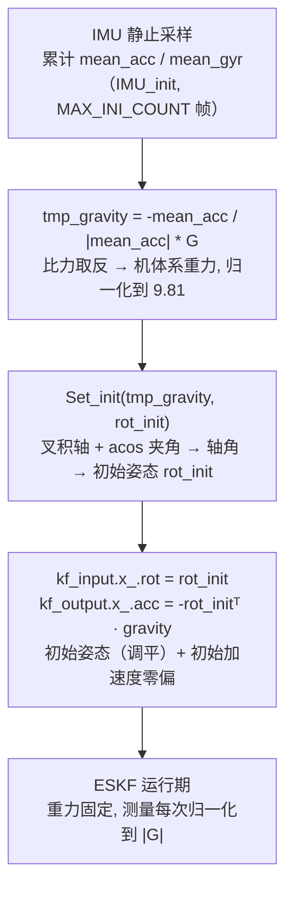
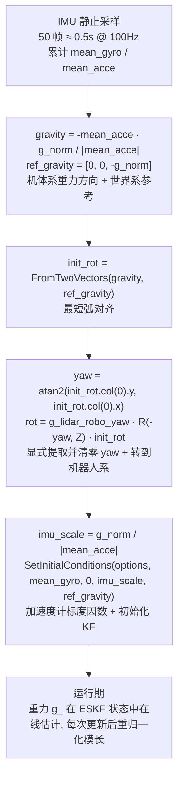

# Point-LIO 与 Super LIO 的重力对齐

## 1. 什么是重力对齐（Gravity Alignment）

重力方向（"下"）是唯一能在静止时从 IMU 加速度计直接测量到的**绝对参考**。静止时加速度计读数是**比力**（specific force），方向和重力相反（`a ≈ -g`），模长 ≈ 9.81 m/s²。

**重力对齐 = 用静止时加速度计平均值的「方向」推断世界系的"下"，从而确定初始姿态的 roll/pitch（调平）。**

关键物理事实：

- 加速度计在静止时测得的加速度方向 = **反重力方向**（向上）；
- 把比力取反即得重力方向在机体系（IMU 系）的表示；
- 重力方向在世界系是已知常量（如 `[0, 0, -9.81]`）；
- 两个 3D 向量对齐 → 唯一确定一个**最短弧旋转**（绕垂直于两向量平面的轴旋转）；
- **yaw（航向）测不出来**：绕重力轴旋转不影响重力向量，重力只约束 2 个自由度（roll/pitch）。

## 2. 数学原理

设：

- `g_w = [0, 0, -G]`：世界系参考重力（G = 重力加速度模长，如 9.81 / 9.7946）；
- `a_bar`：静止时加速度计均值（比力），`|a_bar| ≈ G`；
- 实测重力在机体系：`g_b = -a_bar`。

把 `g_b` 对齐到 `g_w` 的旋转 `R` 满足：

```
R · g_b ≈ g_w     （或将 g_w 转到机体系）
```

- **旋转轴**：`n = g_b × g_w`（两向量叉积，垂直于两者，即水平面内的轴）；
- **旋转角**：`θ = acos( g_b·g_w / (|g_b|·|g_w|) )`；
- 用轴角公式得到旋转矩阵，或用 `FromTwoVectors(g_b, g_w)` 直接构造最短弧旋转。

由于重力方向只含 2 个自由度，`R` 的第 3 个自由度（绕重力轴 = yaw）是**不可观**的，需显式处理（归零或由外部指定）。

## 3. Point-LIO 重力对齐（FAST-LIO2 血统）

### 3.1 代码位置

| 步骤 | 文件 | 函数/行号 |
|------|------|-----------|
| IMU 均值累加 | `src/localization/point_lio/src/IMU_Processing.cpp` | `IMU_init()` 第 57–85 行 |
| 实测重力 + 对齐旋转 | `src/localization/point_lio/src/IMU_Processing.cpp` | `Set_init()` 第 34–55 行 |
| 调用入口 + 初值写入 | `src/localization/point_lio/src/laserMapping.cpp` | 第 487–507 行 |
| 重力参数读取 | `src/localization/point_lio/src/parameters.cpp` | 第 186–190、255 行 |
| 测量归一化 | `src/localization/point_lio/src/Estimator.cpp` | 第 24、63–75、328 行 |
| 重力配置 | `src/localization/point_lio/config/*.yaml` | `mapping.gravity` / `mapping.gravity_init` |

### 3.2 流程



### 3.3 核心代码

**IMU 均值累加**（`IMU_Processing.cpp:57-85`）：

```cpp
void ImuProcess::IMU_init(const MeasureGroup & meas, int & N)
{
  RCLCPP_INFO(logger, "IMU Initializing: %.1f %%", double(N) / MAX_INI_COUNT * 100);
  V3D cur_acc, cur_gyr;

  if (b_first_frame_) {
    Reset();
    N = 1;
    b_first_frame_ = false;
    const auto & imu_acc = meas.imu.front()->linear_acceleration;
    const auto & gyr_acc = meas.imu.front()->angular_velocity;
    mean_acc << imu_acc.x, imu_acc.y, imu_acc.z;   // 静止时加速度均值
    mean_gyr << gyr_acc.x, gyr_acc.y, gyr_acc.z;   // 同时拿陀螺零偏
  }

  for (const auto & imu : meas.imu) {
    const auto & imu_acc = imu->linear_acceleration;
    const auto & gyr_acc = imu->angular_velocity;
    cur_acc << imu_acc.x, imu_acc.y, imu_acc.z;
    cur_gyr << gyr_acc.x, gyr_acc.y, gyr_acc.z;

    mean_acc += (cur_acc - mean_acc) / N;          // 递推均值
    mean_gyr += (cur_gyr - mean_gyr) / N;
    N++;
  }
}
```

**对齐旋转**（`IMU_Processing.cpp:34-55`）：

```cpp
void ImuProcess::Set_init(Eigen::Vector3d & tmp_gravity, Eigen::Matrix3d & rot)
{
  M3D hat_grav;                                   // gravity_ 的反对称阵（世界系参考重力）
  hat_grav << 0.0, gravity_(2), -gravity_(1), -gravity_(2), 0.0, gravity_(0), gravity_(1),
    -gravity_(0), 0.0;
  double align_norm = (hat_grav * tmp_gravity).norm() / gravity_.norm() / tmp_gravity.norm();
  //   = sin(两向量夹角) —— 衡量两向量是否共线
  double align_cos = gravity_.transpose() * tmp_gravity;
  align_cos = align_cos / gravity_.norm() / tmp_gravity.norm();
  //   = cos(两向量夹角)
  if (align_norm < 1e-6) {                         // 共线：相差 0° 或 180°
    if (align_cos > 1e-6) {
      rot = Eye3d;                                // 同向 → 单位阵
    } else {
      rot = -Eye3d;                               // 反向（如 Airy Z 翻转）→ -I
    }
  } else {
    V3D align_angle = hat_grav * tmp_gravity / (hat_grav * tmp_gravity).norm() * acos(align_cos);
    //   旋转轴 = 叉积 g_w × g_b, 旋转角 = 夹角
    rot = Exp(align_angle(0), align_angle(1), align_angle(2));   // 轴角 → 旋转矩阵
  }
}
```

**调用入口 + 初值写入**（`laserMapping.cpp:487-507`）：

```cpp
if (!p_imu->after_imu_init_) {                    // 尚未完成 IMU 初始化
  if (!p_imu->imu_need_init_) {
    V3D tmp_gravity;
    if (imu_en) {
      tmp_gravity = -p_imu->mean_acc / p_imu->mean_acc.norm() * G_m_s2;   // 比力取反 → 重力
    } else {
      tmp_gravity << VEC_FROM_ARRAY(gravity_init);   // 无 IMU 或非静止启动: 用配置
      p_imu->after_imu_init_ = true;
    }
    M3D rot_init;
    p_imu->Set_init(tmp_gravity, rot_init);          // 算初始姿态
    kf_input.x_.rot = rot_init;                      // 写入 EKF 状态
    kf_output.x_.rot = rot_init;
    kf_output.x_.acc = -rot_init.transpose() * kf_output.x_.gravity;   // 初始加速度零偏
  } else {
    continue;
  }
}
```

**测量归一化到 |G|**（`Estimator.cpp:328`）：

```cpp
ekfom_data.z_IMU.block<3, 1>(3, 0) = acc_avr * G_m_s2 / acc_norm - s.acc - s.ba;
//  把加速度测量缩放到模长 G 后, 减去估计的比力(加速度+零偏), 作为加速度残差
```

### 3.4 特点

- 用叉积轴 + `acos` 夹角构造**最短弧**旋转：旋转轴垂直于两向量，**天然没有绕竖直轴（重力轴）的分量 → 隐式 yaw = 0**；
- 重力是**固定状态向量**（来自配置 `mapping.gravity`），运行期不再优化；
- 加速度测量在每次 ESKF 更新时归一化到 `G_m_s2`；
- 支持**无 IMU / 非静止启动**：直接读配置 `mapping.gravity_init`。

## 4. Super LIO 重力对齐

### 4.1 代码位置

| 步骤 | 文件 | 函数/行号 |
|------|------|-----------|
| 均值累加 + 对齐 + 初始化 KF | `src/localization/super_lio/src/super_lio/src/lio/super_lio.cpp` | `kf_init()` 第 115–160 行 |
| 重力在线估计 | `src/localization/super_lio/src/super_lio/src/lio/ESKF.cpp` | `Update()` 第 118–133 行 |
| 重力状态定义 | `src/localization/super_lio/src/super_lio/include/lio/ESKF.h` | 第 17、106 行 |
| 重力模长参数 | `src/localization/super_lio/src/super_lio/src/lio/params.cpp` | 第 37、54 行 |
| 对齐开关 | `src/localization/super_lio/src/super_lio/config/*.yaml` | `lio.kf.kf_align_gravity: true` |

### 4.2 流程



### 4.3 核心代码

**KF 初始化（重力对齐主逻辑）**（`super_lio.cpp:115-160`）：

```cpp
bool SuperLIO::kf_init(){
  static int imu_cout = 0;
  static V3 mean_gyro = V3::Zero();
  static V3 mean_acce = V3::Zero();

  for(auto& imu: measures_.imu){
    imu_cout ++;
    mean_gyro += (imu.gyr - mean_gyro) / imu_cout;    // 陀螺零偏均值
    mean_acce += (imu.acc - mean_acce) / imu_cout;    // 加速度均值
  }

  /// 100 Hz for 1 second.
  if(imu_cout < 50){                                  // 攒够 50 帧才开始
    return false;
  }

  V3 gravity = - mean_acce * g_gravity_norm / mean_acce.norm();   // 机体系重力方向
  V3 ref_gravity(0, 0, - g_gravity_norm);                          // 世界系参考重力
  M3 init_rot = Quat::FromTwoVectors(gravity, ref_gravity).toRotationMatrix();  // 最短弧对齐
  V3 n = init_rot.col(0);
  double yaw = atan2(n(1), n(0));                      // 从对齐旋转中抽出 yaw

  M3 R_yaw_inv = Eigen::AngleAxis<scalar>(-yaw, V3::UnitZ()).toRotationMatrix(); // 消 yaw

  // init_rot 是重力对齐后的水平姿态(调平)。
  // 先做 LiDAR 调平修正, 再变换到机器人坐标系。
  M3 rot = g_lidar_robo_yaw * R_yaw_inv * init_rot;    // 应用到机器人系

  ESKF::Options options;
  options.gyro_var_ = g_imu_ng;
  options.acce_var_ = g_imu_na;
  options.bias_gyro_var_ = g_imu_nbg;
  options.bias_acce_var_ = g_imu_nba;
  options.num_iterations_ = g_kf_max_iterations;
  options.quit_eps_ = g_kf_quit_eps;

  float imu_scale = g_gravity_norm / mean_acce.norm(); // 加速度计标度因数
  kf_->SetInitialConditions(options, mean_gyro, V3::Zero(), imu_scale, ref_gravity);
  auto state = kf_->GetSysState();
  state.R = SO3(rot);                                  // 初始姿态 = 调平后的旋转
  state.p = g_odom_robo.t_;                            // 初始位置 = 机器人原点
  state.timestamp = measures_.imu.back().secs;
  kf_->SetX(state);
  sys_init_pose_ = kf_->GetSE3();
  return true;
}
```

**重力在线估计**（`ESKF.cpp:118-133`）：

```cpp
void ESKF::Update() {
  R_  = R_ * SO3::Exp(dx_.block<3,1>(0,0));     // r
  p_ += dx_.block<3,1>(3,0);
  v_ += dx_.block<3,1>(6,0);
  bg_ += dx_.block<3,1>(9,0);
  ba_ += dx_.block<3,1>(12,0);

  g_ += dx_.block<3,1>(15,0);                   // 重力也在状态里被修正
  g_ = g_gravity_norm * (g_.normalized());      // 只改方向, 模长固定

  fw_R_ = R_; fw_p_ = p_; fw_v_ = v_;
  forward_time_ = current_obs_time_;
}
```

状态定义（`ESKF.h:17, 106`）确认重力是状态量：

```cpp
using STATE_DOF = Eigen::Matrix<BASIC::scalar, 17, 1>;  // Flatten: R p v bg ba g_2
...
BASIC::V3 g_{0, 0, - (BASIC::scalar)g_gravity_norm};     // 默认世界系重力
```

**传播中的重力使用**（`ESKF.cpp:154-161`）：

```cpp
V3 acc = 0.5 * (imu.acc + forward_last_imu_.acc);
acc = imu_scale_ * acc;                 // 应用初始化时算的标度因数
acc = acc - ba_;                        // 减去加速度零偏

V3 gyr = 0.5 * (imu.gyr + forward_last_imu_.gyr) - bg_;

V3 new_p = fw_p_ + fw_v_ * dt + 0.5 * (fw_R_.R() * acc) * dt * dt + 0.5 * g_ * dt * dt;
V3 new_v = fw_v_ + fw_R_.R() * acc * dt + g_ * dt;       // 惯性加速度 + 重力
SO3 new_R = fw_R_ * SO3::Exp(gyr, dt);
```

### 4.4 特点

- `FromTwoVectors` 构造最短弧对齐后，**显式提取并清零 yaw**——因为重力方向不可观 yaw，这是比 Point-LIO 更明确的做法；
- 用 `g_lidar_robo_yaw` 把姿态变换到**机器人系**（而非 IMU 系）；
- 初始化时算加速度计标度因数 `imu_scale = g_norm / |mean_acce|`，传播中统一缩放；
- **重力 `g_` 是 ESKF 状态量**，初始调平后还能被后续观测在线修正（重归一化模长）——比 Point-LIO 的固定重力更稳健；
- 配置开关：`lio.kf.kf_align_gravity: true`。

## 5. 对比总结

| 方面 | Point-LIO (FAST-LIO2) | Super LIO |
|------|----------------------|-----------|
| 对齐旋转构造 | 叉积轴 + `acos` 夹角 → `Exp`（`Set_init`） | `FromTwoVectors`（`kf_init`） |
| 采样帧数 | `MAX_INI_COUNT` 帧 | 50 帧（≈0.5s@100Hz） |
| yaw 处理 | **隐式**（最短弧无竖直分量 → yaw=0） | **显式**：提取 yaw 并清零，再用 `g_lidar_robo_yaw` 转到机器人系 |
| 加速度计标度 | 每次测量归一化到 G | 初始化时算 `imu_scale`，传播统一缩放 |
| 重力向量 | **固定**状态（配置 `mapping.gravity`） | 固定初值 + **在线估计**（ESKF 状态，重归一化模长） |
| 初始陀螺零偏 | `mean_gyr` | `mean_gyr` |
| 初始加速度零偏 | `-Rᵀ·g`（显式赋值） | `0`（交给滤波器估计） |
| 非静止/无 IMU 启动 | 配置 `mapping.gravity_init` 直接给定 | 需静止采样 |
| 输出坐标系 | 初始 IMU 系 | 机器人系（经 `g_lidar_robo_yaw`） |

## 6. 与本项目 Airy 的关联（Z 翻转）

RoboSense Airy 的机体 Z 轴朝下，重力在机体系沿 **+Z**，与常规约定（`-Z`）相反。两个包都用配置显式处理：

Point-LIO（`point_lio/config/robosenseAiry.yaml:56-57`）：

```yaml
gravity:      [ 0.0205, 0.0912, 9.8684 ]   # Airy 机体 Z 朝下，重力沿 +Z；世界系与机体对齐，避免 180° roll
gravity_init: [ 0.0205, 0.0912, 9.8684 ]
```

此时实测重力 `[0,0,+9.8]` 与参考 `[0,0,-9.8]` 相差 180°，`Set_init` 走 `align_cos < 0` 分支（`rot = -Eye3d`，见 3.3 代码）。对比 MID-360（Z 朝上）的配置是负 Z：

```yaml
gravity: [ -0.0205, -0.0912, -9.8684 ]   # mid360.yaml:54
```

**换传感器或换安装方式时，`mapping.gravity` / `gravity_init` 必须与机体系重力方向配对，否则初始姿态会差 180°。**

Super LIO（`config/robosense_airy.yaml`）对应配置 `lio.kf.kf_align_gravity: true`，对齐逻辑由 `kf_init()` 内 `FromTwoVectors` 自动处理 180° 情况。

## 7. 参考文件清单

**Point-LIO**

- `src/localization/point_lio/src/IMU_Processing.cpp` — `IMU_init()` / `Set_init()`
- `src/localization/point_lio/src/IMU_Processing.h` — `gravity_`、`mean_acc`、`mean_gyr` 声明
- `src/localization/point_lio/src/laserMapping.cpp` — 初始化入口（487–507 行）
- `src/localization/point_lio/src/Estimator.cpp` — 测量归一化（328 行）
- `src/localization/point_lio/src/parameters.cpp` — 重力参数读取（186–190、255 行）
- `src/localization/point_lio/config/robosenseAiry.yaml` — Airy 正 Z 重力配置
- `src/localization/point_lio/config/mid360.yaml` — MID-360 负 Z 重力配置

**Super LIO**

- `src/localization/super_lio/src/super_lio/src/lio/super_lio.cpp` — `kf_init()`（115–160 行）
- `src/localization/super_lio/src/super_lio/src/lio/ESKF.cpp` — `Update()`（118–133 行）、`Predict()`（136 行起）
- `src/localization/super_lio/src/super_lio/include/lio/ESKF.h` — 状态定义（17、106 行）
- `src/localization/super_lio/src/super_lio/src/lio/params.cpp` — `g_gravity_norm`、`g_kf_align_gravity`
- `src/localization/super_lio/src/super_lio/config/robosense_airy.yaml` — `kf_align_gravity` 开关
