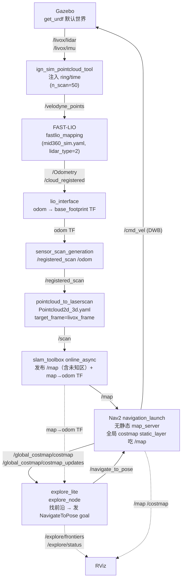

# explore_lite 仿真运行文档（Gazebo + FAST-LIO + Nav2 + m-explore-ros2）

> 适用范围：`3d_nav_ws` 中基于 **explore_lite**（`src/planner/m-explore-ros2/explore`）的前沿（frontier）自主探索仿真。
> 入口脚本：`scripts/exploration_explore_lite_sim.sh`（tmux 会话名 `explore_gz`）。
> 本文记录：① 仿真 pipeline；② 编译方法；③ 文件配置；④ 运行命令；⑤ 调试中**发现的问题与解决方案**。
>
> 与 `docs/dsv_run.md`（DSV 探索）的区别：探索前端由 DSV 换成 explore_lite，**不拷贝任何前端节点**，全部复用 fast-lio 输出 + 标准 3D→2D→SLAM→Nav2 链路。

---

## 1. 仿真 Pipeline

整体数据流（地面机器人，差速底盘，Livox MID-360 仿真）：



### 关键话题一览

| 话题 | 类型 | 发布者 | 消费者 |
|------|------|--------|--------|
| `/livox/lidar` | PointCloud2 | Gazebo | ign_sim_pointcloud_tool |
| `/livox/imu` | Imu | Gazebo | FAST-LIO |
| `/velodyne_points` | PointCloud2（含 ring/time） | ign_sim_pointcloud_tool | FAST-LIO |
| `/Odometry`、`/cloud_registered` | Odometry / PointCloud2 | FAST-LIO | lio_interface |
| `/registered_scan` | PointCloud2（odom 帧） | sensor_scan_generation | pointcloud_to_laserscan |
| `/odom` | Odometry | sensor_scan_generation | rviz / Nav2 |
| `/scan` | LaserScan | pointcloud_to_laserscan | slam_toolbox、Nav2 costmap obstacle_layer |
| `/map` | OccupancyGrid（含未知区） | slam_toolbox | Nav2 全局 costmap static_layer |
| `/global_costmap/costmap` | OccupancyGrid | Nav2 global_costmap | **explore_lite（本脚本用这个）** |
| `/global_costmap/costmap_updates` | OccupancyGridUpdate | Nav2 global_costmap | explore_lite（增量更新） |
| `/navigate_to_pose` | Nav2 action | bt_navigator | **explore_lite（action client）** |
| `/explore/frontiers` | MarkerArray | explore_lite | RViz |
| `/explore/status` | ExploreStatus | explore_lite | 监控（transient_local） |
| `/explore/resume` | std_msgs/Bool | 用户 | explore_lite（暂停/恢复） |
| `/cmd_vel` | Twist | Nav2 DWB | Gazebo |

**TF 树**：`map --slam_toolbox→ odom --lio_interface→ base_footprint → chassis → livox_frame`。

### 关键设计决策

1. **explore_lite 必需的三条腿**：实时代价地图（找前沿）+ Nav2 `NavigateToPose` action（送目标）+ `map→base_footprint` TF（取机器人位姿）。三者缺一不可——没有 action server 会在 `wait_for_action_server()` 处**阻塞**（`explore/src/explore.cpp:112`），没有含未知区的 `/map` 会**找不到前沿直接结束**。
2. **Nav2 必须无静态 map_server**：`my_nav2_launch.py` 带 `map_server` 加载静态图 `test_map__2.yaml`，会跟 slam_toolbox **抢 `/map`**；explore_lite 一旦读到那张"全已知"静态图 → 没有未知格 → 探索立即结束。因此 Nav2 窗口直接起 `nav2_bringup/navigation_launch.py`，全局 costmap 的 `static_layer` 天然订阅 slam 的 `/map`。
3. **explore_lite 订阅 `/global_costmap/costmap`（非裸 `/map`）**：对齐库自带 `params_costmap.yaml`。带膨胀半径 → 目标点不贴墙；同时订阅 `/costmap_updates` 增量同步。
4. **`robot_base_frame` 必须覆盖为 `base_footprint`**（库默认 `base_link`，工作区约定是 `base_footprint`）。
5. **FAST-LIO 必须用 `mid360_sim.yaml` + `convert`**：默认 `mid360.yaml` 的 `lidar_type:2`（Velodyne）需要 `ring/time` 字段，Gazebo 的 `/livox/lidar` 没有 → 必须经 `ign_sim_pointcloud_tool` 注入后由 FAST-LIO 订阅 `/velodyne_points`（见问题 ①）。

---

## 2. 编译

explore_lite 位于 `src/planner/m-explore-ros2/explore`（包名 `explore_lite` + `explore_lite_msgs`），依赖 Nav2 的 `nav2_msgs`/`nav2_costmap_2d`（系统已装）。

```bash
cd /home/ros/rosws/3d_nav_ws
source /opt/ros/humble/setup.bash
conda deactivate                 # 始终在构建前执行，避免 conda 库遮蔽系统库
rm -rf build/nav2_planner install/nav2_planner   # 清理改名前的旧构件（见问题 ②）
./scripts/build.sh               # colcon build --symlink-install --cmake-args -DCMAKE_BUILD_TYPE=Release -DCMAKE_POLICY_VERSION_MINIMUM=3.5
source install/setup.bash
```

> `explore_lite` 已构建好（`install/explore_lite` + `install/explore_lite_msgs`）。改名后首次必须执行上面的**完整清理重建**，否则 `ros2 pkg prefix nav2_planner` 仍会解析到旧的 `install/nav2_planner`，Nav2 的 `planner_server` 依然找不到。

---

## 3. 文件配置

| 文件 | 作用 |
|------|------|
| `scripts/exploration_explore_lite_sim.sh` | 一键仿真入口：起 Gazebo/convert/FAST-LIO/SLAM/Nav2/explore_lite，tmux 分窗 |
| `src/planner/m-explore-ros2/explore/config/params_costmap.yaml` | explore_lite 参数模板（本脚本用 `--ros-args -p` 内联覆盖，见下） |
| `src/planner/m-explore-ros2/explore/src/explore.cpp` | 探索主逻辑：costmap 找前沿 → NavigateToPose |
| `src/planner/nav2_planner_bringup/config/slam_toolbox_params.yaml` | SLAM Toolbox 参数（base_frame=base_footprint、map_frame=map） |
| `src/planner/nav2_planner_bringup/config/nav2_params.yaml` | Nav2 全栈参数（DWB、Navfn、costmap，`use_sim_time: True` 已内建） |
| `src/planner/nav2_planner_bringup/config/Pointcloud2d_3d.yaml` | 3D→2D 切片参数（target_frame=livox_frame，高度 0.3~2.0） |
| `src/localization/FAST_LIO_ROBOAIRY/config/mid360_sim.yaml` | FAST-LIO 仿真配置（`lid_topic=/velodyne_points`、`lidar_type=2`、`scan_line=50`） |
| `src/planner/nav2_planner_bringup/rviz/nav2.rviz` | RViz 显示配置（需手动加 `/explore/frontiers` MarkerArray） |

### 3.1 explore_lite 参数（脚本内联）

```bash
ros2 run explore_lite explore --ros-args \
  -p use_sim_time:=true \
  -p robot_base_frame:=base_footprint \
  -p costmap_topic:=/global_costmap/costmap \
  -p costmap_updates_topic:=/global_costmap/costmap_updates \
  -p return_to_init:=true \
  -p visualize:=true \
  -p planner_frequency:=0.15 \
  -p progress_timeout:=30.0 \
  -p potential_scale:=3.0 \
  -p orientation_scale:=0.0 \
  -p gain_scale:=1.0 \
  -p transform_tolerance:=0.3 \
  -p min_frontier_size:=0.5
```

| 参数 | 含义 |
|------|------|
| `costmap_topic` | 前沿检测用的代价地图（本脚本用 Nav2 全局 costmap） |
| `planner_frequency` | 规划频率（Hz），0.15 ≈ 每 6.7s 重新找一次前沿 |
| `progress_timeout` | 目标卡住 N 秒无进展 → 拉黑该前沿 |
| `min_frontier_size` | 小于该面积（m²）的前沿忽略 |
| `return_to_init` | 探索完成后导航回起点 |
| `potential_scale` / `gain_scale` | 前沿评分：代价 vs 收益权重 |

> 注：`explore.launch.py` 不暴露这些为 launch 参数，所以脚本用 `ros2 run explore_lite explore --ros-args -p ...` 内联传参。

---

## 4. 运行命令

### 4.1 一键启动

```bash
cd /home/ros/rosws/3d_nav_ws
source install/setup.bash
bash scripts/exploration_explore_lite_sim.sh
```

tmux 窗口（会话名 `explore_gz`）：

```
Gazebo | convert | FAST-LIO | lio_if | sensor | laserscan | slam | Nav2 | explore | RViz
```

attach 查看各窗口日志：

```bash
tmux attach -t explore_gz          # 或 docker exec -it lio_nav2 tmux attach -t explore_gz
tmux select-window -t explore_gz:explore
```

### 4.2 各窗口对应命令（手动单起）

```bash
# Gazebo
ros2 launch get_urdf get_urdf_launch.py rviz:=false

# convert：/livox/lidar → /velodyne_points（注入 ring/time）
ros2 run ign_sim_pointcloud_tool ign_sim_pointcloud_tool_node --ros-args \
  -p pcd_topic:=/livox/lidar -p n_scan:=50 -p horizon_scan:=360 \
  -p ang_bottom:=7.22 -p ang_res_y:=1.248

# FAST-LIO（必须 mid360_sim.yaml）
ros2 launch fast_lio_robosense mapping_livox.launch.py config_file:=mid360_sim.yaml rviz:=false use_sim_time:=true

# lio_interface：odom→base_footprint TF
ros2 launch lio_interface fastlio_lio_interface_launch.py

# sensor_scan_generation：/registered_scan + /odom
ros2 launch sensor_scan_generation sensor_scan_generation_launch.py

# 3D→2D 切片：/registered_scan → /scan
ros2 launch nav2_planner_bringup pointcloud_to_laserscan_launch.py

# SLAM Toolbox：/scan → /map + map→odom TF
ros2 launch slam_toolbox online_async_launch.py \
  slam_params_file:=$WS/src/planner/nav2_planner_bringup/config/slam_toolbox_params.yaml

# Nav2（无静态地图！use_composition 必须大写 False）
ros2 launch nav2_bringup navigation_launch.py \
  params_file:=$WS/src/planner/nav2_planner_bringup/config/nav2_params.yaml \
  use_sim_time:=true autostart:=true use_composition:=False

# explore_lite（见 3.1 参数）
ros2 run explore_lite explore --ros-args -p ...

# RViz
rviz2 -d $WS/src/planner/nav2_planner_bringup/rviz/nav2.rviz
```

### 4.3 探索控制与调试

```bash
# 暂停探索（cancel 当前目标 + 停止规划）
ros2 topic pub -1 /explore/resume std_msgs/Bool "{data: false}"
# 恢复探索
ros2 topic pub -1 /explore/resume std_msgs/Bool "{data: true}"

# 探索状态：EXPLORATION_STARTED / EXPLORATION_IN_PROGRESS / EXPLORATION_COMPLETE / RETURNING_TO_ORIGIN
ros2 topic echo /explore/status

# 看前沿可视化：RViz 添加 MarkerArray → /explore/frontiers（蓝=前沿点集，绿=质心，红=已拉黑）

# 检查关键链路
ros2 topic hz /scan /map /global_costmap/costmap
ros2 run tf2_ros tf2_echo map base_footprint

# 手动送一个 Nav2 目标测试导航是否可用
ros2 action send_goal /navigate_to_pose nav2_msgs/action/NavigateToPose \
  "{pose: {header: {frame_id: map}, pose: {position: {x: 2.0, y: 0.0}, orientation: {w: 1.0}}}}"

# 清理
./scripts/kill_all.sh          # 或 tmux kill-session -t explore_gz
```

> 若**刚启动就** `EXPLORATION_COMPLETE`：说明 explore_lite 读到了"全已知"地图（静态 map_server 污染了 `/map`）——先 `kill_all` 再重跑，确认 Nav2 窗口用的是 `navigation_launch.py` 而非 `my_nav2_launch.py`（见问题 ④）。

---

## 5. 发现的问题与解决方案

| # | 现象 | 根因 | 解决 |
|---|------|------|------|
| ① | FAST-LIO 刷屏 `Failed to find match for field 'ring' / 'time'` | `mapping_livox.launch.py` 默认 `mid360.yaml` 的 `lidar_type:2`（Velodyne）需要 `ring`+`time`，Gazebo `/livox/lidar` 只有 `xyz+intensity` | 启用 `convert` 窗口（`ign_sim_pointcloud_tool` 注入 ring/time → `/velodyne_points`），FAST-LIO 改用 `config_file:=mid360_sim.yaml`（`lid_topic=/velodyne_points`） |
| ② | Nav2 `planner_server not found on .../install/nav2_planner/lib/nav2_planner` | 工作区自己的包名就叫 `nav2_planner`（`src/planner/nav2_planner`），遮蔽了系统 Nav2 的同名包 → `navigation_launch.py` 的 `package='nav2_planner'` 解析到工作区包（里面没有 planner_server） | 把工作区包改名 `nav2_planner_bringup`，同步更新 package.xml / CMakeLists / 包内 launch / 全部脚本与 relocalization launch 的包名引用；**删除旧的 `build/nav2_planner` `install/nav2_planner` 后完整重建** |
| ③ | Nav2 启动报 `name 'false' is not defined` | `navigation_launch.py:112` 用 `PythonExpression(['not ', use_composition])` 拼字符串再 `eval()`，小写 `false` 不是合法 Python 名 | `use_composition:=False`（**大写** Python 布尔）——与 launch 文件默认 `'False'` 一致 |
| ④ | 探索启动即结束（`EXPLORATION_COMPLETE`） | `my_nav2_launch.py` 带 `map_server` 静态图 `test_map__2.yaml`，与 slam_toolbox 抢 `/map`；explore_lite 读到全已知图 → 无未知格 → 无前沿 | Nav2 改用 `nav2_bringup/navigation_launch.py`（**不带** map_server），全局 costmap static_layer 直接吃 slam 的 `/map` |

> 附带修复（改名副作用）：`save_map.sh` 里 `src/nav2_planner/map/...` 路径本来就是漏了 `planner/` 的坏路径，已随改名一并修正为 `src/planner/nav2_planner_bringup/map/...`。map_merge 示例 yaml 里的 `nav2_planner_selector_bt_node` 是 **BT 节点插件名**，不是包名，改名时**不要**动它。
