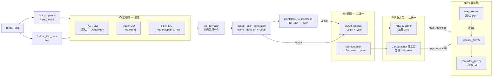

# RoboSense Airy 运行指南

> 传感器: RoboSense Airy（96 线，360° 旋转激光雷达）

---

## 1. 架构概览



**与 Livox 仿真的关键差异：**

| | Livox 仿真 | RoboSense Airy |
|--|-----------|----------------|
| FAST-LIO 包名 | `fast_lio` | `fast_lio_robosense` |
| 点云话题 | `/livox/lidar` | `/rslidar_points` |
| IMU 话题 | `/livox/imu` | `/rslidar_imu_data` |
| 机器人描述包 | `get_urdf` | `gld_robot_description` |
| 高度切片 | `0.3 ~ 2.0`（LiDAR 上方） | `-2.0 ~ -0.3`（LiDAR 下方） |

---

## 2. 实机建图

```bash
source install/setup.bash
./scripts/robo_mapping_real.sh
```

脚本用 gnome-terminal 打开窗口：`FAST-LIO` → `lio_interface` → `机器人描述` → `sensor_scan_generation` → `3d点云转2d` → `slam_toolbox`。

**保存地图：**

```bash
source install/setup.bash
./scripts/save_map.sh    # 2D 栅格地图（.pgm + .yaml）
./scripts/save_pcd.sh     # 3D 点云地图（.pcd，导航时 KISS-Matcher 用）
```

**换用 Cartographer 建图：**

编辑脚本最后一行，把 `slam_toolbox` 替换为 `ros2 launch nav2_planner cartographer_mapping_launch.py use_sim_time:=false`。

Cartographer 保存地图：

```bash
source install/setup.bash
ros2 service call /write_state cartographer_ros_msgs/srv/WriteState \
  '{filename: "src/planner/nav2_planner/map/airy_map.pbstream", include_unfinished_submaps: true}'
ros2 service call /finish_trajectory cartographer_ros_msgs/srv/FinishTrajectory '{trajectory_id: 0}'
ros2 run cartographer_ros cartographer_pbstream_to_ros_map \
  -pbstream_filename src/planner/nav2_planner/map/airy_map.pbstream \
  -map_filestem src/planner/nav2_planner/map/airy_map
```

---

## 3. 实机导航

```bash
source install/setup.bash
./scripts/robo_nav2_real.sh
```

脚本打开窗口：`FAST-LIO` → `lio_interface` → `机器人描述` → `sensor_scan_generation` → `3d点云转2d` → `KISS+GICP` → `Nav2`。

**前置文件：**

| 文件 | 用途 | 来源 |
|------|------|------|
| `.pgm` + `.yaml` | Nav2 map_server 静态地图 | `save_map.sh` / `pbstream_to_ros_map` |
| `.pcd`（`dense_map.pcd`） | KISS-Matcher 全局重定位 | `save_pcd.sh` |

**换用 Cartographer 纯定位：** 编辑脚本，把 KISS-Matcher 那行替换为：
```bash
ros2 launch nav2_planner cartographer_localization_launch.py \
    load_state_filename:=src/planner/nav2_planner/map/airy_map.pbstream use_sim_time:=false
```

---

## 4. Docker 容器内数据集回放

数据集: `~/dataset/robosense/robosenseAiry-slamtoolbox/`（78 秒，782 帧 + 15,648 条 IMU）。

### 4.1 构建镜像 + 编译

```bash
# 构建镜像（首次或 Dockerfile 变更后）
cd ~/ros_ws/LIO_Nav2_ROS2
docker build -t lio_nav2:humble .

# 启动容器（挂载工作空间 + 数据集 + X11）
xhost +local:docker
docker rm -f lio_nav2 2>/dev/null

docker run -d --name lio_nav2 --network host --ipc host --cpus 8 \
  -e DISPLAY=:0 -e QT_X11_NO_MITSHM=1 \
  -v /tmp/.X11-unix:/tmp/.X11-unix \
  --device /dev/dri:/dev/dri \
  -v /home/ros/ros_ws/LIO_Nav2_ROS2:/ws \
  -v /home/ros/dataset:/dataset \
  lio_nav2:humble sleep infinity

# 编译工作空间
docker exec lio_nav2 bash -c "
  source /opt/ros/humble/setup.bash && cd /ws && \
  MAKEFLAGS='-j4' colcon build --symlink-install --executor sequential \
    --cmake-args -DCMAKE_BUILD_TYPE=Release -DCMAKE_POLICY_VERSION_MINIMUM=3.5 -DUSE_SYSTEM_TBB=ON"
```

### 4.2 方案 A: SLAM Toolbox 建图

> **⚠️ 注意：`robo_mapping_real_docker.sh` 里 `bag播放` 窗口被注释掉了**（第 50-53 行），脚本只负责启动节点，**数据需要手动播放**，否则所有节点空转。

```bash
# 1. 启动建图节点（FAST-LIO / robot_desc / lio_if / sensor / pc2laser / slam_toolbox / RViz）
docker exec -it lio_nav2 /ws/scripts/robo_mapping_real_docker.sh

# 2. 播放 bag 数据（--clock 发布 /clock 仿真时钟，配合各节点 use_sim_time:=true；换数据改路径即可）
docker exec lio_nav2 bash -c 'source /opt/ros/humble/setup.bash && cd /ws && \
  ros2 bag play /dataset/robosense/mapping --clock'

# 3. 查看输出（退出: 先按 Ctrl+B 再按 D）
docker exec -it lio_nav2 tmux attach -t robo_mapping

# 停止
docker exec lio_nav2 tmux kill-session -t robo_mapping
```

tmux 窗口：

| 窗口 | 内容 |
|------|------|
| `FAST-LIO` | 3D 里程计 + **FAST-LIO 自带 3D RViz**（点云 + 轨迹） |
| `robot_desc` | URDF → 静态 TF（`rviz:=false`） |
| `lio_if` | 坐标系转换 |
| `sensor` | odom→base TF + /odom |
| `pc2laser` | 3D→2D 切片 → /scan |
| `slam_toolbox` | SLAM Toolbox 2D 建图 |
| `RViz` | **建图专用 2D RViz**（`/map` + `/scan` + TF + 机器人模型） |

> 两个 RViz：FAST-LIO 显示 3D 视角（`/cloud_registered` + `/path`），建图 RViz 显示 2D 地图（`/map` + `/scan`）。

**检查数据流是否正常（bag 播放期间）：**

```bash
docker exec lio_nav2 bash -c 'source /opt/ros/humble/setup.bash && ros2 topic hz /Odometry /scan'
# 预期: /rslidar_points ~8.5Hz → /Odometry ~9Hz → /scan ~10Hz；/map 有 1 个 publisher
```

**保存地图（bag 播完后）：**

```bash
# 3D 点云地图（触发 FAST-LIO 的 /map_save 服务）
docker exec lio_nav2 bash -c 'source /opt/ros/humble/setup.bash && \
  timeout 20 ros2 service call /map_save std_srvs/srv/Trigger'

# 2D 栅格地图（SLAM Toolbox → map_saver → .pgm + .yaml）
docker exec lio_nav2 bash -c 'cd /ws && source install/setup.bash && /ws/scripts/save_map.sh'
```

> 3D 点云保存后需确认落盘位置，见下方 **路径问题**。

**⚠️ 3D PCD 落盘路径问题：**

`robosenseAiry.yaml` 的 `map_file_path` 若指向容器内部路径（如 `/home/ros/rosws/...`），`map_save` 会把 PCD 写进容器层（宿主看不到、容器重建即丢）。建议改为：

```yaml
map_file_path: /ws/src/planner/nav2_planner/pcd/robo_map.pcd
```

改完后保存结果直接落在项目 `src/planner/nav2_planner/pcd/robo_map.pcd`（宿主可见），建图/导航（KISS-Matcher）直接引用。

### 4.3 方案 B: Cartographer 建图

```bash
# 启动
docker exec -it lio_nav2 /ws/scripts/robo_mapping_carto_docker.sh

# 查看输出
docker exec -it lio_nav2 tmux attach -t robo_mapping_carto

# 停止
docker exec lio_nav2 tmux kill-session -t robo_mapping_carto
```

tmux 窗口：

| 窗口 | 内容 |
|------|------|
| `bag播放` | 回放数据集 |
| `FAST-LIO` | 3D 里程计 + **3D RViz** |
| `robot_desc` | URDF → 静态 TF |
| `lio_if` | 坐标系转换 |
| `sensor` | odom→base TF + /odom |
| `pc2laser` | 3D→2D 切片 → /scan |
| `Cartographer` | Cartographer 2D 建图（`/map` + `map→odom` TF） |
| `RViz` | **建图专用 2D RViz**（`cartographer_mapping.rviz`） |

保存地图：

```bash
docker exec lio_nav2 bash -c "
  source /opt/ros/humble/setup.bash && source install/setup.bash && \
  ros2 service call /write_state cartographer_ros_msgs/srv/WriteState \
    '{filename: \"/ws/src/planner/nav2_planner/map/airy_map.pbstream\", include_unfinished_submaps: true}' && \
  ros2 service call /finish_trajectory cartographer_ros_msgs/srv/FinishTrajectory '{trajectory_id: 0}' && \
  ros2 run cartographer_ros cartographer_pbstream_to_ros_map \
    -pbstream_filename /ws/src/planner/nav2_planner/map/airy_map.pbstream \
    -map_filestem /ws/src/planner/nav2_planner/map/airy_map"
```

### 4.4 KISS-Matcher + Nav2 导航

导航模式加载已建好的地图（.pgm + .pcd），通过 KISS-Matcher 全局重定位，Nav2 执行路径规划和控制。

**前置文件（由建图阶段生成）：**

| 文件 | 来源 | 用途 |
|------|------|------|
| `.pgm` + `.yaml` | `save_map.sh` | Nav2 map_server 静态地图 |
| `dense_map.pcd` | `save_pcd.sh` | KISS-Matcher 全局重定位先验地图 |

> 导航前确认 `my_nav2_launch.py` 中 `map_yaml_file` 指向正确的 `.yaml` 文件。

```bash
# 启动
docker exec -it lio_nav2 /ws/scripts/robo_nav2_real_docker.sh /dataset/robosense/nav1

# 查看输出
docker exec -it lio_nav2 tmux attach -t robo_nav2

# 停止
docker exec lio_nav2 tmux kill-session -t robo_nav2
```

tmux 窗口：

| 窗口 | 内容 |
|------|------|
| `bag播放` | 回放数据集 `--clock` |
| `FAST-LIO` | 3D 里程计 + **3D RViz** |
| `robot_desc` | URDF → 静态 TF |
| `lio_if` | 坐标系转换 |
| `sensor` | odom→base TF + /odom |
| `pc2laser` | 3D→2D 切片 → /scan |
| `KISS+GICP` | KISS-Matcher 全局重定位 → `map→odom` TF |
| `Nav2` | planner + controller + behavior server |
| `RViz` | **导航 RViz**（`/map` + `/scan` + `/plan` + `/global_costmap` + `/local_costmap` + TF） |

**操作步骤：**

1. `docker exec -it lio_nav2 tmux attach -t robo_nav2` 查看输出
2. 等待 `KISS+GICP` 窗口打印 `KISSMatcher initialization succeeded`
   - 如果一直 `initializing`：bag 数据开始后 KISS 需要几帧点云做全局匹配
3. RViz 中 Fixed Frame 设为 `map`
4. 用 **"2D Pose Estimate"** 工具在机器人真实位置点击 + 拖动方向
5. KISS-Matcher 对齐后，`map→odom` TF 开始发布，机器人模型对齐到地图
6. 用 **"Nav2 Goal"** 工具点击目标位姿，机器人开始自主导航

### 4.5 关闭

```bash
./scripts/docker_shutdown.sh            # 清理节点，容器保留
./scripts/docker_shutdown.sh --stop     # 停止容器
./scripts/docker_shutdown.sh --rm       # 删除容器
```

---

## 5. 脚本速查

| 场景 | 命令 |
|------|------|
| 实机建图（SLAM Toolbox） | `./scripts/robo_mapping_real.sh` |
| 实机导航（KISS-Matcher） | `./scripts/robo_nav2_real.sh` |
| Docker 建图（FAST-LIO） | `docker exec -it lio_nav2 /ws/scripts/robo_mapping_real_docker.sh` |
| Docker 建图（Point-LIO） | `docker exec -it lio_nav2 /ws/scripts/robo_mapping_pointlio_docker.sh` |
| Docker 建图（Super-LIO） | `docker exec -it lio_nav2 /ws/scripts/robo_mapping_superlio_docker.sh` |
| Docker 建图（Cartographer） | `docker exec -it lio_nav2 /ws/scripts/robo_mapping_carto_docker.sh` |
| Docker 导航（KISS-Matcher） | `docker exec -it lio_nav2 /ws/scripts/robo_nav2_real_docker.sh` |

| Docker 脚本 | 会话 | 里程计 | 建图 |
|------------|------|--------|------|
| `robo_mapping_real_docker.sh` | `robo_mapping` | FAST-LIO | SLAM Toolbox |
| `robo_mapping_superlio_docker.sh` | `robo_mapping_superlio` | Super-LIO | SLAM Toolbox |
| `robo_mapping_carto_docker.sh` | `robo_mapping_carto` | FAST-LIO | Cartographer |
| `robo_nav2_real_docker.sh` | `robo_nav2` | FAST-LIO | KISS-Matcher + Nav2 |

---

## 6. 排错

### TF 报 "Transform data too old"

- 数据集回放：所有节点 `use_sim_time:=true`，bag 带 `--clock`
- 实机：`use_sim_time:=false`（默认值）

### FAST-LIO 报 `lidar_type 1`

配置文件没加载正确。确保使用 `fast_lio_robosense` 包的 `mapping_robosense_airy.launch.py`，它默认使用 `robosenseAiry.yaml`（`lidar_type: 5`）。

### gld_robot_description 修改后不生效

`gld_robot_description` 的 launch 文件是 Python → symlink-install 自动同步，不需重编译。但若改了 `package.xml` 或 `CMakeLists.txt`，则需重建。

### KISS-Matcher 一直 "initializing"

`/registered_scan` 点云累积不足。让机器人移动一段距离或原地缓慢旋转几圈。

### Cartographer "Queue waiting for data: (0, odom)"

```bash
ros2 topic hz /odom
ros2 run tf2_echo odom base_footprint
```
