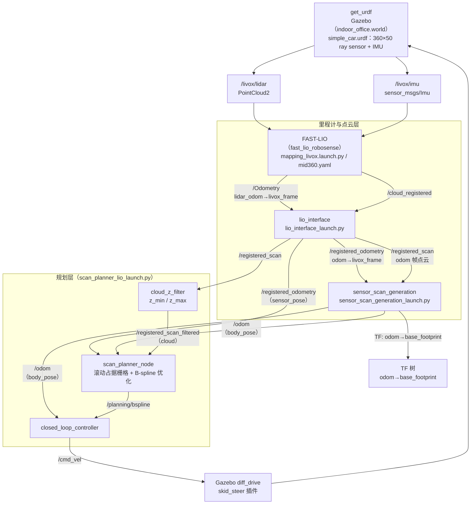

# SCAN-Planner 运行指南（scan_run.md）

> SCAN-Planner：基于滚动占据栅格（ESDF）+ B-spline 优化的局部避障轨迹规划器。
> 本仓库将其与 FAST-LIO 里程计管线整合，用于 simple_car（仿真 Livox MID-360 360° 雷达）在 Gazebo 室内场景中的自主导航。
> 环境：Ubuntu 22.04 + ROS 2 Humble + Gazebo（Classic）。

---

## 1. 管线架构



| 节点 | 包 | 作用 |
|------|-----|------|
| `get_urdf` | `get_urdf` | Gazebo 世界 + 机器人模型 + ray sensor/IMU 插件 |
| `fast_lio` | `fast_lio_robosense` | FAST-LIO 里程计（`/Odometry` + `/cloud_registered`） |
| `lio_interface` | `lio_interface` | 把 FAST-LIO 输出转到标准 `odom` 帧（`/registered_odometry` + `/registered_scan`） |
| `sensor_scan_generation` | `sensor_scan_generation` | 生成 `/odom` + `odom→base_footprint` TF |
| `cloud_z_filter` | `me_nav2_bringup` | 点云 Z 轴直通滤波，去地面/天花板 |
| `scan_planner_node` | `scan_planner` | 占据栅格建图 + 全局/局部轨迹规划 |
| `closed_loop_controller` | `scan_planner` | B-spline 轨迹 → `/cmd_vel` |

> **注意**：`lio_interface` 和 `sensor_scan_generation` 都参与 TF/里程计生成，但只有 `sensor_scan_generation` 发布 `odom→base_footprint` TF 与 `/odom` 话题。

---

## 2. 运行

### 2.1 一键启动

```bash
cd /home/ros/rosws/3d_nav_ws
source install/setup.bash
bash scripts/nav_scan_planner.sh
```

脚本自动完成：杀残留进程 → 启动 Gazebo → FAST-LIO → `lio_interface` + `sensor_scan_generation` → SCAN-Planner + 闭环控制器 → RViz。

脚本关键窗口（`use_sim_time:=true` 已统一为仿真时间）：

| 模块 | 命令要点 |
|------|----------|
| Gazebo | `ros2 launch get_urdf get_urdf_launch.py rviz:=false` |
| FAST-LIO | `ros2 launch fast_lio_robosense mapping_livox.launch.py rviz:=true use_sim_time:=true` |
| lio_if | `ros2 launch lio_interface lio_interface_launch.py` |
| sensor | `ros2 launch sensor_scan_generation sensor_scan_generation_launch.py` |
| SCAN | `ros2 launch me_nav2_bringup scan_planner_lio_launch.py use_sim_time:=true ...` |
| SP-RViz | `rviz2 -d src/me_nav2_bringup/rviz/scan_planner.rviz` |

> 各窗口之间有 `sleep 6/3/2` 保证 Gazebo spawn 完成、TF 就绪后再启动下游节点。

### 2.2 tmux 窗口

```bash
tmux attach -t scan_gz
```

| 窗口 | 内容 |
|------|------|
| `Gazebo` | Gazebo 仿真世界（cpr_office 室内办公环境） |
| `FAST-LIO` | FAST-LIO 里程计 |
| `lio_if` | 里程计接口（`/registered_odometry` + `/registered_scan`） |
| `sensor` | 点云生成（`/odom` + TF） |
| `SCAN` | SCAN-Planner 规划 + 闭环控制器 |
| `SP-RViz` | 规划可视化 |

切换窗口：`Ctrl+B` + 数字键。关闭：`tmux kill-server`。

### 2.3 手动启动（分步调试用）

```bash
cd /home/ros/rosws/3d_nav_ws && source install/setup.bash

# 1. Gazebo
ros2 launch get_urdf get_urdf_launch.py rviz:=false

# 2. FAST-LIO（mid360.yaml：lidar_type=2，订阅 PointCloud2）
ros2 launch fast_lio_robosense mapping_livox.launch.py rviz:=false use_sim_time:=true

# 3. 里程计接口 + 点云生成
ros2 launch lio_interface lio_interface_launch.py
ros2 launch sensor_scan_generation sensor_scan_generation_launch.py

# 4. SCAN-Planner
ros2 launch me_nav2_bringup scan_planner_lio_launch.py use_sim_time:=true

# 5. RViz
rviz2 -d src/me_nav2_bringup/rviz/scan_planner.rviz
```

**操作**：切到 `SP-RViz` 窗口，用工具 `2D Goal Pose` 点目标（Fixed Frame 为 `odom`，目标发到 `/move_base_simple/goal`）。

---

## 3. 关键参数

参数分为三处：`scan_planner/config/planner.yaml`（规划节点）、`scan_planner/config/controllers.yaml`（控制器）、`scan_planner_lio_launch.py`（launch 覆盖与 Z 过滤）。

### 3.1 话题映射（scan_planner_lio_launch.py）

| 参数 | 值 | 说明 |
|------|-----|------|
| `body_pose` | `/odom` | 车体位姿 `odom→base_footprint`（FSM 用） |
| `sensor_pose` | `/registered_odometry` | **LiDAR 真实位姿** `odom→livox_frame`（raycast 原点，z≈0.25） |
| `cloud` | `/registered_scan_filtered` | Z 过滤后的点云（odom 帧） |
| `cloud_is_world` | `true` | 点云已在 odom（世界）帧，直接使用 |
| `need_extrinsic` | `false` | 不再额外施加 LiDAR 外参 |
| `frame_id` | `odom` | 占据栅格发布帧 |

### 3.2 Z 轴过滤（cloud_z_filter）

| 参数 | 默认 | 本脚本值 | 说明 |
|------|------|----------|------|
| `z_min` | -1.0 | 0.15 | 去除地面与车体自身点（LiDAR 高度 0.25，向下视角有限） |
| `z_max` | 2.0 | 3.0 | 去除天花板，保留室内障碍物 |

### 3.3 SCAN-Planner 节点（planner.yaml）

#### FSM 状态机

| 参数 | 默认 | 说明 |
|------|------|------|
| `fsm.navi_mode` | 1 | `1`=RViz 2D Goal、`2`=预设航点、`3`=外部参考路径 |
| `fsm.thresh_replan` | 1.0 | 沿轨迹行进超过该距离触发重规划 |
| `fsm.thresh_no_replan` | 0.1 | 距终点小于该距离不再重规划 |
| `fsm.planning_horizon` | 7.5 | 局部轨迹前瞻长度（m） |
| `fsm.emergency_time` | 1.0 | 碰撞点距当前时刻小于该值则急停 |
| `fsm.fail_safe` | true | 多次重规划失败后急停等待新目标 |
| `fsm.max_replan_fail_count` | 1000 | 重规划失败上限 |

#### Grid Map 占据栅格

| 参数 | 默认 | 本脚本值 | 说明 |
|------|------|----------|------|
| `grid_map.resolution` | 0.05 | — | 栅格分辨率（m） |
| `grid_map.sliding_map_size_x/y/z` | 10/10/5 | 50/50/5 | 滑动地图尺寸（m） |
| `grid_map.local_update_range_x/y/z` | 5/5/2.5 | 25/25/2.5 | 局部更新范围（m） |
| `grid_map.map_sliding_en` | true | — | 地图随机器人滑动 |
| `grid_map.map_sliding_thresh` | 0.2 | 滑动触发阈值（m） |
| `grid_map.ground_height` | 0.0 | 地图 Z 原点（地面高度） |
| `grid_map.max_ray_length` | 5.0 | 最大 raycast 长度（m） |

#### 自碰撞模型（双圆柱）

| 参数 | 默认 | 本脚本值 | 说明 |
|------|------|----------|------|
| `grid_map.double_cylinder_radius` | 0.25 | 0.45 | 圆柱半径，**同时作为障碍物 XY 膨胀半径** |
| `grid_map.double_cylinder_offset` | 0.18 | 0.18 | 前/后圆柱沿朝向的偏移量 |
| `grid_map.body_height` | 0.4 | 0.25 | 车体高度（**仅 navi_mode=3 生效**，见 §4.1） |
| `grid_map.obstacles_inflation_z_up` | 0.1 | 0.1（未覆盖） | 障碍物向上膨胀 |
| `grid_map.obstacles_inflation_z_down` | 0.4 | **0.4** | 障碍物向下膨胀（**必须覆盖到 z=0**，见 §4.1） |

> 碰撞检测逻辑：`getInflateOccupancy(pos, yaw)` 取 `pos ± offset·heading` 两个点，查询已按 `double_cylinder_radius`（XY）+ `obstacles_inflation_z_*`（Z）膨胀后的占据栅格。等价于把机器人建模为前后两个半径为 `double_cylinder_radius` 的圆柱。

#### 占据概率

| 参数 | 默认 | 本脚本值 | 说明 |
|------|------|----------|------|
| `grid_map.p_hit` | 0.85 | 0.9 | 击中一次增加的概率 |
| `grid_map.p_miss` | 0.30 | 0.1 | 穿过一次减少的概率 |
| `grid_map.p_occ` | 0.80 | 0.3 | 判定为占据的阈值 |
| `grid_map.p_min` | 0.12 | — | 概率下限 |
| `grid_map.p_max` | 0.98 | — | 概率上限 |

#### B-spline 优化

| 参数 | 默认 | 本脚本值 | 说明 |
|------|------|----------|------|
| `optimization.lambda_smooth` | 1.0 | — | 平滑项权重 |
| `optimization.lambda_collision` | 1.0 | 50.0 | 碰撞项权重 |
| `optimization.lambda_feasibility` | 0.1 | — | 动力学可行性权重 |
| `optimization.lambda_fitness` | 1.0 | — | 轨迹贴合权重 |
| `optimization.dist0` | 0.2 | 1.0 | 碰撞势场作用距离（m） |
| `optimization.max_vel/max_acc` | 0.75/0.5 | — | 优化限速/限加速度 |
| `optimization.order` | 3 | — | B-spline 阶数 |

### 3.4 闭环控制器（controllers.yaml）

| 参数 | 默认 | 说明 |
|------|------|------|
| `time_forward` | 0.8 | 期望航向前瞻时间（s） |
| `heading_error_threshold` | 0.8 | 航向误差超此值先原地转向 |
| `kp_pos` | 0.8 | 位置误差比例增益 |
| `kp_yaw` | 1.5 | 航向误差比例增益 |
| `max_vx` | 0.75 | 最大前进速度（m/s） |
| `max_vy` | 0.35 | 最大侧向速度（m/s，skid-steer 实际不侧移） |
| `max_vyaw` | 1.0 | 最大角速度（rad/s） |
| `finish_dist` | 0.15 | 到达判定距离（m） |

---

## 4. 问题与解决方案

### 4.1 无法避障（核心问题，已修复）

**现象**：机器人能规划并朝目标运动，但直接撞上障碍物，`checkCollisionCallback` 从不触发避障/急停。

**根因（Z 轴高度不匹配）**：

SCAN-Planner 是 3D 规划器。本管线里：

1. `body_pose` 映射为 `/odom`（`odom→base_footprint`，**z=0**），FSM 的 `odom_pos_(2)=0`。
2. `navi_mode=1`（RViz 2D Goal）下 goal 高度取 `rviz_goal_height_ = odom_pos_(2) = 0`；`body_height` 参数**只在 navi_mode=3 的 `pathCallback` 里加**，手动 goal 模式不生效。
3. 于是轨迹在 **z=0 平面** 规划，碰撞检测 `getInflateOccupancy` 也查 **z=0** 的膨胀栅格。
4. 而 `cloud_z_filter` 用 `z_min=0.15` 把地面和 z<0.15 的点删了 → 障碍物占据栅格最低在 **z=0.15**。
5. `obstacles_inflation_z_down=0.1` 只把障碍物向下膨胀 0.1m（分辨率 0.05 → 2 voxel）→ 膨胀后最低到 **z=0.05**，覆盖不到 z=0。

结果：z=0 那个 voxel 永远查不到障碍 → planner 认为一路畅通 → 直接规划穿过墙的直线。

**解决方案**（已在 `nav_scan_planner.sh` / `scan_planner_lio_launch.py` 修改）：

| 修改 | 旧值 | 新值 | 作用 |
|------|------|------|------|
| `obstacles_inflation_z_down` | 0.1 | 0.4 | 障碍物向下膨胀覆盖到 z=0，使 z=0 的碰撞检测能看到障碍 |
| `sensor_pose` 映射 | `/odom` | `/registered_odometry` | raycast 原点从 base_footprint（z=0）改回真实 LiDAR 位姿（z≈0.25） |

> **更干净的替代方案**（未采用，需改 C++）：在 `scan_replan_fsm.cpp` 的 navi_mode=1 里把 goal/start 的 z 抬到 `body_height`，让碰撞检测直接发生在车体高度，而不是靠「向下膨胀」把障碍物压到地面。当前方案是最小改动（仅 launch 层）。

### 4.2 sensor_pose 映射错误（已修复）

`scan_planner_lio_launch.py` 原先把 `sensor_pose` 映射为 `/odom`（base_footprint，z=0）。但 `sensor_pose` 是 `grid_map` 里 raycast 的射线原点，应为 **LiDAR 位姿**。已改为 `/registered_odometry`（lio_interface 发布的 `odom→livox_frame`，z≈0.25）。否则射线从地面发出，比真实 LiDAR 低 0.25m。

### 4.3 use_sim_time 未统一（已修复）

原 `nav_scan_planner.sh` 中 FAST-LIO 和 SCAN-Planner 用默认 `use_sim_time=false`（wall time），而 Gazebo / lio_interface / sensor_scan_generation 用 sim time。已给 FAST-LIO 与 scan planner 补 `use_sim_time:=true`，与仿真时钟对齐。

### 4.4 use_pcd_map / pcd_map_file 是无效参数（已移除）

`scan_planner_node` / `grid_map` 代码里**没有读取** `grid_map.use_pcd_map` 和 `grid_map.pcd_map_file`（这两个参数只在 simulator 的 launch 里被用到）。脚本里 `use_pcd_map:=true pcd_map_file:=/ws/PCD/map.pcd` 属于无效配置，且 `/ws` 是 docker 路径。已从脚本移除。

### 4.5 启动竞态（已修复）

原脚本无 `sleep`，Gazebo 尚未 spawn 完机器人（`/livox/lidar`、`/livox/imu` 未发布）或 `base_footprint→livox_frame` TF 未就绪时，FAST-LIO / lio_interface 已启动。已补 `sleep 6/3/2`（与参考脚本一致）。

### 4.6 QoS 说明（不是问题）

`lio_interface` / `cloud_z_filter` / `sensor_scan_generation` 用默认 RELIABLE 发布，`grid_map` 用 `SensorDataQoS`（BEST_EFFORT）订阅。**RELIABLE 发布者 + BEST_EFFORT 订阅者实测兼容**（降级为 best-effort），无需修改。反之（BEST_EFFORT 发布 + RELIABLE 订阅）才不兼容。

---

## 5. 调试命令

```bash
# 检查点云/里程计数据流
ros2 topic hz /livox/lidar /registered_scan /registered_scan_filtered /odom
ros2 topic info /registered_scan_filtered -v   # 查看发布/订阅 QoS 是否匹配

# 检查 TF 链
ros2 run tf2_ros tf2_echo odom base_footprint
ros2 run tf2_ros tf2_echo odom livox_frame

# 观察占据栅格与规划轨迹
ros2 topic hz /grid_map/occupancy /grid_map/occupancy_inflate /planning/bspline

# 观察 FSM 状态（SCAN 窗口输出）
#   no odom. / wait for goal. / [FSM]: state: EXEC_TRAJ ...

# 手动发目标（等价于 RViz 2D Goal Pose）
ros2 topic pub /move_base_simple/goal geometry_msgs/msg/PoseStamped \
  "{header: {frame_id: odom}, pose: {position: {x: 2.0, y: 1.0, z: 0.0}, orientation: {w: 1.0}}}" --once

# 清理残留
bash scripts/kill_all.sh
```

### 常见现象对照

| 现象 | 可能原因 |
|------|----------|
| 直接撞墙、轨迹穿过障碍 | §4.1 Z 轴不匹配（`obstacles_inflation_z_down` 太小 / `sensor_pose` 错） |
| SCAN 窗口一直 `no odom.` | `/odom` 未发布：检查 lio_interface / sensor_scan_generation 是否订阅到 `/registered_scan` `/registered_odometry` |
| 一直 `wait for goal.` | RViz Fixed Frame 不是 `odom`，或 2D Goal Pose 未发布到 `/move_base_simple/goal` |
| 目标不可达、规划失败 | 目标点被占据（`adjustGlobalTargetIfOccupied` 会回退），或 `double_cylinder_radius` 过大导致室内无可行空间 |
| 机器人频繁急停 | `emergency_time` 太小、`lambda_collision` 过大，或占据栅格噪声多（调 `p_hit/p_miss`） |
