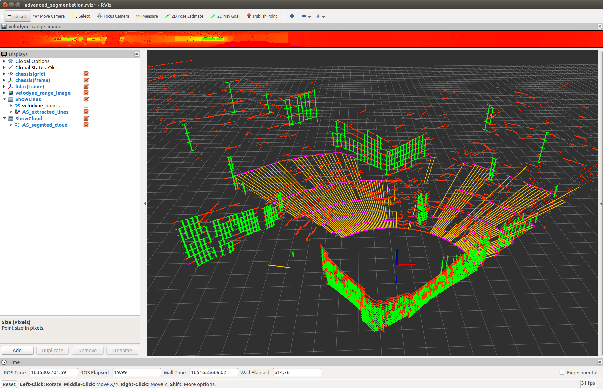

# 地面 / 墙面点云在线分割

> Efficient Online Segmentation of Ground & Wall Points

一个**轻量、高效**的在线分割算法，从 LiDAR 点云中实时分割出**地面点**和**墙面点**。

算法思路源自 Himmelsbach 等人 2010 年的
[*Fast segmentation of 3D point clouds for ground vehicles*](https://github.com/lorenwel/linefit_ground_segmentation)（linefit_ground_segmentation），
本项目在此基础上**扩展了墙面点提取**，并利用多线旋转式激光雷达**俯仰角分布固定**这一特性，把每个扇区（sector）内的
bin 数量恰好设为激光线数（ring 数），从而大幅缩减直线拟合的搜索量，进一步提速。

---

## 1. 特性

- 同时分割 **地面点** 与 **墙面点**（墙面提取引入法向量信息，大入射角下仍准确）。
- 支持**任意线数**的旋转式机械激光雷达（已在 VLP-16、HDL-32 上充分测试）。
- 支持激光雷达**以任意姿态安装**（通过 `kExtrinsicRot` / `kExtrinsicTrans` 配置外参）。
- 外参旋转矩阵 **SO3 单位正交校验**，非法时程序报错退出。
- 所有参数均通过 **yaml 文件**配置。
- 已移植为 **ROS2 (Humble)** 包。

---

## 2. 依赖

仅需 **ROS2 (Humble)** 及 **PCL**、**OpenCV**（OpenCV 仅用于距离图可视化，移除代价很小）。

```bash
sudo apt-get install ros-humble-pcl-conversions ros-humble-cv-bridge \
                     ros-humble-tf2-ros libpcl-dev libopencv-dev libeigen3-dev
```

---

## 3. 编译

```bash
source /opt/ros/humble/setup.bash
cd /home/ros/rosws/efficient_online_segmentation
colcon build --packages-select efficient_online_segmentation
source install/setup.bash
```

---

## 4. 节点

包内提供**两个** ROS 接口节点，共用同一套 `core/` 分割核心：

### 4.1 `efficient_online_segmentation_node` —— 分割 + 可视化

做完整的地面/墙面分割并发布可视化结果：

| 话题 | 类型 | 说明 |
| --- | --- | --- |
| `sub_cloud_topic`（默认 `/velodyne_points_0`） | PointCloud2 | 输入点云 |
| `pub_cloud_topic`（默认 `/EOS_segmted_cloud`） | PointCloud2 | 分割结果，传感器坐标系，用 intensity 编码类别 |
| `/EOS_transformed_cloud` | PointCloud2 | 变换到 `base_link` 的点云（固定话题名） |
| `pub_rangeimage_topic`（默认 `/EOS_range_image`） | Image | 距离图（按距离上色的彩虹图） |
| `pub_extractedlines_topic`（默认 `/EOS_extracted_lines`） | MarkerArray | 提取出的地/墙面直线（青色线段） |

同时广播 `base_link → sensor` 的 TF。

### 4.2 `ground_separation_node` —— 地面 / 非地面拆分

只做地面点与「其他点」的二分类，分别发布两朵点云（**保留原始反射强度**）：

| 话题 | 说明 |
| --- | --- |
| `pub_ground_cloud_topic`（默认 `/ground_cloud`） | 纯地面点 |
| `pub_no_ground_cloud_topic`（默认 `/no_ground_cloud`） | 无地面点（墙面 + 未知） |

输出仍在传感器坐标系，并广播 `base_link → sensor` 的 TF。

---

## 5. 标签与颜色含义

分割核心给每个点打一个标签：

| 标签值 | 含义 |
| --- | --- |
| `0` | 未知（unknown） |
| `1` | 地面（ground） |
| `2` | 墙面（wall） |

- **`efficient_online_segmentation_node`** 会用标签**覆盖 intensity** 以便在 RViz 中着色：
  `墙面 = 10`、`地面 = 100`、`未知 = 180`。在 RViz 中对该话题使用「Intensity」着色 + rainbow 色带时，大致为**墙面偏红、地面偏绿、未知偏蓝**。
- **`ground_separation_node`** 不覆盖 intensity，输出的两朵点云保持**原始反射强度**。
- `/EOS_range_image` 是**按距离**上色的彩虹图（近红远蓝），与类别无关；`/EOS_extracted_lines` 为**青色**线段。

---

## 6. 运行

### 6.1 直接运行（默认 HDL-32 参数）

```bash
ros2 launch efficient_online_segmentation efficient_online_segmentation.launch.py
```

### 6.2 回放 rosbag

```bash
ros2 launch efficient_online_segmentation efficient_online_segmentation.launch.py \
  bag_filename:=/path/to/your.bag
```

### 6.3 指定参数文件

```bash
ros2 launch efficient_online_segmentation efficient_online_segmentation.launch.py \
  params_file:=$(ros2 pkg prefix efficient_online_segmentation)/share/efficient_online_segmentation/config/robosense_airy.yaml \
  bag_filename:=/path/to/your.bag
```

### 6.4 运行地面 / 非地面拆分节点

```bash
ros2 run efficient_online_segmentation ground_separation_node --ros-args \
  --params-file $(ros2 pkg prefix efficient_online_segmentation)/share/efficient_online_segmentation/config/ground_separation.yaml
```

---

## 7. 参数文件

`config/` 目录下预置了四个参数文件：

| 文件 | 适用场景 |
| --- | --- |
| `segmentation_params.yaml` | 默认参数（HDL-32，注释内含 VLP-16 示例） |
| `robosense_airy.yaml` | RoboSense Airy（96 线，z-flip 安装，高约 2.07 m） |
| `gazebo_mid360.yaml` | LIO_Nav2_ROS2 中的 Gazebo 仿真激光雷达（ray sensor） |
| `ground_separation.yaml` | 地面/非地面拆分节点（基于 Airy） |

### 关键参数说明

| 参数 | 单位 | 说明 |
| --- | --- | --- |
| `sub_cloud_topic` | — | 输入点云话题 |
| `sensor_frame_id` | — | 传感器坐标系（输出沿用此坐标系） |
| `base_link_frame_id` | — | 基准坐标系（`z=0` 在地面） |
| `kLidarRows` / `kLidarCols` | — | 线数 / 每线点数 |
| `kLidarHorizRes` / `kLidarVertRes` | 度 | 水平 / 垂直角分辨率（节点内转为弧度） |
| `kLidarVertFovMax` / `kLidarVertFovMin` | 度 | 垂直视场上下限 |
| `kNumSectors` | — | 扇区数，推荐 `{180, 240, 360}` |
| `kExtrinsicRot` / `kExtrinsicTrans` | — | 基准系 → 传感器系外参（3×3 旋转 + 平移，row-major） |
| `kGroundSlopeTolerance` 等 | 度 | 地面直线斜率 / 截距 / 点线距离阈值 |
| `kWallSlopeTolerance` 等 | 度 | 墙面直线斜率 / 点数 / 点线距离阈值 |

> 角度类参数在 yaml 中一律以**度**填写，节点加载时自动转为弧度/斜率；`kExtrinsicRot` 必须为单位正交阵（SO3），否则节点报错退出。

---

## 8. 结果示例



黄线（及品红点）为地面点，绿线（及绿点）为墙面点。

---

## 9. 参考

- M. Himmelsbach, F. v. Hundelshausen and H. -. Wuensche, *Fast segmentation of 3D point clouds for ground vehicles*, 2010 IEEE Intelligent Vehicles Symposium.
- 原实现 [linefit_ground_segmentation](https://github.com/lorenwel/linefit_ground_segmentation)。
- 算法细节（中文）见知乎主页：<https://zhuanlan.zhihu.com/p/508961457>。
